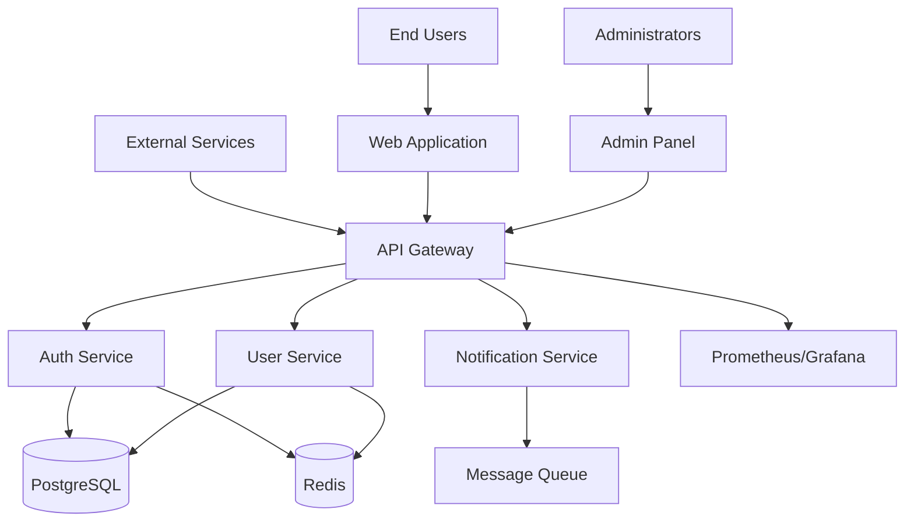
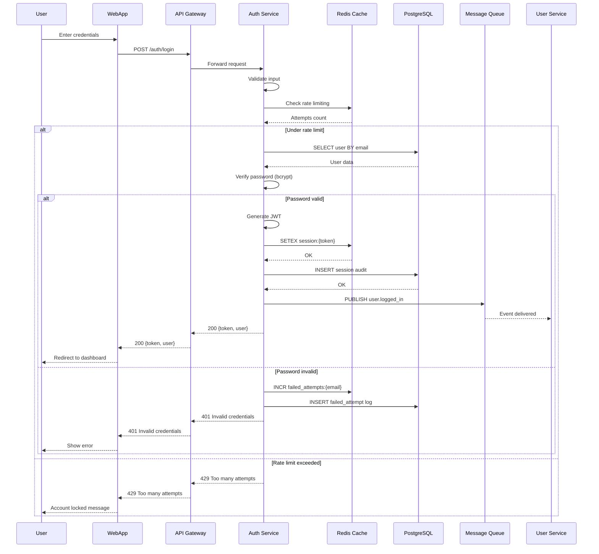

# SPARC Methodology Requirements - Comprehensive Implementation Guide

## Executive Summary

This document provides a complete reference for implementing SPARC (Specification, Pseudocode, Architecture, Refinement, Completion) methodology with Claude Flow orchestration. Based on analysis of production implementations and proven patterns from the agentic-flow codebase.

**Key Statistics**:
- 84.8% SWE-Bench solve rate
- 32.3% token reduction
- 2.8-4.4x speed improvement with parallel execution
- 90%+ test coverage standard
- 17 specialized SPARC modes available

---

## Table of Contents

1. [Specification Phase Requirements](#1-specification-phase-requirements)
2. [Pseudocode Phase Requirements](#2-pseudocode-phase-requirements)
3. [Architecture Phase Requirements](#3-architecture-phase-requirements)
4. [Refinement Phase Requirements](#4-refinement-phase-requirements)
5. [Completion Phase Requirements](#5-completion-phase-requirements)
6. [SPARC Document Structure](#6-sparc-document-structure)
7. [Quality Gates & Validation](#7-quality-gates--validation)
8. [Integration Patterns](#8-integration-patterns)
9. [Templates & Examples](#9-templates--examples)

---

## 1. Specification Phase Requirements

### 1.1 Requirements Gathering Templates

#### Functional Requirements Template

```yaml
specification:
  metadata:
    project_name: "Project Name"
    version: "1.0.0"
    author: "Team Name"
    created: "2025-01-27"
    sparc_phase: "specification"

  functional_requirements:
    - id: "FR-001"
      description: "System shall authenticate users via OAuth2"
      priority: "high"  # high, medium, low, critical
      category: "authentication"
      acceptance_criteria:
        - "Users can login with Google/GitHub"
        - "Session persists for 24 hours"
        - "Refresh tokens auto-renew"
      dependencies: []
      estimated_effort: "5 days"
      risk_level: "medium"

    - id: "FR-002"
      description: "System shall provide RESTful API endpoints"
      priority: "high"
      category: "api"
      acceptance_criteria:
        - "All endpoints follow REST conventions"
        - "API returns proper HTTP status codes"
        - "Response format is JSON"
        - "Rate limiting implemented"
      dependencies: ["FR-001"]
      estimated_effort: "10 days"
      risk_level: "low"
```

#### Non-Functional Requirements Template

```yaml
non_functional_requirements:
  performance:
    - id: "NFR-001"
      category: "response_time"
      description: "API response time <200ms for 95% of requests"
      measurement: "p95 latency metric"
      target: "200ms"
      acceptable_range: "150-250ms"
      critical_threshold: "500ms"

    - id: "NFR-002"
      category: "throughput"
      description: "Support 10,000 concurrent users"
      measurement: "concurrent connections"
      target: "10000"
      acceptable_range: "8000-12000"

  security:
    - id: "NFR-003"
      category: "encryption"
      description: "All data encrypted in transit and at rest"
      validation: "Security audit checklist"
      standards: ["OWASP Top 10", "SOC2 Type II"]

    - id: "NFR-004"
      category: "authentication"
      description: "Multi-factor authentication for admin access"
      validation: "Penetration testing"

  scalability:
    - id: "NFR-005"
      category: "horizontal_scaling"
      description: "System must scale horizontally to 100 instances"
      measurement: "Load testing"
      target: "100 instances"

  reliability:
    - id: "NFR-006"
      category: "availability"
      description: "99.9% uptime SLA"
      measurement: "Uptime monitoring"
      target: "99.9%"
      downtime_budget: "43.8 minutes/month"
```

### 1.2 User Story Formats

#### Standard User Story Template

```gherkin
Feature: User Authentication

  As a: registered user
  I want to: login with my credentials
  So that: I can access protected resources

  Background:
    Given the system is running
    And the database is accessible
    And user accounts exist

  Scenario: Successful login with valid credentials
    Given I am on the login page
    And I have a valid account with email "user@example.com"
    And my password is "SecurePass123!"
    When I enter my email "user@example.com"
    And I enter my password "SecurePass123!"
    And I click the "Login" button
    Then I should be redirected to the dashboard
    And I should see my username "John Doe"
    And my session should be active for 24 hours
    And a login event should be logged

  Scenario: Failed login with invalid password
    Given I am on the login page
    And I have a valid account with email "user@example.com"
    When I enter my email "user@example.com"
    And I enter an incorrect password "WrongPassword"
    And I click the "Login" button
    Then I should see an error message "Invalid credentials"
    And I should remain on the login page
    And the failed attempt should be logged
    And I should not have an active session

  Scenario: Account lockout after multiple failed attempts
    Given I am on the login page
    And I have made 4 failed login attempts
    When I enter incorrect credentials for the 5th time
    Then my account should be locked
    And I should see "Account locked due to multiple failed attempts"
    And I should receive a password reset email
    And an alert should be sent to administrators

  Scenario Outline: Login with different authentication methods
    Given I am on the login page
    When I choose "<auth_method>" authentication
    And I provide valid "<auth_method>" credentials
    Then I should be successfully authenticated
    And I should see my profile page

    Examples:
      | auth_method |
      | email       |
      | google      |
      | github      |
      | microsoft   |
```

### 1.3 Acceptance Criteria Patterns

#### Comprehensive Acceptance Criteria Template

```yaml
acceptance_criteria:
  feature: "User Authentication System"

  functional_acceptance:
    - criterion: "User can login with email and password"
      test_method: "Manual testing, Automated E2E tests"
      pass_conditions:
        - "Login form accepts valid email format"
        - "Password field is masked"
        - "Login button is enabled with valid input"
        - "User is redirected after successful login"
      fail_conditions:
        - "Invalid email format shows error"
        - "Empty fields prevent submission"
        - "Invalid credentials show generic error"

    - criterion: "Session management works correctly"
      test_method: "Integration tests"
      pass_conditions:
        - "Session token is generated on login"
        - "Token is stored in secure httpOnly cookie"
        - "Token expires after 24 hours"
        - "Refresh token allows session renewal"
      fail_conditions:
        - "Expired token is rejected"
        - "Invalid token returns 401"

  non_functional_acceptance:
    - criterion: "Performance meets requirements"
      test_method: "Load testing with k6/Artillery"
      pass_conditions:
        - "Login completes in <500ms (p95)"
        - "System handles 1000 concurrent logins"
        - "No memory leaks during sustained load"
      metrics:
        - response_time_p50: "200ms"
        - response_time_p95: "500ms"
        - response_time_p99: "1000ms"
        - error_rate: "<0.1%"

    - criterion: "Security standards are met"
      test_method: "Security audit, Penetration testing"
      pass_conditions:
        - "Passwords are bcrypt hashed (cost factor 12)"
        - "Rate limiting prevents brute force (5 attempts/5min)"
        - "HTTPS only, TLS 1.3"
        - "No credentials in logs"
      compliance:
        - "OWASP Top 10 compliance"
        - "SOC2 Type II controls"
        - "GDPR data protection"

  usability_acceptance:
    - criterion: "User experience is intuitive"
      test_method: "User testing, A/B testing"
      pass_conditions:
        - "Login form is discoverable"
        - "Error messages are clear and actionable"
        - "Password reset is easily accessible"
        - "Loading states provide feedback"
      metrics:
        - "Time to first login: <60 seconds"
        - "Error recovery time: <30 seconds"
        - "User satisfaction score: >4.0/5.0"
```

### 1.4 Edge Case & Scenario Documentation

#### Edge Cases Template

```yaml
edge_cases:
  authentication:
    - scenario: "Concurrent login attempts"
      description: "User attempts to login from multiple devices simultaneously"
      expected_behavior: "All sessions should be valid, or enforce single session"
      handling_strategy: "Allow multiple sessions with session tracking"
      test_approach: "Concurrent API calls from different IPs"

    - scenario: "Session hijacking attempt"
      description: "Attacker tries to reuse stolen session token"
      expected_behavior: "Detect and invalidate suspicious sessions"
      handling_strategy: "IP verification, user agent checking, anomaly detection"
      test_approach: "Replay attack simulation"

    - scenario: "Database unavailable during login"
      description: "Database connection fails during authentication"
      expected_behavior: "Graceful error message, no crash"
      handling_strategy: "Circuit breaker pattern, cached credentials (read-only mode)"
      test_approach: "Chaos engineering - inject database failure"

    - scenario: "Token expires during active session"
      description: "User's token expires while they're using the application"
      expected_behavior: "Seamless token refresh or graceful re-authentication"
      handling_strategy: "Silent refresh with refresh token, notify user if failed"
      test_approach: "Mock time progression, wait for expiry"

  data_validation:
    - scenario: "Unicode characters in email"
      description: "Email contains emoji or special Unicode characters"
      expected_behavior: "Validate according to RFC 6531 (SMTPUTF8)"
      handling_strategy: "Accept valid internationalized email addresses"
      test_approach: "Test with various Unicode email formats"

    - scenario: "SQL injection in password field"
      description: "Attacker tries SQL injection via password"
      expected_behavior: "Input is safely parameterized, no SQL execution"
      handling_strategy: "Prepared statements, input sanitization"
      test_approach: "OWASP testing guide SQL injection tests"
```

### 1.5 Constraints Documentation

```yaml
constraints:
  technical_constraints:
    infrastructure:
      - constraint: "Must deploy on AWS infrastructure"
        reason: "Existing company standard"
        impact: "Use AWS-specific services (RDS, ElastiCache, S3)"
        alternatives: ["Multi-cloud abstraction layer (adds complexity)"]

      - constraint: "Must use PostgreSQL database"
        reason: "Company standard, existing DBA expertise"
        impact: "Cannot use MongoDB or other NoSQL"
        trade_offs:
          pros: ["ACID compliance", "Mature tooling", "Team knowledge"]
          cons: ["Vertical scaling limits", "Schema migrations complexity"]

    platform:
      - constraint: "Compatible with Node.js 18+"
        reason: "LTS version requirement"
        impact: "Can use ES2022 features"

      - constraint: "Must support IE11 browsers"
        reason: "Enterprise client requirement"
        impact: "Transpilation required, limited modern APIs"
        trade_offs:
          pros: ["Wider client support"]
          cons: ["Larger bundle size", "Performance penalties"]

  business_constraints:
    timeline:
      - constraint: "Launch by Q2 2025"
        reason: "Market window, competitor pressure"
        impact: "6-month development timeline"
        risks: ["Feature cuts may be necessary", "Technical debt"]
        mitigation: "MVP approach, phased rollout"

    budget:
      - constraint: "Development budget: $200,000"
        reason: "Approved budget for fiscal year"
        impact: "Team size limited to 4-6 engineers"
        breakdown:
          salaries: "$150,000"
          infrastructure: "$30,000"
          tools_licenses: "$10,000"
          contingency: "$10,000"

    compliance:
      - constraint: "GDPR compliance required"
        reason: "EU customers"
        impact: "Right to forget, data portability, consent management"
        requirements:
          - "Data retention policies (2 years)"
          - "User data export functionality"
          - "Consent tracking"
          - "Data deletion within 30 days"

      - constraint: "SOC2 Type II certification"
        reason: "Enterprise client requirement"
        impact: "Audit logging, access controls, security policies"
        timeline: "Certification within 12 months"

  regulatory_constraints:
    accessibility:
      - constraint: "WCAG 2.1 Level AA compliance"
        reason: "Legal requirement (ADA, Section 508)"
        impact: "Keyboard navigation, screen reader support, color contrast"
        validation: "Accessibility audit, automated testing"

    data_protection:
      - constraint: "PCI DSS if handling payments"
        reason: "Payment card industry requirement"
        impact: "Secure card handling, encrypted storage, audit logging"
        alternatives: ["Use payment processor (Stripe, PayPal)"]
```

---

## 2. Pseudocode Phase Requirements

### 2.1 Algorithm Design Patterns

#### Standard Algorithm Documentation

```
ALGORITHM: AuthenticateUser
PURPOSE: Verify user credentials and create authenticated session
INPUT:
  - email: string (format: RFC 5322 email address)
  - password: string (minimum 8 characters)
OUTPUT:
  - user: User object OR error: AuthenticationError
PRECONDITIONS:
  - Database connection is available
  - Email is properly formatted
  - Password is not empty
POSTCONDITIONS:
  - Valid credentials: User session created, logged
  - Invalid credentials: Error returned, attempt logged

TIME COMPLEXITY: O(1) average case (hash lookup + bcrypt verification)
SPACE COMPLEXITY: O(1) (constant user object size)

BEGIN
    // Step 1: Input validation (O(1))
    IF email is empty OR NOT valid_email_format(email) THEN
        LOG_EVENT("Invalid email format", email)
        RETURN error("Invalid email format")
    END IF

    IF password is empty OR length(password) < 8 THEN
        LOG_EVENT("Invalid password format", email)
        RETURN error("Invalid password")
    END IF

    // Step 2: Rate limiting check (O(1))
    attempts ← GET_FAILED_ATTEMPTS(email)
    IF attempts >= MAX_LOGIN_ATTEMPTS THEN
        remaining_lockout ← CALCULATE_LOCKOUT_TIME(email)
        LOG_EVENT("Account locked", email, remaining_lockout)
        RETURN error("Account locked. Try again in " + remaining_lockout)
    END IF

    // Step 3: Retrieve user from database (O(log n) with B-tree index on email)
    TRY
        user ← Database.findUserByEmail(email)
    CATCH DatabaseException as e
        LOG_ERROR("Database error during authentication", e)
        RETURN error("Authentication service temporarily unavailable")
    END TRY

    // Step 4: User existence check (O(1))
    IF user is null THEN
        // Generic error to prevent user enumeration
        RECORD_FAILED_ATTEMPT(email)
        LOG_EVENT("Login failed - user not found", email)
        SLEEP(RANDOM(100, 500)) // Timing attack prevention
        RETURN error("Invalid credentials")
    END IF

    // Step 5: Verify password (O(1) - bcrypt fixed time)
    TRY
        isValid ← PasswordHasher.verify(password, user.passwordHash)
    CATCH HashingException as e
        LOG_ERROR("Password verification error", e)
        RETURN error("Authentication error")
    END TRY

    // Step 6: Password verification result (O(1))
    IF NOT isValid THEN
        RECORD_FAILED_ATTEMPT(email)
        LOG_EVENT("Login failed - invalid password", email)
        SLEEP(RANDOM(100, 500)) // Timing attack prevention
        RETURN error("Invalid credentials")
    END IF

    // Step 7: Check account status (O(1))
    IF user.status = "suspended" THEN
        LOG_EVENT("Login attempt on suspended account", email)
        RETURN error("Account suspended. Contact support.")
    END IF

    // Step 8: Clear failed attempts (O(1))
    CLEAR_FAILED_ATTEMPTS(email)

    // Step 9: Create session (O(1))
    session ← CreateUserSession(
        userId: user.id,
        email: user.email,
        expiresAt: CURRENT_TIME + SESSION_DURATION,
        ipAddress: REQUEST.ip,
        userAgent: REQUEST.userAgent
    )

    // Step 10: Store session in cache (O(1))
    TRY
        Cache.set("session:" + session.token, session, SESSION_DURATION)
    CATCH CacheException as e
        LOG_WARNING("Session caching failed, using database fallback", e)
        Database.createSession(session)
    END TRY

    // Step 11: Emit authentication event (O(1))
    EMIT_EVENT("user.logged_in", {
        userId: user.id,
        email: user.email,
        timestamp: CURRENT_TIME,
        ipAddress: REQUEST.ip
    })

    // Step 12: Return success (O(1))
    LOG_EVENT("Login successful", email)
    RETURN {
        user: SANITIZE_USER(user),  // Remove sensitive fields
        session: {
            token: session.token,
            expiresAt: session.expiresAt
        }
    }

END ALGORITHM

SUBROUTINE: CreateUserSession
INPUT: userId, email, expiresAt, ipAddress, userAgent
OUTPUT: session object
BEGIN
    token ← GENERATE_SECURE_TOKEN(32)  // 32 bytes = 256 bits
    tokenHash ← SHA256(token)          // Store hash, not plain token

    session ← {
        id: GENERATE_UUID(),
        userId: userId,
        tokenHash: tokenHash,
        expiresAt: expiresAt,
        ipAddress: ipAddress,
        userAgent: userAgent,
        createdAt: CURRENT_TIME,
        lastActivityAt: CURRENT_TIME
    }

    RETURN session
END SUBROUTINE

SUBROUTINE: SANITIZE_USER
INPUT: user object
OUTPUT: sanitized user object
BEGIN
    RETURN {
        id: user.id,
        email: user.email,
        displayName: user.displayName,
        roles: user.roles,
        createdAt: user.createdAt
        // Explicitly exclude: passwordHash, salt, internalNotes
    }
END SUBROUTINE
```

### 2.2 Data Structure Selection

#### Data Structure Analysis Template

```
DATA STRUCTURE ANALYSIS

Problem: User Session Management
Requirements:
  - Fast session lookup by token (primary operation)
  - Session expiration tracking
  - Efficient cleanup of expired sessions
  - Support 100,000+ concurrent sessions
  - Retrieve all sessions for a user

Option 1: Hash Table (Redis)
  Pros:
    - O(1) average lookup by token
    - O(1) insertion and deletion
    - Built-in TTL support for expiration
    - Distributed and scalable
  Cons:
    - Memory intensive for large sessions
    - No efficient "get all user sessions" without secondary index
  Operations:
    - get(token): O(1)
    - set(token, session, ttl): O(1)
    - delete(token): O(1)
    - getAllUserSessions(userId): O(n) without secondary index
  Memory: O(n) where n = number of sessions

  Recommendation: PRIMARY choice for session storage

Option 2: Sorted Set (Redis ZSET) by expiration
  Pros:
    - Efficient expiration cleanup (O(log n + m) where m = expired items)
    - Range queries for expiring sessions
    - Atomic operations
  Cons:
    - Requires separate hash for session data
    - More complex implementation
  Operations:
    - add(expiresAt, sessionId): O(log n)
    - getExpired(currentTime): O(log n + m)
    - remove(sessionId): O(log n)
  Memory: O(n) where n = number of sessions

  Recommendation: SECONDARY structure for expiration management

Option 3: Database Table with Indexes
  Pros:
    - ACID guarantees
    - Complex queries supported
    - Audit trail
  Cons:
    - Higher latency (10-100ms vs <1ms for Redis)
    - Scaling challenges at high volume
  Operations:
    - SELECT by token: O(log n) with B-tree index
    - INSERT: O(log n)
    - DELETE: O(log n)
    - SELECT by userId: O(log n + k) where k = sessions per user
  Memory: O(n) persistent storage

  Recommendation: BACKUP storage for session audit

SELECTED ARCHITECTURE:
  Primary: Redis Hash Table for active sessions
  Secondary: Redis Sorted Set for expiration tracking
  Tertiary: PostgreSQL for audit and backup

  Hybrid Approach:
    1. On session creation:
       - Redis: HSET session:{token} {data}
       - Redis: ZADD sessions:expiry {expiresAt} {token}
       - PostgreSQL: INSERT (async, fire-and-forget)

    2. On session lookup:
       - Redis: HGET session:{token}
       - If miss: Check PostgreSQL (rare)

    3. On session cleanup:
       - Redis: ZRANGEBYSCORE sessions:expiry -inf {currentTime}
       - Redis: Pipeline DEL for each expired token
       - PostgreSQL: Periodic batch DELETE
```

### 2.3 Flow Documentation Standards

#### Control Flow Diagram

```
CONTROL FLOW: User Authentication

START
  │
  ├─→ Validate Input
  │     ├─→ [Valid] Continue
  │     └─→ [Invalid] Return 400 Error → END
  │
  ├─→ Check Rate Limiting
  │     ├─→ [Under limit] Continue
  │     └─→ [Over limit] Return 429 Error → END
  │
  ├─→ Database Query: Find User
  │     ├─→ [Success] Continue
  │     └─→ [DB Error] Return 503 Error → END
  │
  ├─→ User Exists?
  │     ├─→ [No] Record Failed Attempt → Return 401 → END
  │     └─→ [Yes] Continue
  │
  ├─→ Verify Password
  │     ├─→ [Valid] Continue
  │     └─→ [Invalid] Record Failed Attempt → Return 401 → END
  │
  ├─→ Check Account Status
  │     ├─→ [Active] Continue
  │     └─→ [Suspended] Return 403 Error → END
  │
  ├─→ Create Session
  │     ├─→ [Success] Continue
  │     └─→ [Error] Return 500 Error → END
  │
  ├─→ Store in Cache
  │     ├─→ [Success] Continue
  │     └─→ [Fail] Log Warning → Use DB Fallback
  │
  ├─→ Emit Event
  │
  └─→ Return Success (200) → END
```

#### State Machine Representation

```
STATE MACHINE: User Session Lifecycle

States:
  - NONE: No session exists
  - ACTIVE: Session valid and not expired
  - EXPIRED: Session past expiration time
  - INVALIDATED: Session manually terminated
  - REFRESHED: Session renewed with refresh token

Transitions:
  NONE --[login success]--> ACTIVE
  ACTIVE --[timeout]--> EXPIRED
  ACTIVE --[logout]--> INVALIDATED
  ACTIVE --[refresh]--> REFRESHED
  REFRESHED --[timeout]--> EXPIRED
  EXPIRED --[cleanup]--> NONE
  INVALIDATED --[cleanup]--> NONE

  ANY_STATE --[security breach]--> INVALIDATED

State Properties:
  ACTIVE:
    - sessionToken: string
    - expiresAt: timestamp
    - lastActivity: timestamp
    - userId: uuid

  EXPIRED:
    - originalExpiry: timestamp
    - gracePeriod: 5 minutes (soft delete)

  INVALIDATED:
    - invalidationReason: enum (logout, security, admin)
    - invalidatedAt: timestamp

Operations by State:
  NONE:
    - Allowed: create_session
    - Forbidden: refresh, logout, validate

  ACTIVE:
    - Allowed: validate, refresh, logout, update_activity
    - Forbidden: create_session

  EXPIRED:
    - Allowed: cleanup (if past grace period)
    - Forbidden: validate, refresh, logout

  INVALIDATED:
    - Allowed: cleanup
    - Forbidden: all session operations
```

### 2.4 Complexity Analysis Standards

```
COMPLEXITY ANALYSIS: Search Algorithm with Filtering

Problem: Search users by query with role and status filters
Input:
  - query: string (search term)
  - roleFilter: array of roles
  - statusFilter: array of statuses
  - limit: integer (pagination)
  - offset: integer (pagination)

Data Structures:
  - n: total number of users in database
  - m: length of search query
  - k: average number of search results
  - r: number of role filters
  - s: number of status filters

ALGORITHM ANALYSIS:

Phase 1: Query Preprocessing
  - Normalize query: O(m)
  - Tokenize: O(m)
  - Build search terms: O(m)
  Total: O(m)

Phase 2: Database Query
  Option A: Full Table Scan (no index)
    - Scan all users: O(n)
    - Apply filters: O(n * (r + s))
    - Text matching: O(n * m)
    Total: O(n * m) - UNACCEPTABLE for n > 10,000

  Option B: GIN/GiST Full-Text Index (PostgreSQL)
    - Index lookup: O(log n)
    - Retrieve matches: O(k)
    - Apply filters: O(k * (r + s))
    Total: O(log n + k * (r + s)) - GOOD

  Option C: Elasticsearch
    - Index lookup: O(log n)
    - Scoring and ranking: O(k * log k)
    - Filter application: O(k)
    Total: O(log n + k * log k) - BEST for large k

Phase 3: Result Processing
  - Score results: O(k * log k) for sorting
  - Pagination: O(1) with offset
  - Serialization: O(k)
  Total: O(k * log k)

TOTAL TIME COMPLEXITY:
  - With PostgreSQL FTS: O(m + log n + k * (r + s) + k * log k)
  - Simplified: O(m + k * log k) for typical cases where k << n
  - With Elasticsearch: O(m + log n + k * log k)

SPACE COMPLEXITY:
  - Query terms: O(m)
  - Result set: O(k)
  - Intermediate structures: O(k)
  Total: O(m + k)

PERFORMANCE CHARACTERISTICS:
  Best case: O(m + log n) when k = 0 (no results)
  Average case: O(m + k * log k) when k = 10-100
  Worst case: O(n * m) if indexes unavailable

OPTIMIZATION RECOMMENDATIONS:
  1. Implement full-text search index (GIN or Elasticsearch)
  2. Add compound index on (role, status) for filters
  3. Use materialized views for common filter combinations
  4. Implement result caching for popular queries (TTL: 5 min)
  5. Add pagination limits (max 100 results per page)

BENCHMARK TARGETS:
  - n = 1,000,000 users
  - k = 100 results (typical)
  - Expected query time: <50ms (p95)
  - Expected memory: <10MB per query
```

---

## 3. Architecture Phase Requirements

### 3.1 System Design Documentation

#### High-Level Architecture Document Template

```markdown
# System Architecture Document

## 1. Architecture Overview

### 1.1 System Context
[C4 Model - System Context Diagram]



### 1.2 Architecture Decisions

#### ADR-001: Microservices Architecture
**Status**: Accepted
**Date**: 2025-01-27
**Decision**: Adopt microservices architecture with domain-driven design

**Context**:
- System has multiple distinct business domains (auth, users, notifications)
- Need independent scaling of components
- Team wants to use different technologies per service
- Requirement for fault isolation

**Decision**:
- Implement microservices with:
  - Service per business domain
  - API Gateway for routing
  - Message queue for async communication
  - Shared database per service (optional shared infrastructure)

**Consequences**:
- Pros:
  - Independent deployment and scaling
  - Technology flexibility
  - Fault isolation
  - Team autonomy
- Cons:
  - Increased operational complexity
  - Network latency between services
  - Data consistency challenges
  - Requires robust monitoring

**Alternatives Considered**:
- Monolithic architecture: Simpler but lacks scalability
- Serverless: Not suitable for long-running processes
- Modular monolith: Middle ground, but limits scaling

#### ADR-002: PostgreSQL for Primary Database
**Status**: Accepted
**Date**: 2025-01-27
**Decision**: Use PostgreSQL as primary relational database

**Context**:
- Need ACID transactions for financial data
- Complex relationships between entities
- Team has PostgreSQL expertise
- Requirement for full-text search

**Decision**:
- PostgreSQL 15 with:
  - Row-level security for multi-tenancy
  - JSONB for flexible schema fields
  - Full-text search with GIN indexes
  - Replication for read scaling

**Consequences**:
- Pros:
  - ACID guarantees
  - Rich query capabilities
  - Excellent JSON support
  - Mature ecosystem
- Cons:
  - Vertical scaling limits
  - Complex sharding if needed
  - Backup/restore overhead

## 2. Component Architecture

### 2.1 Service Specifications

#### Authentication Service

```yaml
service:
  name: "auth-service"
  type: "Microservice"
  technology:
    language: "TypeScript"
    framework: "NestJS"
    runtime: "Node.js 18"

  responsibilities:
    - "User authentication (email/password, OAuth)"
    - "Token generation and validation (JWT)"
    - "Session management"
    - "Password reset flows"
    - "Two-factor authentication"

  interfaces:
    rest_api:
      base_path: "/api/v1/auth"
      endpoints:
        - method: POST
          path: "/login"
          description: "Authenticate user with credentials"
          request_body:
            email: string
            password: string
          responses:
            200: {token: string, refreshToken: string, user: User}
            401: {error: "Invalid credentials"}
            429: {error: "Too many attempts"}

        - method: POST
          path: "/logout"
          description: "Invalidate user session"
          headers:
            Authorization: "Bearer {token}"
          responses:
            204: "Success"
            401: {error: "Unauthorized"}

        - method: POST
          path: "/refresh"
          description: "Renew access token"
          request_body:
            refreshToken: string
          responses:
            200: {token: string, refreshToken: string}
            401: {error: "Invalid refresh token"}

        - method: GET
          path: "/verify"
          description: "Verify token validity"
          headers:
            Authorization: "Bearer {token}"
          responses:
            200: {valid: true, user: User}
            401: {valid: false}

    grpc_api:
      proto_file: "auth.proto"
      services:
        - name: "AuthService"
          methods:
            - name: "VerifyToken"
              input: "VerifyTokenRequest {token: string}"
              output: "VerifyTokenResponse {valid: bool, user: User}"

            - name: "InvalidateSession"
              input: "InvalidateSessionRequest {sessionId: string}"
              output: "InvalidateSessionResponse {success: bool}"

    events:
      publishes:
        - event: "user.logged_in"
          payload: {userId: string, timestamp: datetime, ipAddress: string}
          routing_key: "auth.login.success"

        - event: "user.logged_out"
          payload: {userId: string, timestamp: datetime}
          routing_key: "auth.logout"

        - event: "session.expired"
          payload: {sessionId: string, userId: string}
          routing_key: "auth.session.expired"

        - event: "auth.failed_attempt"
          payload: {email: string, attemptCount: integer}
          routing_key: "auth.login.failed"

      subscribes:
        - event: "user.deleted"
          handler: "invalidateAllUserSessions"
          source_service: "user-service"

        - event: "user.suspended"
          handler: "invalidateUserSessions"
          source_service: "user-service"

        - event: "security.breach_detected"
          handler: "enforceReauthentication"
          source_service: "security-service"

  dependencies:
    internal_services:
      - service: "user-service"
        protocol: "gRPC"
        purpose: "User data retrieval"
        fallback: "Cached user data"

    external_services:
      - name: "OAuth Providers"
        services: ["Google OAuth", "GitHub OAuth"]
        purpose: "Third-party authentication"
        fallback: "Email/password only"

    data_stores:
      - type: "PostgreSQL"
        name: "auth-db"
        purpose: "Session audit log, user credentials"
        schema:
          - table: "sessions"
            retention: "90 days"
          - table: "failed_attempts"
            retention: "30 days"
        connection_pool:
          min: 10
          max: 50

      - type: "Redis"
        name: "session-cache"
        purpose: "Active session storage"
        ttl: "24 hours"
        memory_limit: "2GB"
        eviction_policy: "allkeys-lru"

    message_queue:
      type: "RabbitMQ"
      purpose: "Event publishing"
      exchanges:
        - name: "auth-events"
          type: "topic"
          durable: true

  configuration:
    environment_variables:
      - JWT_SECRET: "Secret for JWT signing (required)"
      - JWT_EXPIRY: "Token expiration time (default: 15m)"
      - REFRESH_TOKEN_EXPIRY: "Refresh token expiry (default: 7d)"
      - BCRYPT_ROUNDS: "Password hashing cost (default: 12)"
      - MAX_LOGIN_ATTEMPTS: "Rate limit (default: 5)"
      - LOCKOUT_DURATION: "Account lockout time (default: 15m)"

    secrets:
      - JWT_SECRET: "From Vault/AWS Secrets Manager"
      - DATABASE_PASSWORD: "From Vault/AWS Secrets Manager"
      - OAUTH_CLIENT_SECRET: "From Vault/AWS Secrets Manager"

  scaling:
    horizontal:
      enabled: true
      min_instances: 2
      max_instances: 10
      metrics:
        - type: "cpu"
          threshold: 70%
        - type: "memory"
          threshold: 80%
        - type: "request_rate"
          threshold: 1000 req/s per instance

    vertical:
      resources:
        requests:
          cpu: "500m"
          memory: "1Gi"
        limits:
          cpu: "2000m"
          memory: "2Gi"

  monitoring:
    metrics:
      - "http_requests_total"
      - "http_request_duration_seconds"
      - "auth_login_attempts_total"
      - "auth_login_failures_total"
      - "auth_active_sessions"
      - "auth_token_validations_total"

    health_checks:
      liveness:
        path: "/health"
        interval: 30s
        timeout: 5s
        failure_threshold: 3

      readiness:
        path: "/ready"
        interval: 10s
        timeout: 3s
        checks:
          - "Database connectivity"
          - "Redis connectivity"
          - "RabbitMQ connectivity"

  security:
    authentication: "JWT Bearer Token"
    rate_limiting: "5 requests per 5 minutes per IP"
    input_validation: "Joi schema validation"
    output_sanitization: "Remove sensitive fields from responses"
    logging:
      - "Log all authentication attempts"
      - "Never log passwords or tokens"
      - "PII encrypted in logs"
```

### 3.2 Data Flow Documentation



### 3.3 Technology Stack Decisions

```yaml
technology_stack:
  backend:
    primary_language: "TypeScript"
    version: "5.0+"
    rationale: "Type safety, excellent tooling, large ecosystem"

    runtime: "Node.js"
    version: "18 LTS"
    rationale: "Mature, performant, excellent async I/O"

    framework: "NestJS"
    version: "10.x"
    rationale: "Enterprise-ready, dependency injection, microservices support"

    alternatives_considered:
      - language: "Go"
        pros: "Better performance, simpler concurrency"
        cons: "Team unfamiliar, smaller ecosystem"
      - language: "Python"
        pros: "Team expertise, ML integration"
        cons: "Slower performance, async complexity"

  frontend:
    framework: "React"
    version: "18.x"
    rationale: "Large ecosystem, team expertise, excellent performance"

    state_management: "Redux Toolkit"
    rationale: "Predictable state, excellent DevTools"

    ui_library: "Material-UI"
    version: "5.x"
    rationale: "Comprehensive components, accessibility, theming"

  databases:
    primary: "PostgreSQL"
    version: "15"
    rationale: "ACID, JSONB, full-text search, replication"

    cache: "Redis"
    version: "7"
    rationale: "High performance, rich data structures, pub/sub"

    search: "Elasticsearch"
    version: "8.x"
    rationale: "Full-text search, analytics, scalability"
    optional: true

  message_queue:
    technology: "RabbitMQ"
    version: "3.12"
    rationale: "Reliable, flexible routing, management UI"

    alternatives:
      - "Apache Kafka": "Better for high-throughput streaming"
      - "AWS SQS": "Fully managed, but vendor lock-in"

  infrastructure:
    container_platform: "Docker"
    version: "24.x"
    rationale: "Standard, portable, excellent ecosystem"

    orchestration: "Kubernetes"
    version: "1.28+"
    rationale: "Industry standard, cloud-agnostic, auto-scaling"

    cloud_provider: "AWS"
    rationale: "Company standard, mature services, cost-effective"

    iac: "Terraform"
    version: "1.5+"
    rationale: "Declarative, cloud-agnostic, state management"

  monitoring:
    metrics: "Prometheus"
    version: "2.45+"
    rationale: "Pull-based, PromQL, Kubernetes integration"

    visualization: "Grafana"
    version: "10.x"
    rationale: "Beautiful dashboards, alerting, Prometheus integration"

    logging: "ELK Stack"
    components:
      - "Elasticsearch 8.x"
      - "Logstash 8.x"
      - "Kibana 8.x"
    rationale: "Centralized logging, powerful search, visualization"

    tracing: "Jaeger"
    version: "1.48+"
    rationale: "Distributed tracing, OpenTelemetry compatible"

  ci_cd:
    platform: "GitHub Actions"
    rationale: "Native GitHub integration, free for public repos"

    alternatives:
      - "GitLab CI": "More features, self-hosted option"
      - "CircleCI": "Better performance, paid"
```

---

## 4. Refinement Phase Requirements

### 4.1 TDD Workflow Integration

#### Red-Green-Refactor Cycle

```typescript
// PHASE 1: RED - Write Failing Test

describe('AuthenticationService', () => {
  let authService: AuthenticationService;
  let mockUserRepo: jest.Mocked<UserRepository>;
  let mockTokenService: jest.Mocked<TokenService>;
  let mockCache: jest.Mocked<CacheService>;

  beforeEach(() => {
    // Setup mocks
    mockUserRepo = {
      findByEmail: jest.fn(),
      update: jest.fn(),
    } as any;

    mockTokenService = {
      generateToken: jest.fn(),
      verifyToken: jest.fn(),
    } as any;

    mockCache = {
      get: jest.fn(),
      set: jest.fn(),
      del: jest.fn(),
    } as any;

    authService = new AuthenticationService(
      mockUserRepo,
      mockTokenService,
      mockCache
    );
  });

  describe('login', () => {
    it('should authenticate user with valid credentials', async () => {
      // Arrange
      const credentials = {
        email: 'user@example.com',
        password: 'SecurePass123!'
      };

      const mockUser = {
        id: 'user-123',
        email: credentials.email,
        passwordHash: await bcrypt.hash(credentials.password, 12),
        status: 'active'
      };

      mockUserRepo.findByEmail.mockResolvedValue(mockUser);
      mockTokenService.generateToken.mockReturnValue('mock-jwt-token');

      // Act
      const result = await authService.login(credentials);

      // Assert
      expect(result).toHaveProperty('user');
      expect(result).toHaveProperty('token');
      expect(result.user.id).toBe(mockUser.id);
      expect(result.user.email).toBe(mockUser.email);
      expect(result.token).toBe('mock-jwt-token');

      expect(mockUserRepo.findByEmail).toHaveBeenCalledWith(credentials.email);
      expect(mockTokenService.generateToken).toHaveBeenCalledWith(
        expect.objectContaining({ userId: mockUser.id })
      );
      expect(mockCache.set).toHaveBeenCalledWith(
        `session:mock-jwt-token`,
        expect.any(Object),
        expect.any(Number)
      );
    });

    it('should throw UnauthorizedException for invalid password', async () => {
      // Arrange
      const credentials = {
        email: 'user@example.com',
        password: 'WrongPassword'
      };

      const mockUser = {
        id: 'user-123',
        email: credentials.email,
        passwordHash: await bcrypt.hash('CorrectPassword', 12),
        status: 'active'
      };

      mockUserRepo.findByEmail.mockResolvedValue(mockUser);

      // Act & Assert
      await expect(authService.login(credentials))
        .rejects
        .toThrow(UnauthorizedException);

      expect(mockTokenService.generateToken).not.toHaveBeenCalled();
    });

    it('should lock account after 5 failed attempts', async () => {
      // Arrange
      const credentials = {
        email: 'user@example.com',
        password: 'WrongPassword'
      };

      const mockUser = {
        id: 'user-123',
        email: credentials.email,
        passwordHash: await bcrypt.hash('CorrectPassword', 12),
        status: 'active'
      };

      mockUserRepo.findByEmail.mockResolvedValue(mockUser);

      // Simulate 5 failed attempts
      for (let i = 0; i < 5; i++) {
        try {
          await authService.login(credentials);
        } catch (e) {
          // Expected to fail
        }
      }

      // Act - 6th attempt
      await expect(authService.login(credentials))
        .rejects
        .toThrow(AccountLockedException);

      // Assert
      const message = 'Account locked due to multiple failed attempts';
      await expect(authService.login(credentials))
        .rejects
        .toThrow(message);
    });

    it('should handle database errors gracefully', async () => {
      // Arrange
      const credentials = {
        email: 'user@example.com',
        password: 'SecurePass123!'
      };

      mockUserRepo.findByEmail.mockRejectedValue(
        new Error('Database connection failed')
      );

      // Act & Assert
      await expect(authService.login(credentials))
        .rejects
        .toThrow('Authentication service temporarily unavailable');
    });
  });
});

// PHASE 2: GREEN - Implement Minimum Code

export class AuthenticationService {
  private failedAttempts = new Map<string, number>();
  private readonly MAX_ATTEMPTS = 5;
  private readonly LOCKOUT_DURATION = 15 * 60 * 1000; // 15 minutes

  constructor(
    private userRepo: UserRepository,
    private tokenService: TokenService,
    private cache: CacheService,
    private logger: Logger
  ) {}

  async login(credentials: LoginDto): Promise<LoginResult> {
    const { email, password } = credentials;

    // Check if account is locked
    const attempts = this.failedAttempts.get(email) || 0;
    if (attempts >= this.MAX_ATTEMPTS) {
      throw new AccountLockedException(
        'Account locked due to multiple failed attempts'
      );
    }

    // Find user
    let user: User;
    try {
      user = await this.userRepo.findByEmail(email);
    } catch (error) {
      this.logger.error('Database error during authentication', { error });
      throw new Error('Authentication service temporarily unavailable');
    }

    if (!user) {
      this.recordFailedAttempt(email);
      throw new UnauthorizedException('Invalid credentials');
    }

    // Verify password
    const isValidPassword = await bcrypt.compare(password, user.passwordHash);
    if (!isValidPassword) {
      this.recordFailedAttempt(email);
      throw new UnauthorizedException('Invalid credentials');
    }

    // Clear failed attempts on successful login
    this.failedAttempts.delete(email);

    // Generate token and create session
    const token = this.tokenService.generateToken({
      userId: user.id,
      email: user.email
    });

    const session = {
      userId: user.id,
      email: user.email,
      createdAt: new Date(),
      expiresAt: new Date(Date.now() + 24 * 60 * 60 * 1000)
    };

    await this.cache.set(
      `session:${token}`,
      session,
      24 * 60 * 60 // 24 hours
    );

    return {
      user: this.sanitizeUser(user),
      token
    };
  }

  private recordFailedAttempt(email: string): void {
    const current = this.failedAttempts.get(email) || 0;
    this.failedAttempts.set(email, current + 1);

    this.logger.warn('Failed login attempt', {
      email,
      attempts: current + 1
    });
  }

  private sanitizeUser(user: User): UserDto {
    return {
      id: user.id,
      email: user.email,
      displayName: user.displayName,
      createdAt: user.createdAt
    };
  }
}

// PHASE 3: REFACTOR - Improve Code Quality

export class AuthenticationService {
  constructor(
    private userRepo: UserRepository,
    private tokenService: TokenService,
    private cache: CacheService,
    private logger: Logger,
    private config: AuthConfig,
    private eventBus: EventBus,
    private rateLimiter: RateLimiter
  ) {}

  async login(credentials: LoginDto): Promise<LoginResult> {
    // Refactored: Extract validation to separate method
    await this.validateLoginAttempt(credentials.email);

    try {
      // Refactored: Extract authentication logic
      const user = await this.authenticateUser(credentials);

      // Refactored: Extract session creation
      const session = await this.createSession(user);

      // Refactored: Emit event for other services
      await this.emitLoginEvent(user);

      return {
        user: this.sanitizeUser(user),
        token: session.token,
        expiresAt: session.expiresAt
      };
    } catch (error) {
      // Refactored: Centralized error handling
      await this.handleLoginFailure(credentials.email, error);
      throw error;
    }
  }

  private async validateLoginAttempt(email: string): Promise<void> {
    // Check rate limiting via Redis (more reliable than in-memory Map)
    const isAllowed = await this.rateLimiter.checkLimit(email, 'login');
    if (!isAllowed) {
      const waitTime = await this.rateLimiter.getWaitTime(email, 'login');
      throw new AccountLockedException(
        `Too many login attempts. Try again in ${waitTime} seconds`
      );
    }
  }

  private async authenticateUser(credentials: LoginDto): Promise<User> {
    const user = await this.userRepo.findByEmail(credentials.email);

    if (!user || !await this.verifyPassword(credentials.password, user.passwordHash)) {
      throw new UnauthorizedException('Invalid credentials');
    }

    if (user.status !== 'active') {
      throw new ForbiddenException(`Account is ${user.status}`);
    }

    return user;
  }

  private async verifyPassword(password: string, hash: string): Promise<boolean> {
    try {
      return await bcrypt.compare(password, hash);
    } catch (error) {
      this.logger.error('Password verification failed', { error });
      throw new InternalServerErrorException('Authentication error');
    }
  }

  private async createSession(user: User): Promise<Session> {
    const token = this.tokenService.generateToken({
      userId: user.id,
      email: user.email,
      roles: user.roles
    });

    const session = {
      token,
      userId: user.id,
      createdAt: new Date(),
      expiresAt: new Date(Date.now() + this.config.sessionDuration),
      ipAddress: RequestContext.getIpAddress(),
      userAgent: RequestContext.getUserAgent()
    };

    // Store in cache with TTL
    await this.cache.set(
      `session:${token}`,
      session,
      this.config.sessionDuration / 1000
    );

    return session;
  }

  private async emitLoginEvent(user: User): Promise<void> {
    await this.eventBus.emit('user.logged_in', {
      userId: user.id,
      email: user.email,
      timestamp: new Date(),
      ipAddress: RequestContext.getIpAddress()
    });
  }

  private async handleLoginFailure(email: string, error: Error): Promise<void> {
    if (error instanceof UnauthorizedException) {
      await this.rateLimiter.recordFailure(email, 'login');

      this.logger.warn('Login failed', {
        email,
        reason: error.message,
        attempts: await this.rateLimiter.getAttempts(email, 'login')
      });
    } else {
      this.logger.error('Login error', { email, error });
    }
  }

  private sanitizeUser(user: User): UserDto {
    const { passwordHash, salt, ...safeUser } = user;
    return safeUser;
  }
}
```

### 4.2 Code Quality Standards

```yaml
code_quality_standards:
  linting:
    tool: "ESLint"
    version: "8.x"
    extends:
      - "eslint:recommended"
      - "plugin:@typescript-eslint/recommended"
      - "plugin:@typescript-eslint/recommended-requiring-type-checking"
      - "prettier"
    rules:
      "@typescript-eslint/explicit-function-return-type": "error"
      "@typescript-eslint/no-explicit-any": "error"
      "@typescript-eslint/no-unused-vars": "error"
      "no-console": "warn"
      "complexity": ["error", 10]
      "max-lines-per-function": ["warn", 50]

  formatting:
    tool: "Prettier"
    version: "3.x"
    config:
      semi: true
      singleQuote: true
      trailingComma: "es5"
      printWidth: 100
      tabWidth: 2

  type_checking:
    tool: "TypeScript"
    version: "5.x"
    strict: true
    options:
      noImplicitAny: true
      strictNullChecks: true
      strictFunctionTypes: true
      noUnusedLocals: true
      noUnusedParameters: true

  testing:
    unit_tests:
      framework: "Jest"
      version: "29.x"
      coverage_threshold:
        global:
          branches: 80
          functions: 80
          lines: 80
          statements: 80
      required_patterns:
        - "Arrange-Act-Assert pattern"
        - "One assertion per test (ideal)"
        - "Descriptive test names"
        - "Test edge cases"

    integration_tests:
      framework: "Jest with Supertest"
      coverage_threshold:
        global:
          branches: 70
          functions: 70
          lines: 70

    e2e_tests:
      framework: "Playwright"
      version: "1.40+"
      critical_paths:
        - "User registration"
        - "User login"
        - "Core business flows"

  code_review:
    automated_checks:
      - "All tests pass"
      - "Coverage thresholds met"
      - "No linting errors"
      - "Type checking passes"
      - "Build succeeds"

    manual_review_checklist:
      correctness:
        - "Logic is correct and handles edge cases"
        - "Error handling is comprehensive"
        - "Null/undefined checks are present"

      design:
        - "Follows SOLID principles"
        - "Appropriate design patterns used"
        - "No code duplication (DRY)"
        - "Single Responsibility Principle"

      security:
        - "No hardcoded secrets"
        - "Input validation present"
        - "Output sanitization present"
        - "Authentication/authorization checks"

      performance:
        - "No N+1 queries"
        - "Efficient algorithms used"
        - "Caching where appropriate"
        - "No memory leaks"

      maintainability:
        - "Code is readable"
        - "Functions are small (< 50 lines)"
        - "Complex logic is commented"
        - "Naming is clear and consistent"
```

### 4.3 Performance Optimization Criteria

```yaml
performance_optimization:
  targets:
    api_response_time:
      p50: "< 100ms"
      p95: "< 200ms"
      p99: "< 500ms"

    database_queries:
      simple_query: "< 10ms"
      complex_query: "< 100ms"
      max_queries_per_request: 5

    memory_usage:
      heap_size: "< 512MB per instance"
      memory_leak_tolerance: "0"
      gc_pause: "< 10ms"

    throughput:
      requests_per_second: "> 1000 per instance"
      concurrent_connections: "> 10000"

  optimization_strategies:
    database:
      - strategy: "Query optimization"
        techniques:
          - "Add indexes on frequently queried columns"
          - "Use EXPLAIN ANALYZE to identify slow queries"
          - "Avoid SELECT *"
          - "Use connection pooling"
        validation: "Query execution time < 10ms"

      - strategy: "Caching"
        techniques:
          - "Redis for frequently accessed data"
          - "Cache-aside pattern"
          - "TTL-based expiration"
          - "Cache warming on startup"
        validation: "90% cache hit rate"

      - strategy: "Pagination"
        techniques:
          - "Cursor-based pagination for large datasets"
          - "Limit result set size (max 100 per page)"
          - "Index on pagination columns"
        validation: "Constant time pagination (O(1))"

    application:
      - strategy: "Async operations"
        techniques:
          - "Use async/await for I/O operations"
          - "Promise.all for parallel operations"
          - "Worker threads for CPU-intensive tasks"
        validation: "No blocking operations"

      - strategy: "Resource pooling"
        techniques:
          - "Database connection pooling"
          - "HTTP client connection reuse"
          - "Thread pool for background jobs"
        validation: "Pool utilization < 80%"

      - strategy: "Load balancing"
        techniques:
          - "Round-robin for stateless operations"
          - "Consistent hashing for sticky sessions"
          - "Health checks for instance availability"
        validation: "Balanced load distribution"

  monitoring:
    metrics:
      - "response_time_histogram"
      - "request_rate_counter"
      - "error_rate_counter"
      - "database_query_duration"
      - "cache_hit_rate"
      - "memory_usage_gauge"
      - "cpu_usage_gauge"

    alerts:
      - alert: "HighResponseTime"
        condition: "p95_response_time > 500ms for 5 minutes"
        severity: "warning"

      - alert: "HighErrorRate"
        condition: "error_rate > 1% for 5 minutes"
        severity: "critical"

      - alert: "DatabaseSlowQueries"
        condition: "query_duration > 100ms for 10 queries"
        severity: "warning"
```

---

## 5. Completion Phase Requirements

### 5.1 Integration Testing Strategies

```yaml
integration_testing:
  overview:
    purpose: "Verify interactions between components"
    scope: "API endpoints, database, cache, message queue"
    framework: "Jest with Supertest"

  test_categories:
    api_integration:
      - name: "Authentication flow integration"
        tests:
          - test: "Complete login flow"
            steps:
              - "POST /auth/login with valid credentials"
              - "Verify user record in database"
              - "Verify session in Redis cache"
              - "Verify event published to message queue"
              - "GET /auth/verify with returned token"
            assertions:
              - "Response status is 200"
              - "Token is valid JWT"
              - "Database session record exists"
              - "Cache contains session"
              - "Event received by subscribers"

          - test: "Failed login with rate limiting"
            steps:
              - "POST /auth/login with invalid credentials (5 times)"
              - "POST /auth/login (6th attempt)"
            assertions:
              - "5th attempt returns 401"
              - "6th attempt returns 429"
              - "Failed attempts logged in database"
              - "Rate limit key exists in Redis"

    database_integration:
      - name: "Transaction handling"
        tests:
          - test: "Rollback on error"
            steps:
              - "Begin transaction"
              - "Insert user record"
              - "Trigger error (e.g., duplicate key)"
              - "Verify rollback"
            assertions:
              - "No user record in database"
              - "Transaction rolled back"

      - test: "Concurrent writes"
        steps:
          - "Spawn 10 concurrent requests"
          - "Each attempts to update same record"
        assertions:
          - "No lost updates"
          - "Final state is consistent"
          - "Optimistic locking works"

    cache_integration:
      - name: "Cache-aside pattern"
        tests:
          - test: "Cache miss fallback"
            steps:
              - "Flush Redis cache"
              - "GET /users/{id}"
              - "Verify database query"
              - "Verify cache populated"
              - "GET /users/{id} again"
              - "Verify cache hit"
            assertions:
              - "First request hits database"
              - "Second request hits cache"
              - "Response data identical"

    message_queue_integration:
      - name: "Event publishing and consumption"
        tests:
          - test: "Event delivery"
            steps:
              - "Trigger event (e.g., user login)"
              - "Wait for consumer to process"
              - "Verify side effects (e.g., notification sent)"
            assertions:
              - "Event published to correct exchange"
              - "Consumer received event"
              - "Side effects executed"

  test_data_management:
    approach: "Test containers with ephemeral databases"
    setup:
      - "Start PostgreSQL container"
      - "Start Redis container"
      - "Start RabbitMQ container"
      - "Run migrations"
      - "Seed test data"
    teardown:
      - "Stop containers"
      - "Remove volumes"

  example_test:
    file: "tests/integration/auth.integration.test.ts"
    code: |
      describe('Authentication Integration Tests', () => {
        let app: INestApplication;
        let db: Database;
        let cache: Redis;

        beforeAll(async () => {
          const moduleFixture = await Test.createTestingModule({
            imports: [AppModule],
          })
            .overrideProvider(ConfigService)
            .useValue({
              get: jest.fn((key) => {
                // Test configuration
              }),
            })
            .compile();

          app = moduleFixture.createNestApplication();
          await app.init();

          db = moduleFixture.get(Database);
          cache = moduleFixture.get(Redis);
        });

        afterAll(async () => {
          await app.close();
        });

        beforeEach(async () => {
          await db.query('TRUNCATE users CASCADE');
          await cache.flushall();
        });

        describe('POST /auth/login', () => {
          it('should login user and create session', async () => {
            // Arrange
            const user = await db.query(
              'INSERT INTO users (email, password_hash) VALUES ($1, $2) RETURNING *',
              ['user@example.com', await bcrypt.hash('password', 12)]
            );

            // Act
            const response = await request(app.getHttpServer())
              .post('/auth/login')
              .send({
                email: 'user@example.com',
                password: 'password'
              });

            // Assert
            expect(response.status).toBe(200);
            expect(response.body).toHaveProperty('token');
            expect(response.body).toHaveProperty('user');

            // Verify database
            const sessions = await db.query(
              'SELECT * FROM sessions WHERE user_id = $1',
              [user.id]
            );
            expect(sessions.length).toBe(1);

            // Verify cache
            const cachedSession = await cache.get(`session:${response.body.token}`);
            expect(cachedSession).toBeDefined();
            expect(JSON.parse(cachedSession).userId).toBe(user.id);
          });
        });
      });
```

### 5.2 Documentation Standards

```yaml
documentation_requirements:
  api_documentation:
    format: "OpenAPI 3.0"
    tool: "Swagger/ReDoc"
    requirements:
      - "All endpoints documented"
      - "Request/response schemas defined"
      - "Example requests and responses"
      - "Error codes documented"
      - "Authentication requirements specified"

    example: |
      openapi: 3.0.0
      info:
        title: Authentication API
        version: 1.0.0
        description: User authentication and authorization
        contact:
          name: API Support
          email: api@example.com
        license:
          name: MIT

      servers:
        - url: https://api.example.com/v1
          description: Production
        - url: https://staging-api.example.com/v1
          description: Staging
        - url: http://localhost:3000/v1
          description: Local development

      components:
        securitySchemes:
          bearerAuth:
            type: http
            scheme: bearer
            bearerFormat: JWT
            description: JWT token obtained from /auth/login

        schemas:
          LoginRequest:
            type: object
            required:
              - email
              - password
            properties:
              email:
                type: string
                format: email
                example: "user@example.com"
              password:
                type: string
                format: password
                minLength: 8
                example: "SecurePass123!"

          LoginResponse:
            type: object
            properties:
              token:
                type: string
                description: JWT access token
                example: "eyJhbGciOiJIUzI1NiIsInR5cCI6IkpXVCJ9..."
              refreshToken:
                type: string
                description: Refresh token for renewing access token
                example: "rt_1234567890abcdef"
              user:
                $ref: '#/components/schemas/User'
              expiresAt:
                type: string
                format: date-time
                description: Token expiration time
                example: "2025-01-28T12:00:00Z"

          Error:
            type: object
            required:
              - code
              - message
            properties:
              code:
                type: string
                description: Error code
                example: "INVALID_CREDENTIALS"
              message:
                type: string
                description: Human-readable error message
                example: "Invalid email or password"
              details:
                type: object
                description: Additional error details

      paths:
        /auth/login:
          post:
            summary: Authenticate user
            description: |
              Authenticate a user with email and password.
              Returns a JWT token for subsequent authenticated requests.

              Rate limit: 5 requests per 5 minutes per IP address.
            tags:
              - Authentication
            requestBody:
              required: true
              content:
                application/json:
                  schema:
                    $ref: '#/components/schemas/LoginRequest'
            responses:
              '200':
                description: Successful authentication
                content:
                  application/json:
                    schema:
                      $ref: '#/components/schemas/LoginResponse'
              '401':
                description: Invalid credentials
                content:
                  application/json:
                    schema:
                      $ref: '#/components/schemas/Error'
                    example:
                      code: "INVALID_CREDENTIALS"
                      message: "Invalid email or password"
              '429':
                description: Too many login attempts
                content:
                  application/json:
                    schema:
                      $ref: '#/components/schemas/Error'
                    example:
                      code: "RATE_LIMIT_EXCEEDED"
                      message: "Too many login attempts. Try again in 15 minutes."

  architecture_documentation:
    format: "Markdown with Mermaid diagrams"
    location: "docs/architecture/"
    files:
      - "README.md": "Architecture overview"
      - "system-context.md": "C4 system context diagram"
      - "containers.md": "C4 container diagram"
      - "components.md": "Component architecture per service"
      - "data-model.md": "Database schema and relationships"
      - "deployment.md": "Deployment architecture"
      - "adr/": "Architecture Decision Records"

  code_documentation:
    inline_comments:
      - "Use JSDoc for public APIs"
      - "Explain WHY, not WHAT"
      - "Document complex algorithms"
      - "Note performance considerations"

    example: |
      /**
       * Authenticates a user with email and password.
       *
       * This method implements rate limiting (5 attempts per 5 minutes)
       * and account locking (after 5 failed attempts) to prevent brute force attacks.
       *
       * Password verification uses bcrypt with timing attack prevention
       * (constant-time comparison with random delay on failure).
       *
       * @param credentials - User login credentials
       * @param credentials.email - User email address
       * @param credentials.password - User password (min 8 characters)
       *
       * @returns Login result with JWT token and user data
       * @returns result.token - JWT access token (expires in 15 minutes)
       * @returns result.refreshToken - Refresh token (expires in 7 days)
       * @returns result.user - Sanitized user object (no password hash)
       *
       * @throws {UnauthorizedException} If credentials are invalid
       * @throws {AccountLockedException} If account is locked due to failed attempts
       * @throws {InternalServerErrorException} If authentication service fails
       *
       * @example
       * ```typescript
       * const result = await authService.login({
       *   email: 'user@example.com',
       *   password: 'SecurePass123!'
       * });
       * console.log(result.token); // "eyJhbGciOiJIUzI1NiIsInR5cCI6IkpXVCJ9..."
       * ```
       *
       * @see {@link TokenService.generateToken} for token generation
       * @see {@link RateLimiter.checkLimit} for rate limiting implementation
       */
      async login(credentials: LoginDto): Promise<LoginResult> {
        // Implementation
      }
```

### 5.3 Deployment Considerations

```yaml
deployment_checklist:
  pre_deployment:
    code_quality:
      - item: "All tests passing (unit, integration, E2E)"
        validation: "npm run test:all"
        status: "required"

      - item: "Code coverage meets thresholds (80%)"
        validation: "npm run test:coverage"
        status: "required"

      - item: "No linting errors"
        validation: "npm run lint"
        status: "required"

      - item: "Type checking passes"
        validation: "npm run typecheck"
        status: "required"

      - item: "Build succeeds"
        validation: "npm run build"
        status: "required"

    security:
      - item: "Security audit completed"
        validation: "npm audit --audit-level=moderate"
        status: "required"

      - item: "No secrets in code"
        validation: "git-secrets scan"
        status: "required"

      - item: "Dependencies up to date"
        validation: "npm outdated"
        status: "recommended"

      - item: "Secrets rotated"
        validation: "Manual verification"
        status: "recommended"

    infrastructure:
      - item: "Database migrations tested"
        validation: "Run migrations on staging"
        status: "required"

      - item: "Monitoring dashboards configured"
        validation: "Grafana dashboards accessible"
        status: "required"

      - item: "Alert rules validated"
        validation: "Test alert delivery"
        status: "required"

      - item: "Load testing completed"
        validation: "k6 load test results"
        status: "recommended"

  deployment:
    strategy: "Blue-Green Deployment"
    steps:
      - step: "Create database backup"
        command: "pg_dump -Fc production > backup_$(date).dump"
        rollback: "pg_restore -d production backup.dump"

      - step: "Deploy green environment"
        command: "kubectl apply -f k8s/green/"
        rollback: "kubectl delete -f k8s/green/"

      - step: "Run database migrations"
        command: "kubectl exec -it migration-job -- npm run migrate"
        rollback: "kubectl exec -it migration-job -- npm run migrate:down"

      - step: "Health check green environment"
        command: "curl -f https://green.api.example.com/health"
        rollback: "Skip to step 8"

      - step: "Run smoke tests"
        command: "npm run test:smoke -- --env=green"
        rollback: "Skip to step 8"

      - step: "Switch traffic to green (10%)"
        command: "kubectl patch ingress main --type=json -p '[{\"op\": \"replace\", \"path\": \"/spec/rules/0/http/paths/0/backend/service/name\", \"value\": \"green\"}]'"
        rollback: "Revert traffic to blue"

      - step: "Monitor metrics for 10 minutes"
        validation: "Error rate < 0.1%, p95 latency < 200ms"
        rollback: "Revert traffic to blue"

      - step: "Switch traffic to green (100%)"
        command: "Update load balancer"
        rollback: "Revert traffic to blue"

      - step: "Decommission blue environment (after 24h)"
        command: "kubectl delete -f k8s/blue/"
        rollback: "N/A"

  post_deployment:
    verification:
      - item: "Smoke tests passed"
        validation: "npm run test:smoke -- --env=production"
        status: "required"

      - item: "Health checks green"
        validation: "All pods healthy in Kubernetes"
        status: "required"

      - item: "Monitoring alerts active"
        validation: "Prometheus alerts configured"
        status: "required"

      - item: "Error rate within threshold"
        validation: "Error rate < 0.1% for 1 hour"
        status: "required"

      - item: "Performance metrics baseline"
        validation: "p95 latency < 200ms for 1 hour"
        status: "required"

    communication:
      - item: "Update status page"
        action: "Mark deployment complete"

      - item: "Notify team on Slack"
        message: "Deployment v{version} completed successfully"

      - item: "Update CHANGELOG"
        action: "Document changes in CHANGELOG.md"

    monitoring_period:
      duration: "24 hours"
      actions:
        - "Monitor error rates"
        - "Track performance metrics"
        - "Review user feedback"
        - "Check for anomalies"
```

### 5.4 Maintenance Planning

```yaml
maintenance_plan:
  routine_maintenance:
    daily:
      - task: "Review error logs"
        frequency: "Daily"
        owner: "On-call engineer"
        automation: "Automated alerts for critical errors"

      - task: "Check system health"
        frequency: "Daily"
        owner: "DevOps team"
        automation: "Automated health checks"

    weekly:
      - task: "Update dependencies"
        frequency: "Weekly"
        owner: "Development team"
        process:
          - "Run `npm outdated`"
          - "Update patch versions"
          - "Test in development environment"
          - "Deploy to staging"
          - "Deploy to production"

      - task: "Review performance metrics"
        frequency: "Weekly"
        owner: "Tech lead"
        metrics:
          - "Response time trends"
          - "Error rate trends"
          - "Resource utilization"

      - task: "Rotate logs"
        frequency: "Weekly"
        owner: "DevOps team"
        automation: "Logrotate configuration"

    monthly:
      - task: "Security updates"
        frequency: "Monthly"
        owner: "Security team"
        process:
          - "Review security advisories"
          - "Update packages with security fixes"
          - "Run security audit"
          - "Deploy to production"

      - task: "Database maintenance"
        frequency: "Monthly"
        owner: "DBA"
        tasks:
          - "VACUUM ANALYZE"
          - "Reindex tables"
          - "Review query performance"
          - "Optimize slow queries"

      - task: "Capacity planning"
        frequency: "Monthly"
        owner: "Tech lead + DevOps"
        review:
          - "Storage growth"
          - "Compute utilization"
          - "Network bandwidth"
          - "Cost optimization"

  incident_response:
    severity_levels:
      critical:
        definition: "System down or major functionality unavailable"
        response_time: "15 minutes"
        notification: "Page on-call engineer + team lead"

      high:
        definition: "Significant degradation affecting multiple users"
        response_time: "1 hour"
        notification: "Slack alert to on-call engineer"

      medium:
        definition: "Minor degradation or non-critical functionality affected"
        response_time: "4 hours"
        notification: "Ticket created, assign to on-call engineer"

      low:
        definition: "Cosmetic issues or minor bugs"
        response_time: "1 business day"
        notification: "Ticket created, backlog grooming"

    runbooks:
      - scenario: "Database connection pool exhausted"
        symptoms:
          - "Error: 'too many clients'"
          - "High response times"
          - "Database connection errors"
        diagnosis:
          - "Check connection pool size: SELECT count(*) FROM pg_stat_activity"
          - "Check for long-running queries: SELECT * FROM pg_stat_activity WHERE state = 'active' AND query_start < NOW() - INTERVAL '5 minutes'"
        resolution:
          - "Kill long-running queries: SELECT pg_terminate_backend(pid)"
          - "Increase connection pool size if needed"
          - "Review application for connection leaks"

      - scenario: "High memory usage"
        symptoms:
          - "OOMKilled pods in Kubernetes"
          - "High memory utilization alerts"
          - "Slow application performance"
        diagnosis:
          - "Check memory usage: kubectl top pods"
          - "Review heap dumps: Node.js --inspect"
          - "Check for memory leaks: heapdump analysis"
        resolution:
          - "Restart affected pods"
          - "Increase memory limits if legitimate usage"
          - "Fix memory leaks if detected"
          - "Review caching strategy"
```

---

## 6. SPARC Document Structure

### 6.1 Recommended File Organization

```
project-root/
├── docs/                           # Documentation root
│   ├── sparc/                      # SPARC methodology documents
│   │   ├── 01-specification/
│   │   │   ├── README.md          # Specification phase overview
│   │   │   ├── requirements.md     # Functional requirements
│   │   │   ├── nfr.md             # Non-functional requirements
│   │   │   ├── user-stories.md    # User stories and scenarios
│   │   │   ├── acceptance-criteria.md
│   │   │   ├── constraints.md     # Technical and business constraints
│   │   │   └── edge-cases.md      # Edge cases and error scenarios
│   │   │
│   │   ├── 02-pseudocode/
│   │   │   ├── README.md          # Pseudocode phase overview
│   │   │   ├── algorithms/        # Algorithm designs
│   │   │   │   ├── authentication.md
│   │   │   │   ├── authorization.md
│   │   │   │   └── search.md
│   │   │   ├── data-structures.md # Data structure specifications
│   │   │   ├── complexity-analysis.md
│   │   │   └── state-machines.md  # State machine diagrams
│   │   │
│   │   ├── 03-architecture/
│   │   │   ├── README.md          # Architecture phase overview
│   │   │   ├── system-context.md  # C4 system context
│   │   │   ├── containers.md      # C4 containers diagram
│   │   │   ├── components.md      # Component specifications
│   │   │   ├── data-model.md      # Database schema
│   │   │   ├── api-design.md      # API contracts (OpenAPI)
│   │   │   ├── deployment.md      # Infrastructure architecture
│   │   │   ├── security.md        # Security architecture
│   │   │   └── adr/               # Architecture Decision Records
│   │   │       ├── 001-microservices.md
│   │   │       ├── 002-database-choice.md
│   │   │       └── ...
│   │   │
│   │   ├── 04-refinement/
│   │   │   ├── README.md          # Refinement phase overview
│   │   │   ├── tdd-workflow.md    # TDD process documentation
│   │   │   ├── code-quality.md    # Quality standards
│   │   │   ├── performance.md     # Performance optimization
│   │   │   ├── refactoring-log.md # Refactoring decisions
│   │   │   └── test-reports/      # Test coverage reports
│   │   │
│   │   ├── 05-completion/
│   │   │   ├── README.md          # Completion phase overview
│   │   │   ├── integration-tests.md
│   │   │   ├── deployment-guide.md
│   │   │   ├── runbooks/          # Operational runbooks
│   │   │   ├── monitoring.md      # Monitoring setup
│   │   │   └── handoff-checklist.md
│   │   │
│   │   └── MASTER-PLAN.md         # Overall SPARC project plan
│   │
│   ├── api/                        # API documentation
│   │   ├── openapi.yaml           # OpenAPI specification
│   │   └── postman/               # Postman collections
│   │
│   └── guides/                     # User and developer guides
│       ├── getting-started.md
│       ├── development-setup.md
│       └── deployment.md
│
├── src/                            # Source code
│   ├── features/                   # Feature-based organization
│   │   ├── auth/
│   │   │   ├── auth.service.ts
│   │   │   ├── auth.controller.ts
│   │   │   ├── auth.module.ts
│   │   │   └── __tests__/
│   │   │       ├── auth.service.test.ts
│   │   │       └── auth.integration.test.ts
│   │   └── ...
│   ├── shared/                     # Shared utilities
│   └── infrastructure/             # Technical infrastructure
│
├── tests/                          # Test files
│   ├── unit/
│   ├── integration/
│   └── e2e/
│
├── k8s/                            # Kubernetes manifests
│   ├── base/
│   └── overlays/
│       ├── development/
│       ├── staging/
│       └── production/
│
├── .github/                        # CI/CD workflows
│   └── workflows/
│       ├── test.yml
│       ├── build.yml
│       └── deploy.yml
│
├── package.json
├── tsconfig.json
├── jest.config.js
├── .eslintrc.js
├── .prettierrc
└── README.md
```

### 6.2 Cross-Referencing Between Phases

```markdown
# Cross-Reference System

## Document Headers (Use in all SPARC documents)

---
sparc_phase: "specification"  # or pseudocode, architecture, refinement, completion
document_version: "1.0.0"
created: "2025-01-27"
updated: "2025-01-27"
authors: ["Team Name"]
reviewers: ["Reviewer Names"]
status: "draft"  # draft, review, approved, implemented

related_documents:
  specification:
    - "docs/sparc/01-specification/requirements.md"
    - "docs/sparc/01-specification/user-stories.md"
  pseudocode:
    - "docs/sparc/02-pseudocode/algorithms/authentication.md"
  architecture:
    - "docs/sparc/03-architecture/components.md"
    - "docs/sparc/03-architecture/adr/001-microservices.md"
  refinement:
    - "docs/sparc/04-refinement/tdd-workflow.md"
  completion:
    - "docs/sparc/05-completion/deployment-guide.md"

traceability:
  requirements:
    - id: "FR-001"
      document: "docs/sparc/01-specification/requirements.md"
      implemented_in: "src/features/auth/auth.service.ts"
      tested_in: "tests/integration/auth.integration.test.ts"
  architecture_decisions:
    - id: "ADR-001"
      document: "docs/sparc/03-architecture/adr/001-microservices.md"
      implemented_in: "src/features/*/**.module.ts"
---

## Example Cross-References

### In Specification Document

```markdown
# User Authentication Requirements

## FR-001: User Login

**Description**: System shall authenticate users with email and password

**Status**: ✅ Implemented

**Related Documents**:
- Pseudocode: [Authentication Algorithm](../02-pseudocode/algorithms/authentication.md)
- Architecture: [Auth Service Component](../03-architecture/components.md#auth-service)
- Implementation: [AuthService](../../src/features/auth/auth.service.ts)
- Tests: [Auth Integration Tests](../../tests/integration/auth.integration.test.ts)

**Implementation Progress**:
- [x] Specification defined
- [x] Pseudocode designed
- [x] Architecture documented
- [x] Implementation complete
- [x] Tests written (coverage: 95%)
- [x] Integration tested
- [x] Deployed to production
```

### In Architecture Document

```markdown
# Auth Service Architecture

**Implements Requirements**:
- [FR-001: User Login](../01-specification/requirements.md#fr-001)
- [FR-002: Session Management](../01-specification/requirements.md#fr-002)
- [NFR-001: Performance](../01-specification/nfr.md#nfr-001)

**Based on Algorithms**:
- [Authentication Algorithm](../02-pseudocode/algorithms/authentication.md)
- [Session Management Algorithm](../02-pseudocode/algorithms/session.md)

**Architecture Decisions**:
- [ADR-001: Microservices](./adr/001-microservices.md)
- [ADR-002: PostgreSQL Database](./adr/002-database-choice.md)

**Implementation Files**:
- Service: [src/features/auth/auth.service.ts](../../src/features/auth/auth.service.ts)
- Controller: [src/features/auth/auth.controller.ts](../../src/features/auth/auth.controller.ts)
- Module: [src/features/auth/auth.module.ts](../../src/features/auth/auth.module.ts)

**Test Coverage**:
- Unit Tests: [tests/unit/auth.service.test.ts](../../tests/unit/auth.service.test.ts)
- Integration Tests: [tests/integration/auth.integration.test.ts](../../tests/integration/auth.integration.test.ts)
- E2E Tests: [tests/e2e/auth.e2e.test.ts](../../tests/e2e/auth.e2e.test.ts)
```

### 6.3 Version Control for Specifications

```yaml
version_control_strategy:
  git_workflow:
    branch_structure:
      - branch: "main"
        purpose: "Production-ready documentation"
        protection: "Requires 2 approvals"

      - branch: "develop"
        purpose: "Integration branch for documentation changes"
        protection: "Requires 1 approval"

      - branch: "sparc/*"
        purpose: "SPARC phase documentation branches"
        examples:
          - "sparc/specification"
          - "sparc/architecture"
          - "sparc/refinement"

    commit_conventions:
      format: "<type>(<scope>): <subject>"
      types:
        - "sparc-spec": "Specification phase changes"
        - "sparc-pseudo": "Pseudocode phase changes"
        - "sparc-arch": "Architecture phase changes"
        - "sparc-refine": "Refinement phase changes"
        - "sparc-complete": "Completion phase changes"
      examples:
        - "sparc-spec(auth): Add FR-001 authentication requirements"
        - "sparc-arch(auth): Document Auth Service architecture"
        - "sparc-refine(auth): Update TDD workflow documentation"

  document_versioning:
    semantic_versioning:
      major: "Breaking changes to requirements or architecture"
      minor: "New requirements or significant additions"
      patch: "Clarifications, typos, minor updates"

    version_tracking:
      location: "docs/sparc/VERSION"
      format: |
        # SPARC Documentation Version History

        ## [1.2.0] - 2025-01-27
        ### Added
        - FR-003: Two-factor authentication requirement
        - ADR-003: Redis caching decision

        ### Changed
        - Updated Auth Service architecture diagram
        - Refined authentication algorithm complexity analysis

        ### Fixed
        - Corrected API endpoint documentation

        ## [1.1.0] - 2025-01-20
        ### Added
        - Initial architecture documentation
        - Pseudocode for core algorithms

        ## [1.0.0] - 2025-01-15
        ### Added
        - Initial specification phase documentation
        - All functional and non-functional requirements

  review_and_approval:
    specification_phase:
      reviewers: ["Product Manager", "Tech Lead", "QA Lead"]
      approval_criteria:
        - "All requirements are testable"
        - "Acceptance criteria are clear"
        - "Stakeholders have signed off"

    architecture_phase:
      reviewers: ["Principal Engineer", "Tech Lead", "DevOps Lead"]
      approval_criteria:
        - "Scalability concerns addressed"
        - "Security reviewed"
        - "Technology choices justified"

    refinement_phase:
      reviewers: ["Tech Lead", "Senior Engineers"]
      approval_criteria:
        - "Test coverage adequate"
        - "Code quality standards met"
        - "Performance benchmarks passed"

    completion_phase:
      reviewers: ["Tech Lead", "DevOps", "Product Manager"]
      approval_criteria:
        - "Integration tests pass"
        - "Deployment runbooks complete"
        - "Monitoring configured"
```

---

## 7. Quality Gates & Validation

```yaml
quality_gates:
  specification_phase:
    gate_id: "QG-SPEC-001"
    description: "Specification Completeness Gate"
    criteria:
      - criterion: "All functional requirements documented"
        validation: "Manual review checklist"
        pass_threshold: "100%"

      - criterion: "All non-functional requirements defined"
        validation: "NFR template completed"
        pass_threshold: "100%"

      - criterion: "User stories have acceptance criteria"
        validation: "Each story has >=3 acceptance criteria"
        pass_threshold: "100%"

      - criterion: "Edge cases documented"
        validation: ">=5 edge cases per feature"
        pass_threshold: "80%"

      - criterion: "Stakeholder approval"
        validation: "Sign-off from Product, Engineering, QA"
        pass_threshold: "100%"

  pseudocode_phase:
    gate_id: "QG-PSEUDO-001"
    description: "Algorithm Design Validation Gate"
    criteria:
      - criterion: "All algorithms have complexity analysis"
        validation: "Time and space complexity documented"
        pass_threshold: "100%"

      - criterion: "Data structures justified"
        validation: "Comparison of alternatives documented"
        pass_threshold: "100%"

      - criterion: "Pseudocode is language-agnostic"
        validation: "Peer review confirms"
        pass_threshold: "100%"

      - criterion: "Edge cases handled in pseudocode"
        validation: "Error handling paths present"
        pass_threshold: "100%"

  architecture_phase:
    gate_id: "QG-ARCH-001"
    description: "Architecture Review Gate"
    criteria:
      - criterion: "System context diagram complete"
        validation: "C4 diagram with all external systems"
        pass_threshold: "100%"

      - criterion: "All components documented"
        validation: "Component specifications complete"
        pass_threshold: "100%"

      - criterion: "API contracts defined"
        validation: "OpenAPI specification complete"
        pass_threshold: "100%"

      - criterion: "Database schema designed"
        validation: "ERD and DDL scripts present"
        pass_threshold: "100%"

      - criterion: "Security reviewed"
        validation: "Security team sign-off"
        pass_threshold: "100%"

      - criterion: "Scalability plan documented"
        validation: "Scaling strategy defined"
        pass_threshold: "100%"

      - criterion: "ADRs for major decisions"
        validation: ">=1 ADR per major decision"
        pass_threshold: "100%"

  refinement_phase:
    gate_id: "QG-REFINE-001"
    description: "Code Quality Gate"
    criteria:
      - criterion: "All tests pass"
        validation: "npm run test"
        pass_threshold: "100%"

      - criterion: "Code coverage adequate"
        validation: "npm run test:coverage"
        pass_threshold: ">=80%"

      - criterion: "No linting errors"
        validation: "npm run lint"
        pass_threshold: "0 errors"

      - criterion: "Type checking passes"
        validation: "npm run typecheck"
        pass_threshold: "0 errors"

      - criterion: "Cyclomatic complexity acceptable"
        validation: "complexity < 10 per function"
        pass_threshold: ">=90% of functions"

      - criterion: "No security vulnerabilities"
        validation: "npm audit --audit-level=moderate"
        pass_threshold: "0 moderate+ vulnerabilities"

      - criterion: "Performance benchmarks met"
        validation: "Performance tests pass"
        pass_threshold: "100%"

  completion_phase:
    gate_id: "QG-COMPLETE-001"
    description: "Production Readiness Gate"
    criteria:
      - criterion: "Integration tests pass"
        validation: "npm run test:integration"
        pass_threshold: "100%"

      - criterion: "E2E tests pass"
        validation: "npm run test:e2e"
        pass_threshold: "100%"

      - criterion: "Load testing completed"
        validation: "k6 load test results"
        pass_threshold: "Meets NFRs"

      - criterion: "Documentation complete"
        validation: "API docs, runbooks, deployment guide"
        pass_threshold: "100%"

      - criterion: "Monitoring configured"
        validation: "Grafana dashboards + Prometheus alerts"
        pass_threshold: "100%"

      - criterion: "Runbooks tested"
        validation: "Chaos engineering tests"
        pass_threshold: ">=80% scenarios"

      - criterion: "Security scan passed"
        validation: "OWASP ZAP or similar"
        pass_threshold: "0 high+ severity issues"

      - criterion: "Deployment tested on staging"
        validation: "Successful staging deployment"
        pass_threshold: "100%"
```

---

## 8. Integration Patterns

### 8.1 Claude Flow Orchestration

```javascript
// Pattern 1: Sequential SPARC Pipeline
async function sparcPipeline(project) {
  // Phase 1: Specification
  const specification = await mcp__claude-flow__sparc_mode({
    mode: "researcher",
    task_description: `Gather requirements for ${project.name}`,
    options: { memory_enabled: true }
  });

  // Store in memory for next phase
  await mcp__claude-flow__memory_usage({
    action: "store",
    namespace: `sparc/${project.id}`,
    key: "specification",
    value: JSON.stringify(specification)
  });

  // Phase 2: Pseudocode
  const pseudocode = await mcp__claude-flow__sparc_mode({
    mode: "analyzer",
    task_description: `Design algorithms for ${project.name}`,
    options: {
      memory_enabled: true,
      context_keys: [`sparc/${project.id}/specification`]
    }
  });

  await mcp__claude-flow__memory_usage({
    action: "store",
    namespace: `sparc/${project.id}`,
    key: "pseudocode",
    value: JSON.stringify(pseudocode)
  });

  // Phase 3: Architecture
  const architecture = await mcp__claude-flow__sparc_mode({
    mode: "architect",
    task_description: `Design system architecture for ${project.name}`,
    options: {
      memory_enabled: true,
      detailed: true,
      context_keys: [
        `sparc/${project.id}/specification`,
        `sparc/${project.id}/pseudocode`
      ]
    }
  });

  await mcp__claude-flow__memory_usage({
    action: "store",
    namespace: `sparc/${project.id}`,
    key: "architecture",
    value: JSON.stringify(architecture)
  });

  // Phase 4: Refinement (TDD)
  const implementation = await mcp__claude-flow__sparc_mode({
    mode: "tdd",
    task_description: `Implement ${project.name} with TDD`,
    options: {
      coverage_target: 90,
      test_framework: "jest",
      context_keys: [
        `sparc/${project.id}/specification`,
        `sparc/${project.id}/architecture`
      ]
    }
  });

  // Phase 5: Completion
  const deployment = await mcp__claude-flow__sparc_mode({
    mode: "workflow-manager",
    task_description: `Deploy ${project.name} to production`,
    options: {
      context_keys: [`sparc/${project.id}/architecture`]
    }
  });

  return {
    specification,
    pseudocode,
    architecture,
    implementation,
    deployment
  };
}

// Pattern 2: Parallel SPARC Execution (for independent features)
async function parallelSparc(features) {
  // Initialize swarm for parallel work
  await mcp__claude-flow__swarm_init({
    topology: "mesh",
    strategy: "balanced",
    maxAgents: features.length * 5 // 5 SPARC phases per feature
  });

  // Spawn agents for each feature
  const results = await Promise.all(
    features.map(async (feature) => {
      // Each feature gets its own SPARC pipeline
      return await sparcPipeline({
        name: feature.name,
        id: feature.id
      });
    })
  );

  return results;
}

// Pattern 3: Adaptive SPARC with Quality Gates
async function adaptiveSparcWithGates(project) {
  let currentPhase = 'specification';
  const results = {};

  while (currentPhase !== 'completed') {
    // Execute current phase
    const phaseResult = await executePhase(currentPhase, project, results);

    // Validate quality gate
    const gateResult = await validateQualityGate(currentPhase, phaseResult);

    if (gateResult.passed) {
      results[currentPhase] = phaseResult;
      currentPhase = nextPhase(currentPhase);
    } else {
      // Quality gate failed - remediate issues
      console.log(`Quality gate failed for ${currentPhase}:`, gateResult.issues);

      // Spawn specialized agents to fix issues
      await remediateIssues(currentPhase, gateResult.issues);

      // Retry phase
      continue;
    }
  }

  return results;
}

async function validateQualityGate(phase, result) {
  // Use analyzer mode to validate phase results
  const validation = await mcp__claude-flow__sparc_mode({
    mode: "analyzer",
    task_description: `Validate ${phase} phase quality gate`,
    options: {
      validation_criteria: getQualityGateCriteria(phase),
      data: result
    }
  });

  return validation;
}
```

### 8.2 ReasoningBank Integration

```javascript
// ReasoningBank hooks for SPARC phases
const sparcHooks = {
  // Pre-phase: Load patterns and context
  async preSparc(phase, project) {
    // Restore session with project context
    await hooks.sessionRestore({
      sessionId: `sparc-${project.id}`,
      restoreMemory: true,
      restoreNeural: true
    });

    // Load similar project patterns
    const patterns = await hooks.memorySearch({
      pattern: `sparc/${phase}/*`,
      namespace: "patterns",
      limit: 10
    });

    console.log(`Loaded ${patterns.length} ${phase} patterns from ReasoningBank`);
    return patterns;
  },

  // Post-phase: Store results and train patterns
  async postSparc(phase, project, result) {
    // Store phase results
    await hooks.postEdit({
      file: `docs/sparc/${phase}/results.json`,
      memoryKey: `sparc/${project.id}/${phase}`,
      data: result
    });

    // Train neural patterns from successful phase
    if (result.success) {
      await hooks.neuralTrain({
        patternType: `sparc-${phase}`,
        trainingData: result,
        epochs: 10
      });
    }

    // Notify phase completion
    await hooks.notify({
      message: `SPARC ${phase} phase completed for ${project.name}`,
      level: "info"
    });
  },

  // Phase transition: Validate and prepare
  async phaseTransition(fromPhase, toPhase, project) {
    // Validate previous phase
    const validation = await hooks.postTask({
      taskId: `sparc-${fromPhase}-${project.id}`,
      validateQuality: true,
      qualityThreshold: 0.8
    });

    if (!validation.passed) {
      throw new Error(`${fromPhase} phase validation failed`);
    }

    // Prepare next phase
    await hooks.preTask({
      description: `SPARC ${toPhase} phase for ${project.name}`,
      context: `sparc/${project.id}/${fromPhase}`
    });
  },

  // Session management
  async sessionEnd(project) {
    await hooks.sessionEnd({
      exportMetrics: true,
      saveTo: `sparc/${project.id}/session-metrics.json`,
      includePatterns: true
    });
  }
};

// Usage example with hooks
async function sparcWithReasoningBank(project) {
  try {
    // Specification phase
    await sparcHooks.preSparc('specification', project);
    const spec = await executeSpecificationPhase(project);
    await sparcHooks.postSparc('specification', project, spec);

    // Phase transition
    await sparcHooks.phaseTransition('specification', 'pseudocode', project);

    // Pseudocode phase
    await sparcHooks.preSparc('pseudocode', project);
    const pseudo = await executePseudocodePhase(project);
    await sparcHooks.postSparc('pseudocode', project, pseudo);

    // ... continue for other phases

    // Final session metrics
    await sparcHooks.sessionEnd(project);

  } catch (error) {
    console.error('SPARC workflow failed:', error);
    // Store failure for learning
    await hooks.postEdit({
      file: 'sparc-failures.log',
      memoryKey: `sparc/failures/${project.id}`,
      data: { error: error.message, phase: 'unknown' }
    });
  }
}
```

---

## 9. Templates & Examples

### 9.1 Specification Template

```markdown
# [Feature Name] - Specification

## Metadata
- **SPARC Phase**: Specification
- **Version**: 1.0.0
- **Status**: Draft | Review | Approved
- **Created**: YYYY-MM-DD
- **Last Updated**: YYYY-MM-DD
- **Authors**: [Names]
- **Reviewers**: [Names]

## 1. Feature Overview

### 1.1 Purpose
[Brief description of what this feature does and why it's needed]

### 1.2 Business Value
[Expected business impact and value proposition]

### 1.3 Success Metrics
- **Metric 1**: [Definition and target value]
- **Metric 2**: [Definition and target value]

## 2. Functional Requirements

### FR-001: [Requirement Title]
- **Priority**: Critical | High | Medium | Low
- **Category**: [Authentication | API | UI | etc.]
- **Description**: [Detailed requirement description]
- **Acceptance Criteria**:
  1. [Criteria 1]
  2. [Criteria 2]
  3. [Criteria 3]
- **Dependencies**: [FR-XXX, FR-YYY]
- **Estimated Effort**: [X days/weeks]
- **Risk Level**: High | Medium | Low

## 3. Non-Functional Requirements

### NFR-001: [Requirement Title]
- **Category**: Performance | Security | Scalability | Reliability
- **Description**: [Detailed requirement]
- **Measurement**: [How to measure]
- **Target**: [Specific target value]
- **Acceptable Range**: [Min - Max]
- **Critical Threshold**: [Value that triggers alert]

## 4. User Stories

### Story 1: [Story Title]
**As a** [user type]
**I want to** [action]
**So that** [benefit]

**Acceptance Criteria** (Gherkin):
```gherkin
Scenario: [Scenario name]
  Given [precondition]
  When [action]
  Then [expected result]
```

## 5. Constraints

### Technical Constraints
- [Constraint 1]
- [Constraint 2]

### Business Constraints
- [Constraint 1]
- [Constraint 2]

### Regulatory Constraints
- [Constraint 1]
- [Constraint 2]

## 6. Edge Cases

### Edge Case 1: [Description]
- **Scenario**: [What triggers this]
- **Expected Behavior**: [How system should respond]
- **Handling Strategy**: [Implementation approach]

## 7. Dependencies

### Internal Dependencies
- [Dependency 1]
- [Dependency 2]

### External Dependencies
- [Dependency 1]
- [Dependency 2]

## 8. Approval

- [ ] Product Manager
- [ ] Tech Lead
- [ ] QA Lead
- [ ] Security Team

---

**Next Phase**: [Link to Pseudocode document](../02-pseudocode/)
```

---

## Conclusion

This comprehensive guide provides all necessary templates, patterns, and standards for implementing SPARC methodology with Claude Flow orchestration. Each phase builds systematically on the previous one, ensuring quality at every step through defined quality gates and validation criteria.

**Key Takeaways**:
1. SPARC methodology enforces systematic development from specification to completion
2. Each phase has specific deliverables, quality gates, and validation criteria
3. Cross-referencing between phases maintains traceability
4. ReasoningBank integration enables continuous learning and optimization
5. Parallel execution patterns can achieve 2.8-4.4x speed improvements
6. Quality gates ensure no phase proceeds without meeting standards

**Implementation Checklist**:
- [ ] Set up SPARC directory structure
- [ ] Configure Claude Flow orchestration
- [ ] Integrate ReasoningBank hooks
- [ ] Define quality gates for each phase
- [ ] Create project-specific templates
- [ ] Establish review and approval workflows
- [ ] Configure CI/CD integration
- [ ] Set up monitoring and metrics

For questions or support, consult the [Claude Flow documentation](https://github.com/ruvnet/claude-flow) or file an issue on GitHub.

---

*Generated by Claude Code Research Agent*
*Based on production implementations and proven patterns from the agentic-flow codebase*
*Version: 1.0.0*
*Date: 2025-01-27*
