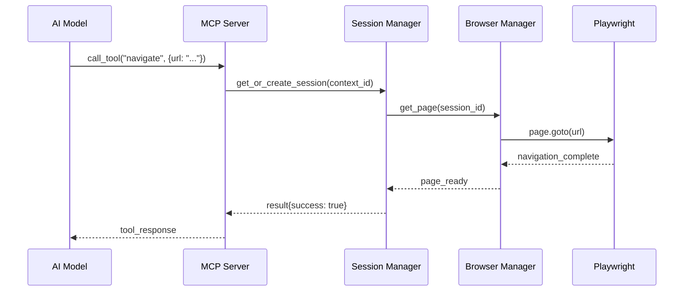
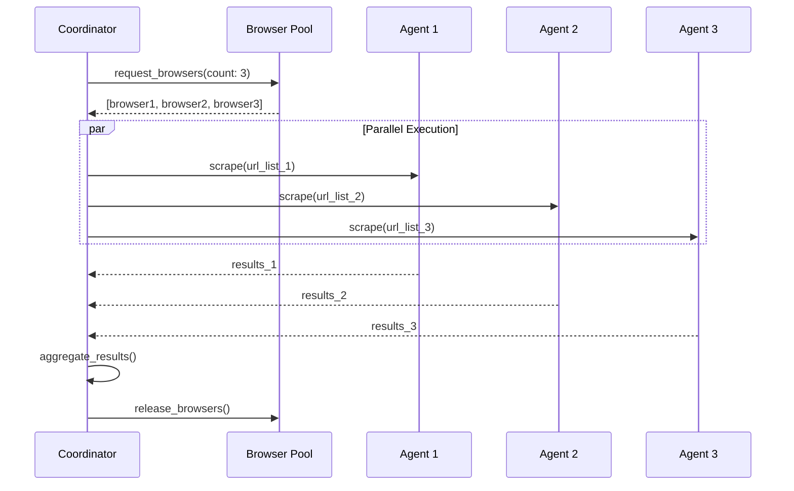
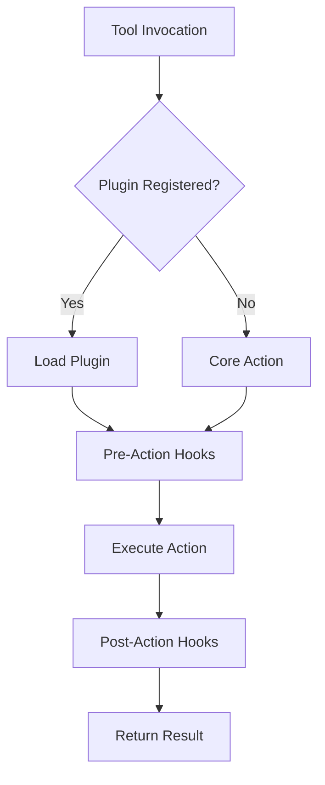

# Playwright-MCP Browser Automation Agent - System Architecture

**Version:** 1.0.0
**Date:** 2025-11-27
**Status:** Proposed

---

## Executive Summary

This document presents a comprehensive, extensible architecture for a Playwright-based browser automation agent integrated with the Model Context Protocol (MCP). The system enables AI models to interact with web browsers through a standardized interface, supporting parallel execution, distributed coordination, and advanced automation capabilities.

### Key Design Goals

1. **Modularity**: Loosely coupled components with clear interfaces
2. **Extensibility**: Plugin-based architecture for custom functionality
3. **Scalability**: Support for parallel browser instances and distributed execution
4. **Reliability**: Robust error handling, retry logic, and session recovery
5. **Performance**: Efficient resource management and connection pooling
6. **Security**: Sandboxed execution, permission controls, and audit logging

---

## 1. High-Level Architecture

### 1.1 System Context Diagram

```
┌─────────────────────────────────────────────────────────────────────┐
│                         External Systems                             │
├─────────────────────────────────────────────────────────────────────┤
│                                                                       │
│  ┌──────────────┐    ┌──────────────┐    ┌──────────────┐          │
│  │   AI Model   │    │  Claude Code │    │   Flow-Nexus │          │
│  │   (Claude)   │    │     CLI      │    │   Platform   │          │
│  └───────┬──────┘    └───────┬──────┘    └───────┬──────┘          │
│          │                   │                    │                  │
└──────────┼───────────────────┼────────────────────┼──────────────────┘
           │                   │                    │
           │ MCP Protocol      │ MCP Protocol       │ API
           │                   │                    │
┌──────────▼───────────────────▼────────────────────▼──────────────────┐
│                    Playwright-MCP Agent                               │
├───────────────────────────────────────────────────────────────────────┤
│                                                                       │
│  ┌────────────────────────────────────────────────────────────┐     │
│  │                  MCP Server Layer                          │     │
│  │  ┌──────────┐  ┌──────────┐  ┌──────────┐  ┌──────────┐  │     │
│  │  │  Tools   │  │Resources │  │ Prompts  │  │Transport │  │     │
│  │  └──────────┘  └──────────┘  └──────────┘  └──────────┘  │     │
│  └────────────────────────────────────────────────────────────┘     │
│                               │                                      │
│  ┌────────────────────────────▼───────────────────────────────┐     │
│  │               Core Orchestration Layer                     │     │
│  │  ┌─────────────┐  ┌──────────────┐  ┌─────────────┐      │     │
│  │  │   Session   │  │   Browser    │  │    Pool     │      │     │
│  │  │   Manager   │  │   Manager    │  │   Manager   │      │     │
│  │  └─────────────┘  └──────────────┘  └─────────────┘      │     │
│  └────────────────────────────────────────────────────────────┘     │
│                               │                                      │
│  ┌────────────────────────────▼───────────────────────────────┐     │
│  │              Execution Engine Layer                        │     │
│  │  ┌──────────┐  ┌──────────┐  ┌──────────┐  ┌──────────┐  │     │
│  │  │   Page   │  │ Element  │  │  Action  │  │   Data   │  │     │
│  │  │Controller│  │ Locator  │  │ Executor │  │Extractor │  │     │
│  │  └──────────┘  └──────────┘  └──────────┘  └──────────┘  │     │
│  └────────────────────────────────────────────────────────────┘     │
│                               │                                      │
│  ┌────────────────────────────▼───────────────────────────────┐     │
│  │            Infrastructure Layer                            │     │
│  │  ┌──────────┐  ┌──────────┐  ┌──────────┐  ┌──────────┐  │     │
│  │  │ Network  │  │  Plugin  │  │  Config  │  │   Event  │  │     │
│  │  │Intercept │  │  System  │  │  Manager │  │   Bus    │  │     │
│  │  └──────────┘  └──────────┘  └──────────┘  └──────────┘  │     │
│  └────────────────────────────────────────────────────────────┘     │
│                                                                       │
└───────────────────────────────┬───────────────────────────────────────┘
                                │
                    ┌───────────▼────────────┐
                    │  Playwright Browser    │
                    │  (Chromium/FF/WebKit)  │
                    └────────────────────────┘
```

### 1.2 Deployment Topology Options

#### Option A: Standalone Local Agent
```
┌──────────────┐
│  Claude CLI  │
│  + MCP Agent │  ← Single machine, local browsers
│  + Browsers  │
└──────────────┘
```

#### Option B: Distributed Agent Pool
```
┌──────────────┐         ┌──────────────┐
│  Claude CLI  │────────▶│  MCP Agent   │
│  (Coordinator)         │  (Primary)   │
└──────────────┘         └──────┬───────┘
                                │
                    ┌───────────┼───────────┐
                    ▼           ▼           ▼
            ┌──────────┐ ┌──────────┐ ┌──────────┐
            │ Worker 1 │ │ Worker 2 │ │ Worker N │
            │+Browsers │ │+Browsers │ │+Browsers │
            └──────────┘ └──────────┘ └──────────┘
```

#### Option C: Cloud-Native with Flow-Nexus
```
┌──────────────┐         ┌──────────────────┐
│  Claude CLI  │────────▶│  Flow-Nexus      │
│  (Client)    │         │  Platform        │
└──────────────┘         └────────┬─────────┘
                                  │
                    ┌─────────────┼─────────────┐
                    ▼             ▼             ▼
            ┌──────────────┐ ┌──────────┐ ┌──────────┐
            │  Sandboxed   │ │  Agent   │ │  Browser │
            │  Execution   │ │  Pool    │ │  Cluster │
            └──────────────┘ └──────────┘ └──────────┘
```

---

## 2. Layer Architecture

### 2.1 MCP Server Layer

**Responsibility**: Expose browser automation capabilities through MCP protocol

**Components**:
- Tool Registry: Manages available MCP tools
- Resource Manager: Handles page/element resources
- Prompt Library: Pre-built automation templates
- Transport Handler: Stdio/HTTP/WebSocket transport

**Key Patterns**:
- Request/Response cycle for tool calls
- Streaming support for long-running operations
- Resource URIs for referencing browser objects
- Notification system for async events

### 2.2 Core Orchestration Layer

**Responsibility**: Manage browser instances, sessions, and resource pools

**Components**:
- Session Manager: Browser context lifecycle
- Browser Manager: Browser instance management
- Pool Manager: Connection and instance pooling
- Coordinator: Multi-agent task distribution

**Key Patterns**:
- Object pooling for performance
- Session isolation for security
- Graceful shutdown and cleanup
- Health monitoring and auto-recovery

### 2.3 Execution Engine Layer

**Responsibility**: Execute browser automation actions

**Components**:
- Page Controller: Navigation and page state
- Element Locator: Smart element finding
- Action Executor: User interactions
- Data Extractor: Content and screenshot capture

**Key Patterns**:
- Strategy pattern for selectors
- Command pattern for actions
- Retry logic with exponential backoff
- Timeout management

### 2.4 Infrastructure Layer

**Responsibility**: Cross-cutting concerns and extensibility

**Components**:
- Network Interceptor: Request/response interception
- Plugin System: Custom action registration
- Config Manager: Runtime configuration
- Event Bus: Internal event communication

**Key Patterns**:
- Plugin architecture for extensibility
- Event-driven communication
- Middleware pipeline
- Dependency injection

---

## 3. Data Flow Architecture

### 3.1 Tool Invocation Flow



### 3.2 Multi-Agent Coordination Flow



### 3.3 Plugin Execution Flow



---

## 4. Technology Stack

### Core Technologies
- **Runtime**: Node.js 20+ (ES modules)
- **Browser Automation**: Playwright 1.40+
- **Protocol**: @modelcontextprotocol/sdk
- **Language**: TypeScript 5.3+

### Supporting Libraries
- **Event Management**: EventEmitter3
- **Configuration**: dotenv, zod (validation)
- **Logging**: winston or pino
- **Testing**: Vitest, Playwright Test
- **Build**: tsup or esbuild

### Optional Integrations
- **Orchestration**: claude-flow (agent coordination)
- **Cloud Execution**: flow-nexus (sandboxed browsers)
- **Monitoring**: OpenTelemetry
- **Storage**: Redis (session state), S3 (screenshots)

---

## 5. Non-Functional Requirements

### 5.1 Performance

| Metric | Target | Rationale |
|--------|--------|-----------|
| Browser Launch | < 2s | Fast startup for interactive use |
| Navigation | < 5s | Reasonable page load timeout |
| Element Lookup | < 1s | Quick interaction response |
| Screenshot | < 500ms | Rapid visual feedback |
| Pool Allocation | < 100ms | Efficient resource management |
| Concurrent Browsers | 10-50 | Parallel scraping capacity |

### 5.2 Reliability

- **Uptime**: 99.9% (excluding external dependencies)
- **Error Recovery**: Automatic retry with exponential backoff
- **Session Recovery**: Resume from last known state
- **Graceful Degradation**: Fallback to simpler strategies

### 5.3 Security

- **Sandboxing**: Isolate browser contexts
- **Permission Model**: Restrict access to sensitive resources
- **Audit Logging**: Track all browser actions
- **Data Protection**: Encrypt stored credentials
- **Network Isolation**: Optional proxy/VPN support

### 5.4 Scalability

- **Vertical**: Support 50+ browsers on single machine
- **Horizontal**: Distribute across worker nodes
- **Resource Limits**: Configurable memory/CPU caps
- **Auto-Scaling**: Dynamic browser pool sizing

---

## 6. Quality Attributes

### Modifiability
- **Plugin System**: Add custom actions without core changes
- **Strategy Pattern**: Swap selector/action implementations
- **Configuration**: Modify behavior via config files

### Testability
- **Unit Tests**: Mock Playwright API
- **Integration Tests**: Real browser instances
- **E2E Tests**: Full MCP protocol flow

### Observability
- **Structured Logging**: JSON logs with correlation IDs
- **Metrics**: Browser usage, success rates, latency
- **Tracing**: Distributed traces for multi-agent flows

---

## 7. Deployment Considerations

### 7.1 Resource Requirements

**Minimum (Development)**:
- 4 CPU cores
- 8GB RAM
- 10GB disk space

**Recommended (Production)**:
- 16+ CPU cores
- 32GB+ RAM
- 100GB+ SSD storage
- Network: 100Mbps+

### 7.2 Browser Installation

- Support for browser installation paths
- Download on first use
- Version pinning for reproducibility
- Multi-browser support (Chromium, Firefox, WebKit)

### 7.3 Environment Variables

```bash
PLAYWRIGHT_MCP_PORT=3000
PLAYWRIGHT_MCP_TRANSPORT=stdio|http
PLAYWRIGHT_MAX_BROWSERS=10
PLAYWRIGHT_HEADLESS=true
PLAYWRIGHT_TIMEOUT=30000
PLAYWRIGHT_SCREENSHOT_PATH=/tmp/screenshots
```

---

## 8. Risk Assessment

| Risk | Impact | Probability | Mitigation |
|------|--------|-------------|------------|
| Browser crashes | High | Medium | Auto-restart, health checks |
| Memory leaks | High | Medium | Resource limits, monitoring |
| Playwright API changes | Medium | Low | Version pinning, adapter pattern |
| MCP protocol evolution | Medium | Medium | Abstraction layer, versioning |
| Security vulnerabilities | High | Low | Sandboxing, security audits |
| Performance degradation | Medium | Medium | Profiling, optimization |

---

## 9. Future Considerations

### Phase 2 Enhancements
- WebSocket transport for real-time updates
- Screenshot diffing for visual testing
- Browser recording and replay
- AI-powered element locators
- Natural language command parsing

### Phase 3 Enhancements
- Multi-browser coordination
- Cross-browser testing
- Mobile device emulation
- Accessibility testing integration
- Performance profiling tools

---

## 10. References

- [Playwright Documentation](https://playwright.dev)
- [Model Context Protocol Specification](https://modelcontextprotocol.io)
- [Claude Flow Orchestration](https://github.com/ruvnet/claude-flow)
- [Architecture Decision Records](./adrs/)

---

**Next Documents**:
- [02-component-specifications.md](./02-component-specifications.md)
- [03-mcp-server-design.md](./03-mcp-server-design.md)
- [04-extensibility-design.md](./04-extensibility-design.md)
