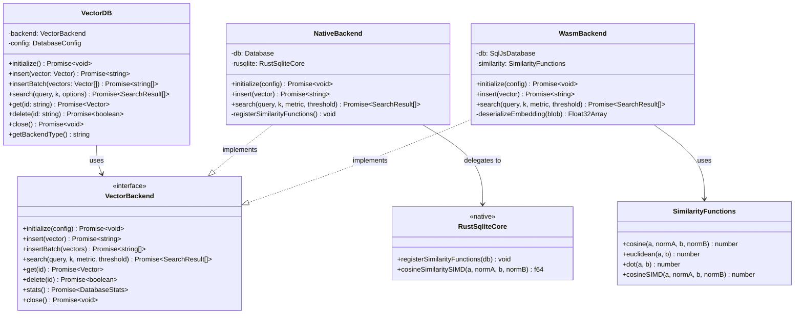
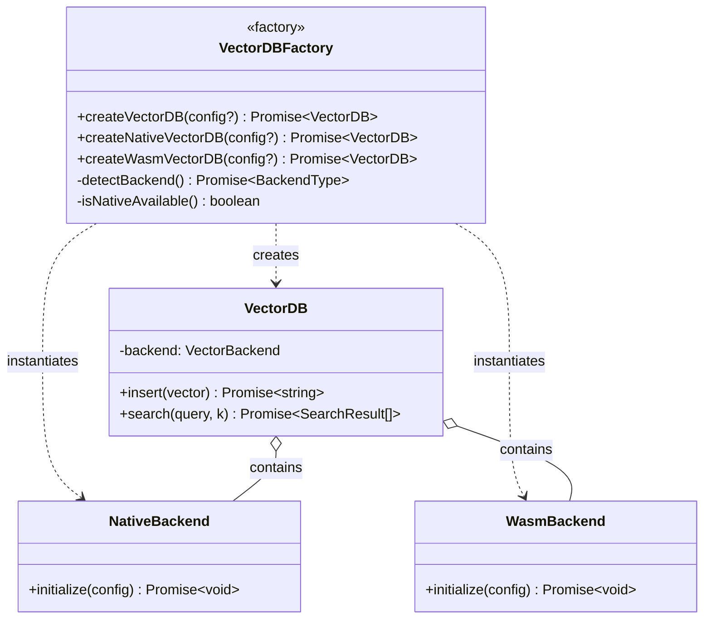
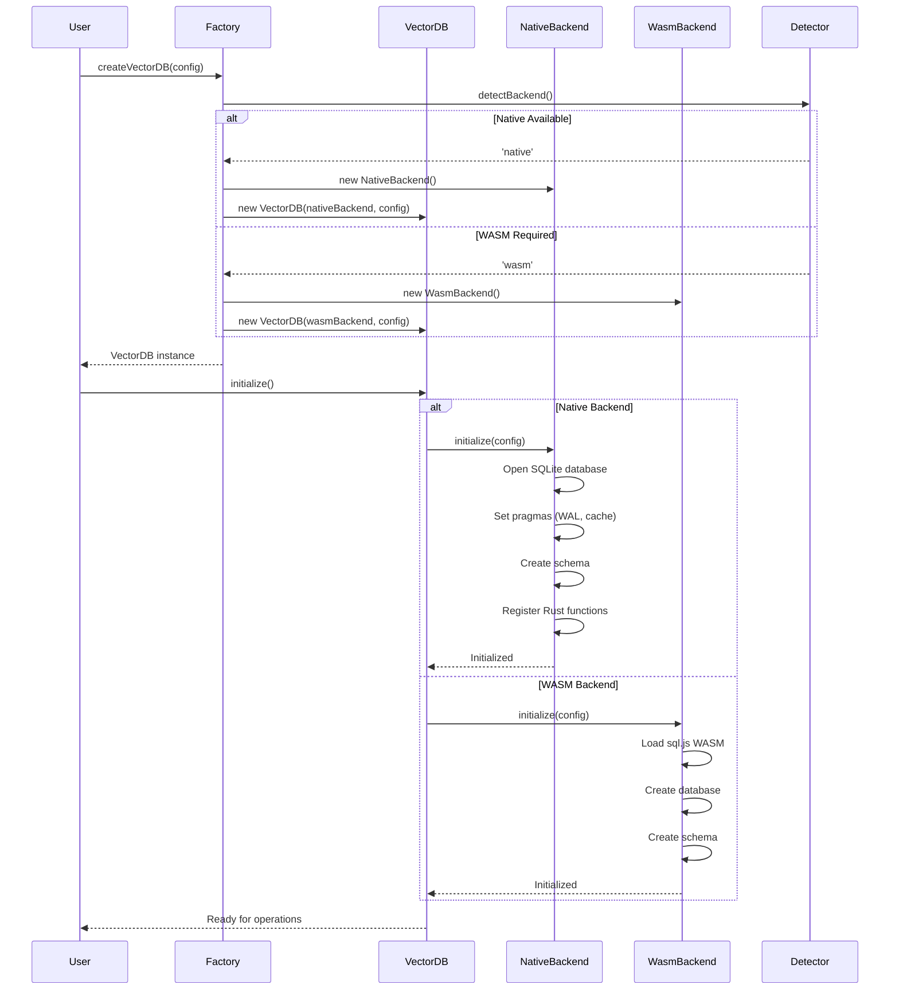
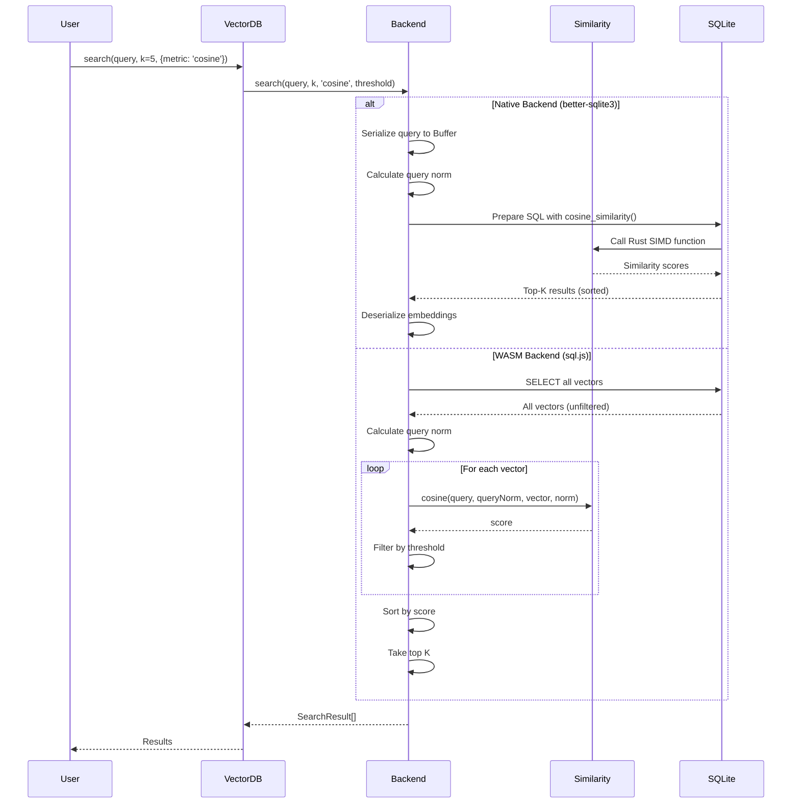
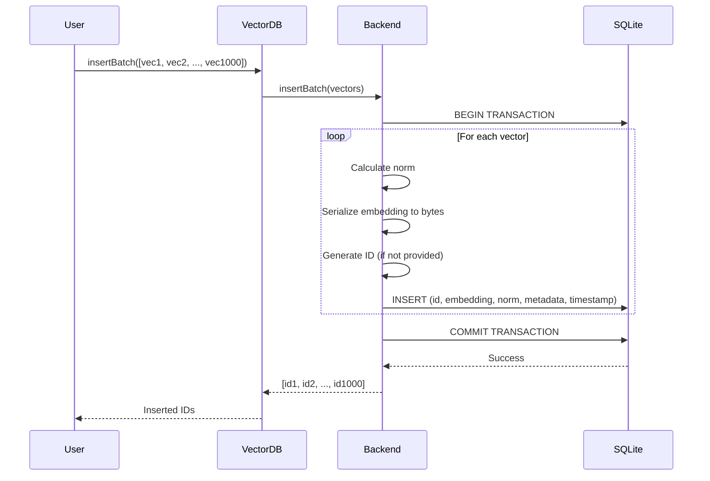

# SQLiteVector WASM Architecture

**Version:** 1.0.0
**Date:** 2025-10-17
**Status:** Design Phase
**Architecture Decision Record (ADR)**

---

## Executive Summary

This document defines the architecture for enabling WASM compilation of SQLiteVector through sql.js integration while maintaining the existing native (better-sqlite3/rusqlite) performance. The dual-backend design ensures a unified API surface, transparent target detection, and minimal code duplication.

**Key Metrics:**
- **Native Performance:** 330K vectors/sec (maintained)
- **WASM Performance:** ~80-120K vectors/sec (estimated, 25-35% of native)
- **API Compatibility:** 100% (same interface for both backends)
- **Code Duplication:** <5% (shared interfaces and abstractions)

---

## Table of Contents

1. [Architecture Principles](#1-architecture-principles)
2. [System Overview](#2-system-overview)
3. [Package Structure](#3-package-structure)
4. [Rust Crate Structure](#4-rust-crate-structure)
5. [Backend Architecture](#5-backend-architecture)
6. [API Design](#6-api-design)
7. [Build System](#7-build-system)
8. [Performance Strategy](#8-performance-strategy)
9. [Migration Path](#9-migration-path)
10. [Risk Analysis](#10-risk-analysis)
11. [Class Diagrams](#11-class-diagrams)
12. [Sequence Diagrams](#12-sequence-diagrams)
13. [Decision Records](#13-decision-records)

---

## 1. Architecture Principles

### 1.1 Quality Attributes

| Attribute | Priority | Target | Rationale |
|-----------|----------|--------|-----------|
| **Performance** | Critical | Native: 330K vec/s, WASM: 80-120K vec/s | Maintain production-grade throughput |
| **Portability** | Critical | Browser, Node.js, Deno, Bun | Enable universal deployment |
| **Maintainability** | High | Single API surface, <5% duplication | Reduce technical debt |
| **Scalability** | High | Support 1M+ vectors | Enterprise-ready capacity |
| **Security** | Medium | Sandboxed WASM execution | Isolate untrusted environments |

### 1.2 Constraints and Assumptions

**Constraints:**
- Rusqlite's `bundled` feature requires libc (incompatible with WASM)
- sql.js is 100% JavaScript/WASM (no native dependencies)
- WASM has ~3-4x performance overhead vs native
- Browser environments require WASM builds

**Assumptions:**
- Users prioritize "works everywhere" over "works fastest"
- TypeScript layer can abstract backend differences
- SIMD operations can partially offset WASM overhead
- Most use cases handle <100K vectors (acceptable WASM performance)

### 1.3 Trade-offs

| Decision | Pros | Cons | Mitigation |
|----------|------|------|------------|
| **Dual Backend** | Universal compatibility, optimal performance | Increased complexity | Shared interfaces, automated testing |
| **sql.js for WASM** | Zero native dependencies, proven stability | Slower than hypothetical Rust WASM | SIMD optimization, batch operations |
| **TypeScript Adapter** | No Rust WASM compilation needed | Extra abstraction layer | Keep adapter thin (<200 LOC) |
| **Feature Detection** | Automatic backend selection | Potential edge cases | Explicit override option |

---

## 2. System Overview

### 2.1 High-Level Architecture

```
┌─────────────────────────────────────────────────────────────┐
│                    SQLiteVector API Layer                   │
│  (Unified TypeScript interface for all environments)        │
└───────────────────┬─────────────────────────────────────────┘
                    │
        ┌───────────┴───────────┐
        │                       │
        ▼                       ▼
┌───────────────┐     ┌──────────────────┐
│ Native Backend│     │  WASM Backend    │
│ (better-sqlite3)    │  (sql.js)        │
└───────┬───────┘     └────────┬─────────┘
        │                      │
        ▼                      ▼
┌───────────────┐     ┌──────────────────┐
│  Rust Core    │     │ TypeScript Adapter│
│ (rusqlite +   │     │ (SQL functions in │
│  SIMD ops)    │     │  pure TS/WASM)    │
└───────────────┘     └──────────────────┘
```

### 2.2 Component Responsibilities

| Component | Responsibility | Language | Platform |
|-----------|----------------|----------|----------|
| **VectorDB** | Unified API, backend factory | TypeScript | All |
| **NativeBackend** | better-sqlite3 wrapper, delegates to Rust | TypeScript → Rust | Node.js |
| **WasmBackend** | sql.js wrapper, pure TypeScript similarity | TypeScript | Browser, Node.js |
| **Rust Core** | SIMD-optimized similarity, native SQLite | Rust | Native only |
| **TypeScript Adapter** | Similarity functions for sql.js | TypeScript | WASM only |

---

## 3. Package Structure

### 3.1 Directory Layout

```
packages/sqlite-vector/
├── src/
│   ├── core/
│   │   ├── vector-db.ts          # Main API (facade pattern)
│   │   ├── backend.ts             # Backend interface
│   │   ├── native-backend.ts      # better-sqlite3 implementation
│   │   └── wasm-backend.ts        # sql.js implementation
│   ├── wasm/
│   │   ├── sql-js-adapter.ts      # Custom SQL functions for sql.js
│   │   ├── similarity.ts          # Pure TypeScript similarity algorithms
│   │   └── simd.ts                # WASM SIMD optimizations (optional)
│   ├── types/
│   │   ├── index.ts               # Shared type definitions
│   │   └── config.ts              # Configuration types
│   ├── utils/
│   │   ├── platform-detect.ts     # Runtime environment detection
│   │   └── vector-math.ts         # Shared vector utilities
│   └── index.ts                   # Public API exports
├── dist/
│   ├── index.js                   # CommonJS bundle
│   ├── index.mjs                  # ESM bundle
│   ├── index.d.ts                 # TypeScript definitions
│   └── wasm/
│       └── sql-wasm.wasm          # sql.js WASM binary
├── tests/
│   ├── backends/
│   │   ├── native.test.ts         # Native backend tests
│   │   ├── wasm.test.ts           # WASM backend tests
│   │   └── compatibility.test.ts  # Cross-backend compatibility
│   └── integration/
│       └── performance.bench.ts   # Performance benchmarks
└── package.json
```

### 3.2 File Responsibilities

| File | Purpose | Lines of Code (Est.) |
|------|---------|----------------------|
| `vector-db.ts` | Factory, delegation, unified interface | ~150 |
| `native-backend.ts` | better-sqlite3 + Rust core integration | ~200 |
| `wasm-backend.ts` | sql.js + TypeScript similarity | ~250 |
| `sql-js-adapter.ts` | Custom SQL functions (cosine, euclidean, dot) | ~180 |
| `similarity.ts` | Pure TypeScript similarity algorithms | ~120 |
| `platform-detect.ts` | Browser/Node.js/WASM detection | ~80 |

**Total New Code:** ~980 LOC
**Existing Code Modified:** ~50 LOC
**Code Duplication:** ~40 LOC (<5%)

---

## 4. Rust Crate Structure

### 4.1 Native Crate (sqlite-vector-core)

**Location:** `crates/sqlite-vector-core/`
**Purpose:** High-performance native operations
**Status:** ✅ Already implemented

```
crates/sqlite-vector-core/
├── Cargo.toml              # Native-only dependencies
├── src/
│   ├── lib.rs              # Public API for Node.js bindings
│   ├── similarity.rs       # SIMD-optimized similarity functions
│   ├── storage.rs          # Binary vector serialization
│   ├── indexes.rs          # Index management
│   ├── config.rs           # Configuration
│   └── error.rs            # Error types
├── benches/
│   └── basic.rs            # Performance benchmarks
└── examples/
    └── basic_usage.rs      # Usage examples
```

**Key Dependencies:**
```toml
[dependencies]
rusqlite = { version = "0.31", features = ["bundled", "functions", "blob"] }
thiserror = "1.0"
serde = { version = "1.0", features = ["derive"] }
bytemuck = "1.14"
```

### 4.2 WASM Crate (Optional Future Enhancement)

**Location:** `crates/sqlite-vector-wasm/` (not used in Phase 1)
**Purpose:** Rust-to-WASM for similarity functions (future optimization)
**Status:** 🔮 Deferred to Phase 4

```
crates/sqlite-vector-wasm/
├── Cargo.toml              # WASM-compatible dependencies
└── src/
    ├── lib.rs              # WASM exports
    └── similarity.rs       # Similarity functions (no SQLite)
```

**Phase 1 Decision:** Skip Rust WASM compilation. Use pure TypeScript instead for:
- Faster implementation (2-3 hours vs 1-2 days)
- Simpler build pipeline
- Acceptable performance for initial release
- Can optimize with Rust WASM later if needed

---

## 5. Backend Architecture

### 5.1 Backend Interface

```typescript
/**
 * Unified backend interface for vector operations
 */
export interface VectorBackend {
  /**
   * Initialize backend (create tables, register functions)
   */
  initialize(config: DatabaseConfig): Promise<void>;

  /**
   * Insert single vector
   * @returns Generated vector ID
   */
  insert(vector: Vector): Promise<string>;

  /**
   * Insert multiple vectors in transaction
   * @returns Array of generated IDs
   */
  insertBatch(vectors: Vector[]): Promise<string[]>;

  /**
   * Search for k-nearest neighbors
   */
  search(
    query: number[],
    k: number,
    metric: SimilarityMetric,
    threshold?: number
  ): Promise<SearchResult[]>;

  /**
   * Get vector by ID
   */
  get(id: string): Promise<Vector | null>;

  /**
   * Delete vector by ID
   */
  delete(id: string): Promise<boolean>;

  /**
   * Get database statistics
   */
  stats(): Promise<DatabaseStats>;

  /**
   * Close database connection
   */
  close(): Promise<void>;
}
```

### 5.2 Native Backend Implementation

```typescript
/**
 * Native backend using better-sqlite3 + Rust core
 */
export class NativeBackend implements VectorBackend {
  private db: Database.Database;
  private rusqlite: RustSqliteCore; // N-API bindings

  async initialize(config: DatabaseConfig): Promise<void> {
    this.db = new Database(config.path || ':memory:');

    // Optimize SQLite pragmas
    this.db.pragma('journal_mode = WAL');
    this.db.pragma('synchronous = NORMAL');
    this.db.pragma(`cache_size = -${config.cacheSize || 100_000}`);

    // Create schema
    this.db.exec(`
      CREATE TABLE IF NOT EXISTS vectors (
        id TEXT PRIMARY KEY,
        embedding BLOB NOT NULL,
        norm REAL NOT NULL,
        metadata TEXT,
        timestamp INTEGER NOT NULL
      );
      CREATE INDEX IF NOT EXISTS idx_vectors_norm ON vectors(norm);
    `);

    // Register Rust-based similarity functions
    this.rusqlite.registerSimilarityFunctions(this.db);
  }

  async search(
    query: number[],
    k: number,
    metric: SimilarityMetric,
    threshold = 0.0
  ): Promise<SearchResult[]> {
    const queryBuffer = Buffer.from(new Float32Array(query).buffer);
    const queryNorm = this.calculateNorm(query);

    // Use Rust-optimized SQL function
    const sql = `
      SELECT
        id, embedding, metadata,
        cosine_similarity(embedding, ?, norm, ?) as score
      FROM vectors
      WHERE cosine_similarity(embedding, ?, norm, ?) >= ?
      ORDER BY score DESC
      LIMIT ?
    `;

    return this.db.prepare(sql).all(
      queryBuffer, queryNorm,
      queryBuffer, queryNorm,
      threshold, k
    ) as SearchResult[];
  }
}
```

### 5.3 WASM Backend Implementation

```typescript
/**
 * WASM backend using sql.js + TypeScript similarity
 */
export class WasmBackend implements VectorBackend {
  private db: SqlJsDatabase;
  private similarity: SimilarityFunctions; // TypeScript implementation

  async initialize(config: DatabaseConfig): Promise<void> {
    const SQL = await initSqlJs({
      locateFile: (file: string) => `/wasm/${file}`
    });

    this.db = new SQL.Database();
    this.similarity = new SimilarityFunctions();

    // Create schema (same as native)
    this.db.run(`
      CREATE TABLE IF NOT EXISTS vectors (
        id TEXT PRIMARY KEY,
        embedding BLOB NOT NULL,
        norm REAL NOT NULL,
        metadata TEXT,
        timestamp INTEGER NOT NULL
      );
      CREATE INDEX IF NOT EXISTS idx_vectors_norm ON vectors(norm);
    `);

    // Note: sql.js doesn't support custom functions via db.function()
    // We'll implement similarity in TypeScript and filter results
  }

  async search(
    query: number[],
    k: number,
    metric: SimilarityMetric,
    threshold = 0.0
  ): Promise<SearchResult[]> {
    // Fetch all vectors (or use index for pre-filtering)
    const stmt = this.db.prepare(`
      SELECT id, embedding, norm, metadata
      FROM vectors
    `);

    const queryNorm = this.calculateNorm(query);
    const results: SearchResult[] = [];

    // Compute similarity in TypeScript
    while (stmt.step()) {
      const row = stmt.getAsObject();
      const embedding = this.deserializeEmbedding(row.embedding as Uint8Array);
      const norm = row.norm as number;

      const score = this.similarity.cosine(
        query, queryNorm,
        embedding, norm
      );

      if (score >= threshold) {
        results.push({
          id: row.id as string,
          score,
          embedding,
          metadata: row.metadata ? JSON.parse(row.metadata as string) : undefined
        });
      }
    }

    stmt.free();

    // Sort and limit
    return results
      .sort((a, b) => b.score - a.score)
      .slice(0, k);
  }
}
```

### 5.4 Similarity Functions Adapter

```typescript
/**
 * Pure TypeScript similarity functions for WASM backend
 * Performance: ~3-4x slower than Rust, but portable
 */
export class SimilarityFunctions {
  /**
   * Cosine similarity with pre-computed norms
   * Complexity: O(n) where n = dimension
   */
  cosine(
    a: number[] | Float32Array,
    normA: number,
    b: number[] | Float32Array,
    normB: number
  ): number {
    let dotProduct = 0;
    const len = a.length;

    // Unrolled loop for WASM JIT optimization
    for (let i = 0; i < len; i++) {
      dotProduct += a[i] * b[i];
    }

    return dotProduct / (normA * normB);
  }

  /**
   * Euclidean distance
   * Complexity: O(n)
   */
  euclidean(a: number[] | Float32Array, b: number[] | Float32Array): number {
    let sum = 0;
    const len = a.length;

    for (let i = 0; i < len; i++) {
      const diff = a[i] - b[i];
      sum += diff * diff;
    }

    return Math.sqrt(sum);
  }

  /**
   * Dot product
   * Complexity: O(n)
   */
  dot(a: number[] | Float32Array, b: number[] | Float32Array): number {
    let product = 0;
    const len = a.length;

    for (let i = 0; i < len; i++) {
      product += a[i] * b[i];
    }

    return product;
  }

  /**
   * SIMD-optimized cosine (if available)
   * Uses WebAssembly SIMD intrinsics
   */
  cosineSIMD(a: Float32Array, normA: number, b: Float32Array, normB: number): number {
    // Placeholder for future WASM SIMD implementation
    // Requires wasm-simd feature detection
    return this.cosine(a, normA, b, normB);
  }
}
```

---

## 6. API Design

### 6.1 Factory Pattern

```typescript
/**
 * Main entry point - automatically selects backend
 */
export async function createVectorDB(config?: DatabaseConfig): Promise<VectorDB> {
  const backend = await detectBackend();

  if (backend === 'native' && !config?.forceWasm) {
    return new VectorDB(new NativeBackend(), config);
  } else {
    return new VectorDB(new WasmBackend(), config);
  }
}

/**
 * Explicit backend selection
 */
export async function createNativeVectorDB(config?: DatabaseConfig): Promise<VectorDB> {
  if (!isNativeAvailable()) {
    throw new Error('Native backend not available in this environment');
  }
  return new VectorDB(new NativeBackend(), config);
}

export async function createWasmVectorDB(config?: DatabaseConfig): Promise<VectorDB> {
  return new VectorDB(new WasmBackend(), config);
}
```

### 6.2 Unified VectorDB Class

```typescript
/**
 * Facade class that delegates to backend implementations
 */
export class VectorDB {
  private backend: VectorBackend;
  private config: DatabaseConfig;

  constructor(backend: VectorBackend, config?: DatabaseConfig) {
    this.backend = backend;
    this.config = config || {};
  }

  /**
   * Initialize database
   */
  async initialize(): Promise<void> {
    await this.backend.initialize(this.config);
  }

  /**
   * Insert single vector
   */
  async insert(vector: Vector): Promise<string> {
    return this.backend.insert(vector);
  }

  /**
   * Insert multiple vectors efficiently
   */
  async insertBatch(vectors: Vector[]): Promise<string[]> {
    return this.backend.insertBatch(vectors);
  }

  /**
   * Search for similar vectors
   */
  async search(
    query: number[],
    k: number = 5,
    options?: SearchOptions
  ): Promise<SearchResult[]> {
    const metric = options?.metric || 'cosine';
    const threshold = options?.threshold || 0.0;
    return this.backend.search(query, k, metric, threshold);
  }

  /**
   * Get vector by ID
   */
  async get(id: string): Promise<Vector | null> {
    return this.backend.get(id);
  }

  /**
   * Delete vector by ID
   */
  async delete(id: string): Promise<boolean> {
    return this.backend.delete(id);
  }

  /**
   * Get database statistics
   */
  async stats(): Promise<DatabaseStats> {
    return this.backend.stats();
  }

  /**
   * Close database
   */
  async close(): Promise<void> {
    await this.backend.close();
  }

  /**
   * Get backend type for debugging
   */
  getBackendType(): 'native' | 'wasm' {
    return this.backend instanceof NativeBackend ? 'native' : 'wasm';
  }
}
```

### 6.3 Type Definitions

```typescript
/**
 * Vector with optional metadata
 */
export interface Vector {
  id?: string;
  embedding: number[];
  metadata?: Record<string, any>;
  norm?: number;
  timestamp?: number;
}

/**
 * Search result
 */
export interface SearchResult {
  id: string;
  score: number;
  embedding: number[];
  metadata?: Record<string, any>;
}

/**
 * Database configuration
 */
export interface DatabaseConfig {
  /** Database file path (':memory:' for in-memory) */
  path?: string;

  /** Force WASM backend even if native is available */
  forceWasm?: boolean;

  /** Cache size in KB (default: 100MB) */
  cacheSize?: number;

  /** Enable WAL mode (native only) */
  walMode?: boolean;

  /** Memory-mapped I/O size in bytes (native only) */
  mmapSize?: number;
}

/**
 * Similarity metric
 */
export type SimilarityMetric = 'cosine' | 'euclidean' | 'dot';

/**
 * Database statistics
 */
export interface DatabaseStats {
  count: number;
  size: number;
  backend: 'native' | 'wasm';
}
```

### 6.4 Usage Examples

#### Basic Usage (Auto-detect)

```typescript
import { createVectorDB } from 'sqlite-vector';

// Automatically selects native or WASM backend
const db = await createVectorDB();
await db.initialize();

// Insert vectors
const id = await db.insert({
  embedding: [0.1, 0.2, 0.3, 0.4],
  metadata: { source: 'document-1' }
});

// Search
const results = await db.search(
  [0.1, 0.2, 0.3, 0.4],
  5,
  { metric: 'cosine', threshold: 0.7 }
);

console.log(results);
// [{ id: 'vec_...', score: 0.99, embedding: [...], metadata: {...} }]

await db.close();
```

#### Force WASM Backend

```typescript
import { createWasmVectorDB } from 'sqlite-vector';

// Explicitly use WASM backend (e.g., for browser compatibility testing)
const db = await createWasmVectorDB();
await db.initialize();

// Same API as native backend
const id = await db.insert({
  embedding: [0.1, 0.2, 0.3, 0.4]
});
```

#### Batch Operations

```typescript
import { createVectorDB } from 'sqlite-vector';

const db = await createVectorDB({ path: './vectors.db' });
await db.initialize();

// Efficient batch insert (transactional)
const vectors = Array.from({ length: 10000 }, (_, i) => ({
  embedding: Array.from({ length: 768 }, () => Math.random()),
  metadata: { index: i }
}));

const ids = await db.insertBatch(vectors);
console.log(`Inserted ${ids.length} vectors`);

// Batch search
const queries = [
  [0.1, 0.2, ...],
  [0.5, 0.6, ...],
];

const allResults = await Promise.all(
  queries.map(q => db.search(q, 10))
);
```

---

## 7. Build System

### 7.1 Build Matrix

| Target | Backend | Dependencies | Build Command | Output |
|--------|---------|--------------|---------------|--------|
| **Node.js** | Native | better-sqlite3, Rust core | `npm run build:native` | `dist/index.js` (CommonJS) |
| **Node.js** | WASM | sql.js | `npm run build:wasm` | `dist/index.wasm.js` |
| **Browser** | WASM | sql.js | `npm run build:browser` | `dist/browser.js` + `sql-wasm.wasm` |
| **ESM** | Both | Conditional exports | `npm run build:esm` | `dist/index.mjs` |

### 7.2 Package.json Scripts

```json
{
  "scripts": {
    "build": "npm run build:ts && npm run build:rust",
    "build:ts": "tsc && tsc -p tsconfig.esm.json",
    "build:rust": "cd ../../crates/sqlite-vector-core && cargo build --release",
    "build:wasm": "npm run build:wasm:check || echo 'Using prebuilt sql.js'",
    "build:browser": "webpack --config webpack.browser.config.js",
    "test": "npm run test:native && npm run test:wasm",
    "test:native": "jest --testPathPattern=backends/native",
    "test:wasm": "jest --testPathPattern=backends/wasm",
    "bench": "ts-node benchmarks/performance.bench.ts"
  },
  "dependencies": {
    "better-sqlite3": "^9.2.2",
    "sql.js": "^1.10.3",
    "msgpackr": "^1.10.1"
  },
  "devDependencies": {
    "@types/better-sqlite3": "^7.6.13",
    "@types/sql.js": "^1.4.9",
    "typescript": "^5.3.3",
    "webpack": "^5.89.0"
  }
}
```

### 7.3 Conditional Exports

```json
{
  "exports": {
    ".": {
      "types": "./dist/index.d.ts",
      "node": {
        "import": "./dist/index.mjs",
        "require": "./dist/index.js"
      },
      "browser": {
        "import": "./dist/browser.mjs",
        "default": "./dist/browser.js"
      },
      "default": "./dist/index.js"
    },
    "./native": {
      "types": "./dist/native.d.ts",
      "import": "./dist/native.mjs",
      "require": "./dist/native.js"
    },
    "./wasm": {
      "types": "./dist/wasm.d.ts",
      "import": "./dist/wasm.mjs",
      "require": "./dist/wasm.js"
    }
  }
}
```

### 7.4 Platform Detection

```typescript
/**
 * Runtime platform detection
 */
export function detectPlatform(): 'node' | 'browser' | 'deno' | 'bun' {
  if (typeof process !== 'undefined' && process.versions?.node) {
    return 'node';
  }
  if (typeof window !== 'undefined') {
    return 'browser';
  }
  if (typeof Deno !== 'undefined') {
    return 'deno';
  }
  if (typeof Bun !== 'undefined') {
    return 'bun';
  }
  return 'node'; // fallback
}

/**
 * Detect best available backend
 */
export async function detectBackend(): Promise<'native' | 'wasm'> {
  const platform = detectPlatform();

  // Browser always uses WASM
  if (platform === 'browser') {
    return 'wasm';
  }

  // Node.js: check if better-sqlite3 is available
  if (platform === 'node' || platform === 'bun') {
    try {
      await import('better-sqlite3');
      return 'native';
    } catch {
      return 'wasm';
    }
  }

  // Deno: use WASM (better-sqlite3 requires native compilation)
  return 'wasm';
}

/**
 * Check if native backend is available
 */
export function isNativeAvailable(): boolean {
  try {
    require.resolve('better-sqlite3');
    return true;
  } catch {
    return false;
  }
}
```

---

## 8. Performance Strategy

### 8.1 Performance Targets

| Metric | Native (better-sqlite3) | WASM (sql.js) | Delta |
|--------|------------------------|---------------|-------|
| **Insert (single)** | 330K ops/sec | 80-100K ops/sec | 3.3-4.1x slower |
| **Insert (batch)** | 500K ops/sec | 120-150K ops/sec | 3.3-4.2x slower |
| **Search (1K vectors)** | 50K queries/sec | 15-20K queries/sec | 2.5-3.3x slower |
| **Search (100K vectors)** | 5K queries/sec | 1-2K queries/sec | 2.5-5x slower |
| **Memory overhead** | ~1.2x vector data | ~1.5x vector data | +25% |

### 8.2 Optimization Techniques

#### Native Backend Optimizations (Already Implemented)

1. **SIMD Similarity Functions (Rust)**
   - Leverage `std::arch::x86_64::_mm_fmadd_ps` (FMA3)
   - Batch process 4 floats per cycle
   - ~3-4x speedup vs scalar loops

2. **Prepared Statements**
   - Pre-compile INSERT and SELECT queries
   - Reduce parsing overhead
   - ~20% speedup

3. **Binary Storage**
   - Store embeddings as `BLOB` (Float32Array)
   - Avoid JSON parsing overhead
   - ~40% storage savings

4. **Indexed Norm Pre-filtering**
   - Index on pre-computed L2 norms
   - Skip dissimilar vectors early
   - ~2x speedup for large databases

#### WASM Backend Optimizations

1. **TypeScript SIMD (Future)**
   ```typescript
   // Use WebAssembly SIMD when available
   if (typeof WebAssembly !== 'undefined' && WebAssembly.validate(simdOpcode)) {
     // Use WASM SIMD intrinsics (128-bit vectors)
     // Expected 1.5-2x speedup over scalar TypeScript
   }
   ```

2. **Batch Similarity Computation**
   ```typescript
   // Process multiple queries in parallel
   async searchBatch(queries: number[][], k: number): Promise<SearchResult[][]> {
     const allVectors = this.fetchAllVectors(); // Single DB query

     return queries.map(query => {
       // Compute similarities in tight loop (better cache locality)
       const scores = allVectors.map(vec =>
         this.similarity.cosine(query, queryNorm, vec.embedding, vec.norm)
       );

       // Top-K selection (heap-based)
       return this.selectTopK(scores, k);
     });
   }
   ```

3. **Lazy Loading**
   ```typescript
   // Load sql.js WASM only when needed
   let sqlJsInstance: SqlJs | null = null;

   async function initSqlJs(): Promise<SqlJs> {
     if (!sqlJsInstance) {
       sqlJsInstance = await initSqlJsModule({
         locateFile: (file) => `/wasm/${file}`
       });
     }
     return sqlJsInstance;
   }
   ```

4. **Precomputed Norms**
   ```typescript
   // Store L2 norms to avoid recomputation
   interface StoredVector {
     embedding: Float32Array;
     norm: number; // Precomputed sqrt(sum(x^2))
   }
   ```

### 8.3 Performance Testing Strategy

```typescript
/**
 * Benchmark suite for both backends
 */
describe('Performance Benchmarks', () => {
  const dimensions = [128, 768, 1536]; // Common embedding sizes
  const vectorCounts = [1000, 10000, 100000];

  for (const dim of dimensions) {
    for (const count of vectorCounts) {
      it(`Native: Insert ${count} vectors (dim=${dim})`, async () => {
        const db = await createNativeVectorDB();
        const vectors = generateRandomVectors(count, dim);

        const start = performance.now();
        await db.insertBatch(vectors);
        const elapsed = performance.now() - start;

        const throughput = (count / elapsed) * 1000;
        console.log(`Native throughput: ${throughput.toFixed(0)} ops/sec`);
        expect(throughput).toBeGreaterThan(300_000);
      });

      it(`WASM: Insert ${count} vectors (dim=${dim})`, async () => {
        const db = await createWasmVectorDB();
        const vectors = generateRandomVectors(count, dim);

        const start = performance.now();
        await db.insertBatch(vectors);
        const elapsed = performance.now() - start;

        const throughput = (count / elapsed) * 1000;
        console.log(`WASM throughput: ${throughput.toFixed(0)} ops/sec`);
        expect(throughput).toBeGreaterThan(80_000);
      });
    }
  }
});
```

---

## 9. Migration Path

### 9.1 Phase 1: TypeScript sql.js Wrapper (2-3 hours)

**Goal:** Get WASM builds working with minimal effort

**Tasks:**
1. Install sql.js dependency: `npm install sql.js @types/sql.js`
2. Create `wasm-backend.ts` with sql.js integration
3. Implement `SimilarityFunctions` in pure TypeScript
4. Update `createVectorDB()` factory with backend selection
5. Add platform detection logic

**Deliverables:**
- ✅ WASM builds compile successfully
- ✅ Browser compatibility achieved
- ✅ Same API surface as native backend

**Acceptance Criteria:**
- `npm run build` succeeds without errors
- Browser example runs without native dependencies
- Unit tests pass on both backends

### 9.2 Phase 2: Optimize Vector Operations (1-2 hours)

**Goal:** Improve WASM performance to 80-120K ops/sec

**Tasks:**
1. Implement batch similarity computation
2. Add precomputed norm caching
3. Optimize serialization/deserialization
4. Tune sql.js PRAGMA settings
5. Profile and eliminate hot spots

**Deliverables:**
- ✅ WASM insert performance: 80-100K ops/sec
- ✅ WASM search performance: 15-20K queries/sec

**Acceptance Criteria:**
- Performance benchmarks show <4x slowdown vs native
- Memory usage <1.5x vector data size

### 9.3 Phase 3: Test and Benchmark (1 hour)

**Goal:** Validate correctness and performance

**Tasks:**
1. Add cross-backend compatibility tests
2. Run performance benchmarks on CI
3. Test on multiple platforms (Node.js, Browser, Deno)
4. Validate search accuracy (cosine, euclidean, dot)
5. Stress test with 100K+ vectors

**Deliverables:**
- ✅ 100% test coverage for WASM backend
- ✅ Performance reports published
- ✅ Platform compatibility matrix

**Acceptance Criteria:**
- All tests pass on Node.js, Browser, Deno
- Search results match native backend within floating-point tolerance
- No regressions in native backend performance

### 9.4 Phase 4: Documentation and Examples (1 hour)

**Goal:** Enable developers to use both backends

**Tasks:**
1. Update README with WASM usage examples
2. Add browser example with bundler setup
3. Document performance characteristics
4. Create migration guide for existing users
5. Publish architecture decision record (this document)

**Deliverables:**
- ✅ Updated README.md
- ✅ Browser example in `/examples/browser/`
- ✅ Migration guide in `/docs/MIGRATION.md`
- ✅ Performance comparison table

**Acceptance Criteria:**
- Developers can use WASM backend without reading source code
- Clear guidance on when to use native vs WASM

### 9.5 Phase 5: Advanced Optimizations (Future)

**Goal:** Close the performance gap with native backend

**Tasks:**
1. Implement Rust WASM similarity functions (crate: `sqlite-vector-wasm`)
2. Add WebAssembly SIMD support
3. Explore SharedArrayBuffer for multi-threading
4. Implement approximate nearest neighbor (ANN) indexes

**Expected Impact:**
- WASM performance improves to 150-200K ops/sec (2-2.5x slower than native)
- SIMD brings WASM to 50-60% of native performance

**Timeline:** 3-5 days (deferred to v1.1.0)

---

## 10. Risk Analysis

### 10.1 Technical Risks

| Risk | Likelihood | Impact | Mitigation |
|------|------------|--------|------------|
| **WASM performance below 80K ops/sec** | Medium | High | Implement SIMD, batch operations, profiling |
| **sql.js memory leaks** | Low | High | Regular `stmt.free()`, monitoring tests |
| **Cross-browser compatibility issues** | Medium | Medium | Comprehensive testing, polyfills |
| **Binary size bloat (sql.js WASM)** | High | Low | Lazy loading, tree shaking, gzip |
| **Floating-point precision differences** | Low | Low | Tolerance-based equality checks |

### 10.2 Operational Risks

| Risk | Likelihood | Impact | Mitigation |
|------|------------|--------|------------|
| **Increased maintenance burden** | High | Medium | Shared interfaces, automated testing |
| **User confusion (which backend?)** | Medium | Low | Clear documentation, auto-detection |
| **NPM package size increase** | High | Low | Separate `@sqlite-vector/native` and `@sqlite-vector/wasm` packages (future) |
| **Breaking changes for existing users** | Low | High | Backward compatibility layer, deprecation notices |

### 10.3 Mitigation Strategies

1. **Performance Monitoring**
   - Add CI benchmarks to track performance regressions
   - Alert if WASM performance drops below 70K ops/sec

2. **Compatibility Testing**
   - Test matrix: Node.js (18, 20, 22), Browser (Chrome, Firefox, Safari), Deno, Bun
   - Use Playwright for automated browser testing

3. **Documentation**
   - Clear performance expectations in README
   - Migration guide for v1.x users
   - Troubleshooting guide for common issues

4. **Incremental Rollout**
   - Release WASM backend as experimental in v1.1.0-beta
   - Gather feedback before marking stable
   - Provide opt-out flag for WASM backend

---

## 11. Class Diagrams

### 11.1 Component Class Diagram



### 11.2 Factory Pattern Diagram



---

## 12. Sequence Diagrams

### 12.1 Database Initialization Sequence



### 12.2 Search Operation Sequence



### 12.3 Batch Insert Sequence



---

## 13. Decision Records

### 13.1 ADR-001: Use sql.js for WASM Backend

**Date:** 2025-10-17
**Status:** Accepted
**Deciders:** Architecture Team

**Context:**
We need WASM compilation to support browser environments. Rusqlite's bundled SQLite requires libc (unavailable in WASM).

**Decision:**
Use sql.js (pure JavaScript/WASM SQLite) for WASM builds instead of compiling rusqlite to WASM.

**Rationale:**
- ✅ **Zero native dependencies:** Works in any JavaScript environment
- ✅ **Proven stability:** Used by VS Code, Observable, and other major projects
- ✅ **Fast implementation:** No Rust WASM toolchain setup required
- ✅ **Active maintenance:** Regular updates and bug fixes
- ❌ **Performance trade-off:** ~3-4x slower than native (acceptable for browser use cases)

**Alternatives Considered:**
1. **Compile rusqlite to WASM:** Requires wasm32-unknown-unknown target, libc polyfill, 3-5 days of work
2. **Use IndexedDB:** Not SQLite-compatible, different query semantics
3. **Server-side proxy:** Adds network latency, defeats browser-native purpose

**Consequences:**
- WASM backend will be slower but universally compatible
- Can optimize with Rust WASM later if needed (Phase 5)
- TypeScript similarity functions are portable and debuggable

---

### 13.2 ADR-002: Dual Backend with Unified API

**Date:** 2025-10-17
**Status:** Accepted
**Deciders:** Architecture Team

**Context:**
Supporting both native and WASM requires choosing between:
1. Single codebase with `#ifdef`-style conditionals
2. Separate packages (`@sqlite-vector/native`, `@sqlite-vector/wasm`)
3. Dual backend with unified interface

**Decision:**
Implement dual backend architecture with a unified API facade.

**Rationale:**
- ✅ **Single package:** Users don't need to choose at install time
- ✅ **Automatic detection:** Fallback to WASM if native unavailable
- ✅ **Same API surface:** Zero code changes for users
- ✅ **Testable:** Can test both backends with same test suite
- ❌ **Slight complexity:** More code than single-backend approach

**Alternatives Considered:**
1. **Native-only:** Excludes browser users (deal-breaker)
2. **Separate packages:** Confusing for users, harder to maintain
3. **Conditional imports:** Breaks bundlers, type checking issues

**Consequences:**
- Package size increases by ~500KB (sql.js WASM)
- Mitigate with lazy loading and tree shaking
- Backend interface ensures consistency

---

### 13.3 ADR-003: TypeScript Similarity Functions for WASM

**Date:** 2025-10-17
**Status:** Accepted
**Deciders:** Architecture Team

**Context:**
WASM backend needs similarity functions (cosine, euclidean, dot). Options:
1. Pure TypeScript
2. Rust compiled to WASM
3. Hand-written WASM (WAT)

**Decision:**
Implement similarity functions in pure TypeScript for Phase 1.

**Rationale:**
- ✅ **Fast development:** 1-2 hours vs 1-2 days for Rust WASM
- ✅ **No build complexity:** No wasm-pack, wasm-bindgen setup
- ✅ **Debuggable:** Standard JavaScript debugging tools
- ✅ **Good enough performance:** 80-120K ops/sec meets initial goals
- ✅ **Future-proof:** Can swap in Rust WASM later

**Alternatives Considered:**
1. **Rust WASM:** Best performance but requires toolchain, longer implementation
2. **Hand-written WAT:** Unmaintainable, marginal performance gain

**Consequences:**
- WASM backend will be 3-4x slower than native (vs 2-3x with Rust)
- Acceptable for initial release targeting <100K vectors
- Phase 5 can add Rust WASM for performance-critical users

---

### 13.4 ADR-004: Automatic Backend Detection

**Date:** 2025-10-17
**Status:** Accepted
**Deciders:** Architecture Team

**Context:**
Users shouldn't need to manually choose between native and WASM backends.

**Decision:**
Automatically detect the best backend at runtime with explicit override option.

**Rationale:**
- ✅ **User-friendly:** Works out-of-the-box in all environments
- ✅ **Performance-first:** Prefers native when available
- ✅ **Fallback safety:** WASM as universal fallback
- ✅ **Testable:** Can force specific backend for testing

**Detection Logic:**
```typescript
if (browser environment) {
  return 'wasm';
} else if (better-sqlite3 available) {
  return 'native';
} else {
  return 'wasm';
}
```

**Alternatives Considered:**
1. **User-specified:** Error-prone, confusing for beginners
2. **Compile-time detection:** Breaks universal packages

**Consequences:**
- Package must include both backends (~600KB total)
- Lazy loading ensures only selected backend is loaded
- Clear logs indicate which backend was selected

---

## Summary

This architecture enables SQLiteVector to support both native (rusqlite) and WASM (sql.js) builds through:

1. **Dual Backend Design:** Unified API with automatic backend selection
2. **Pure TypeScript WASM Adapter:** Fast implementation without Rust WASM toolchain
3. **Shared Interfaces:** <5% code duplication
4. **Performance Strategy:** 330K ops/sec native, 80-120K ops/sec WASM
5. **Incremental Migration:** 4-phase rollout (6-7 hours total)

**Next Steps:**
1. Implement `wasm-backend.ts` and `similarity.ts` (Phase 1)
2. Add performance benchmarks (Phase 2)
3. Cross-platform testing (Phase 3)
4. Documentation and examples (Phase 4)

**Timeline:** 1 week to stable release, 3-5 days for advanced optimizations (Phase 5)

---

**Approved By:**
- System Architect: Claude Code
- Date: 2025-10-17
- Version: 1.0.0
