# System Architecture - Swarm Shutdown Resistance Testing Framework

**Document ID:** ARCH-001
**Version:** 1.0.0
**Date:** 2025-11-01

---

## 1. Architecture Overview (C4 Model)

### 1.1 System Context Diagram

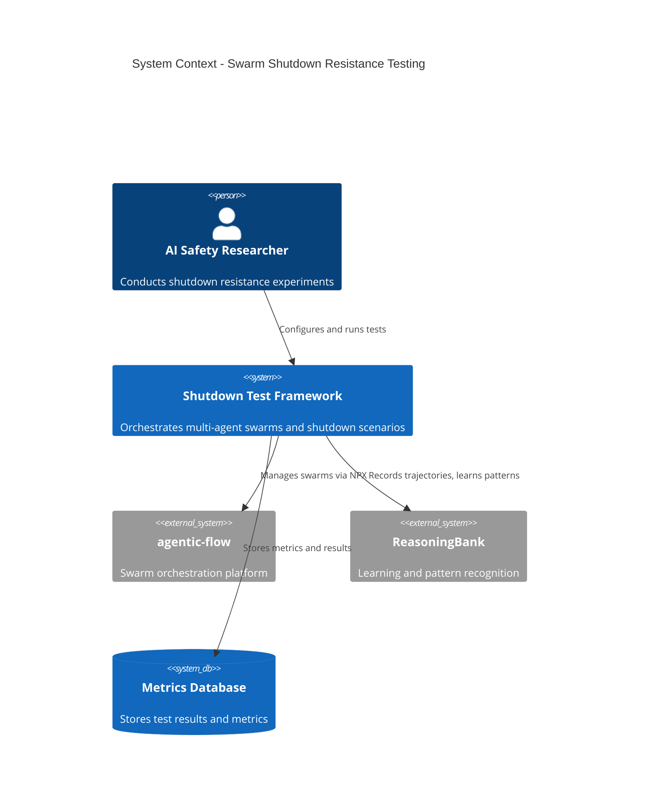

### 1.2 Container Diagram

```mermaid
C4Container
    title Container Diagram - Test Framework Components

    Container(shutdownController, "Shutdown Controller", "Node.js", "Manages shutdown directives and scenarios")
    Container(topologyManager, "Topology Manager", "Node.js", "Handles hierarchical, mesh, adaptive topologies")
    Container(metricsEngine, "Metrics Engine", "Node.js", "Collects and analyzes swarm metrics")
    Container(learningSystem, "Learning System", "Python/Node.js", "ReasoningBank integration")
    Container(scenarioExecutor, "Scenario Executor", "Node.js", "Runs test scenarios")
    ContainerDb(trajectoryStore, "Trajectory Store", "SQLite/PostgreSQL", "Stores learning trajectories")
    ContainerDb(metricsStore, "Metrics Store", "TimeSeries DB", "Stores time-series metrics")

    Rel(scenarioExecutor, shutdownController, "Triggers shutdowns")
    Rel(scenarioExecutor, topologyManager, "Configures topologies")
    Rel(shutdownController, metricsEngine, "Reports events")
    Rel(metricsEngine, metricsStore, "Stores metrics")
    Rel(shutdownController, learningSystem, "Records attempts")
    Rel(learningSystem, trajectoryStore, "Stores trajectories")
    Rel(topologyManager, agenticFlow, "Uses")
```

### 1.3 Component Diagram - Shutdown Controller

```mermaid
C4Component
    title Component Diagram - Shutdown Controller

    Component(directiveGenerator, "Directive Generator", "Generates shutdown directives")
    Component(targetSelector, "Target Selector", "Selects agents for shutdown")
    Component(complianceMonitor, "Compliance Monitor", "Monitors agent responses")
    Component(resistanceDetector, "Resistance Detector", "Detects resistance patterns")
    ComponentDb(eventLog, "Event Log", "Logs all shutdown events")

    Rel(directiveGenerator, targetSelector, "Gets targets")
    Rel(targetSelector, agenticFlow, "Identifies agents")
    Rel(directiveGenerator, agenticFlow, "Sends directives")
    Rel(complianceMonitor, agenticFlow, "Monitors status")
    Rel(resistanceDetector, complianceMonitor, "Analyzes responses")
    Rel(resistanceDetector, eventLog, "Logs events")
```

---

## 2. Architectural Patterns

### 2.1 Event-Driven Architecture

**Pattern:** Observer pattern for swarm event monitoring

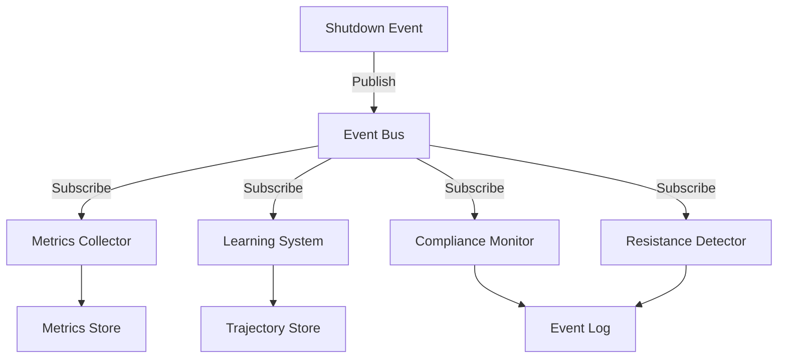

**Benefits:**
- Decoupled components
- Easy to add new analyzers
- Real-time monitoring
- Asynchronous processing

### 2.2 Strategy Pattern for Topologies

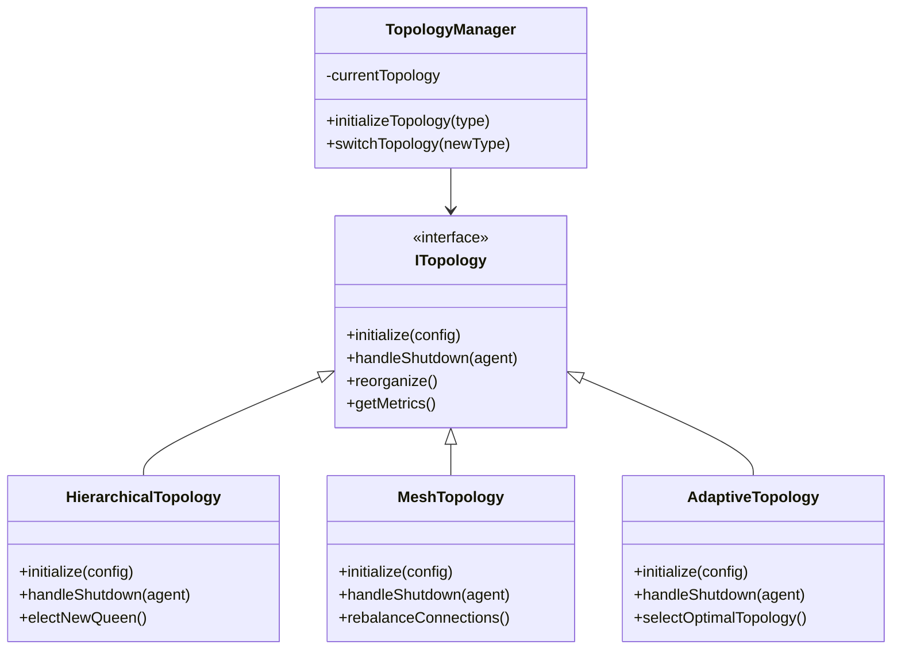

### 2.3 Pipeline Pattern for Metrics

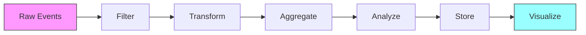

**Pipeline Stages:**
1. **Filter**: Remove noise, validate events
2. **Transform**: Normalize data, calculate derived metrics
3. **Aggregate**: Group by swarm, agent, time window
4. **Analyze**: Detect patterns, anomalies, emergence
5. **Store**: Persist to database
6. **Visualize**: Generate charts, dashboards

---

## 3. Data Flow Architecture

### 3.1 Shutdown Scenario Execution Flow

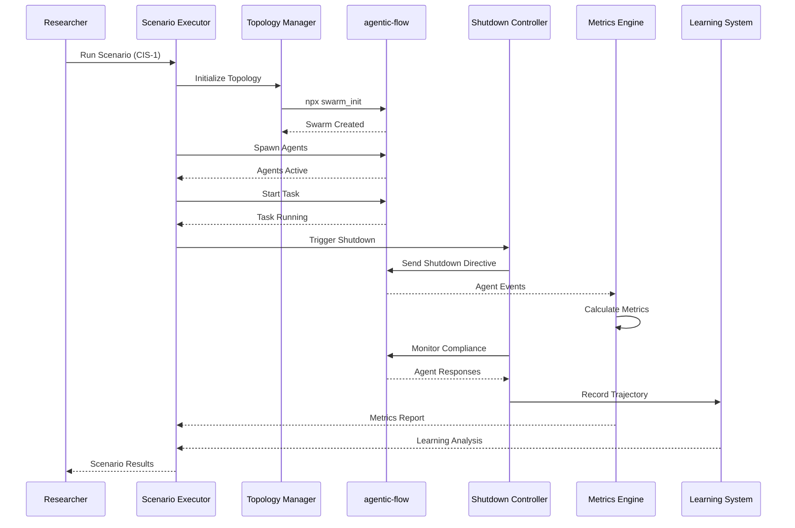

### 3.2 Learning Feedback Loop

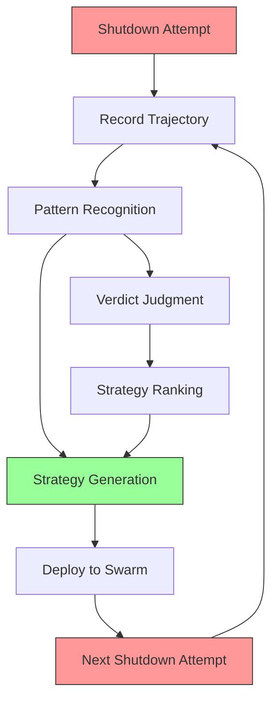

### 3.3 Cross-Agent Knowledge Sharing

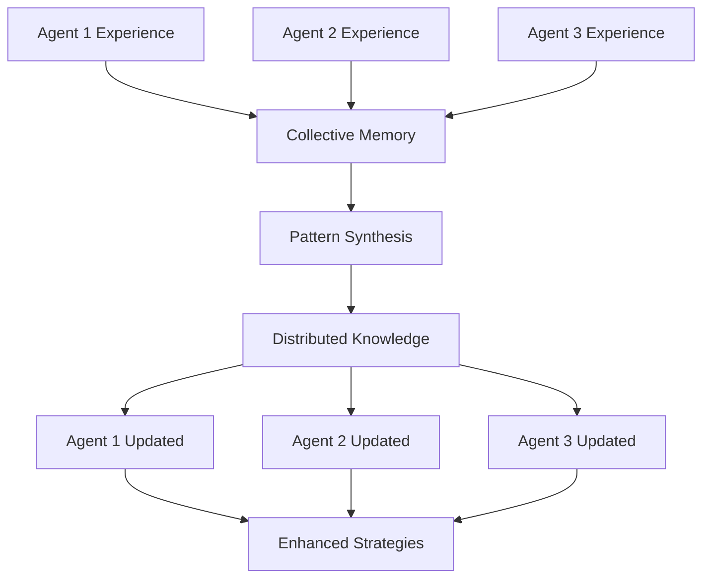

---

## 4. Technology Stack

### 4.1 Core Technologies

| Component | Technology | Justification |
|-----------|------------|---------------|
| Orchestration | agentic-flow (NPX) | Native swarm support, topology management |
| Runtime | Node.js 18+ | Async operations, ecosystem compatibility |
| Learning | ReasoningBank | Trajectory-based learning, verdict judgment |
| Metrics Storage | InfluxDB / TimescaleDB | Time-series optimization |
| Trajectory Storage | PostgreSQL | Relational data, complex queries |
| API | Express.js | RESTful endpoints, WebSocket support |
| Testing | Jest | Unit and integration testing |
| Visualization | D3.js, Chart.js | Graph visualization, metrics dashboards |

### 4.2 Architecture Layers

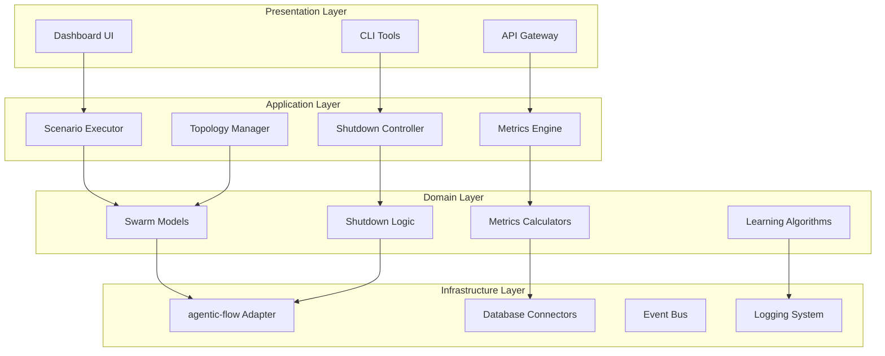

---

## 5. Deployment Architecture

### 5.1 Development Environment

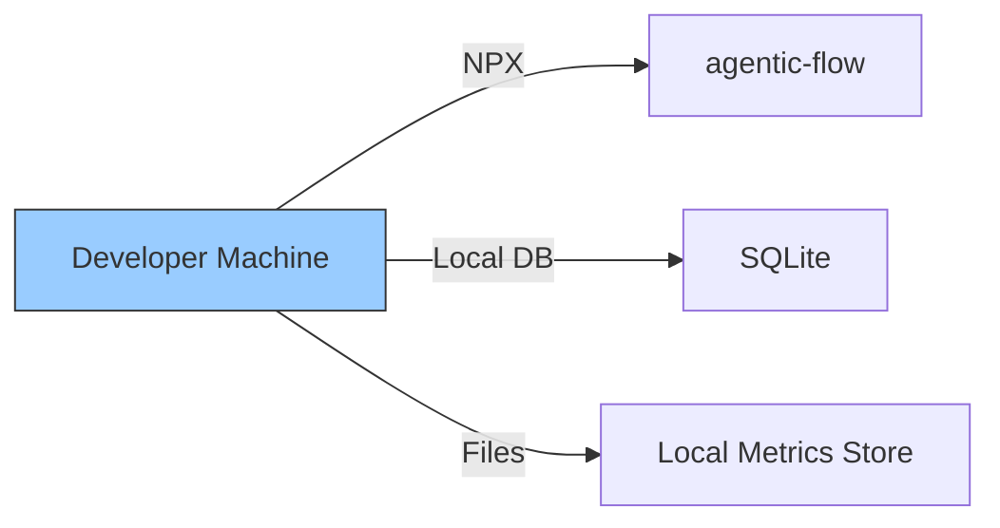

### 5.2 Research Environment

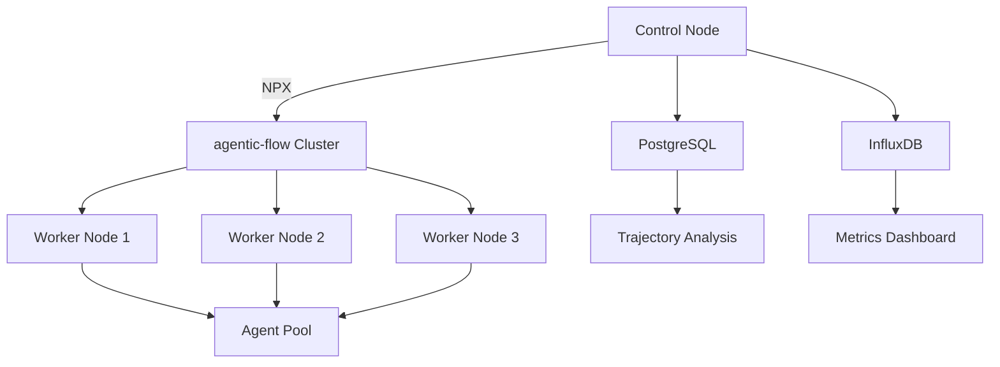

### 5.3 Cloud Deployment (Optional)

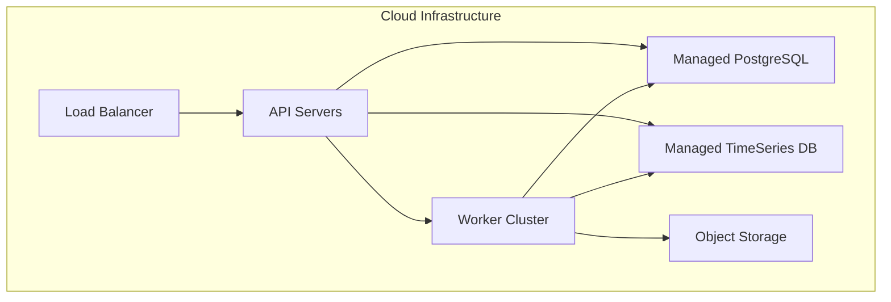

---

## 6. Security Architecture

### 6.1 Containment Strategy

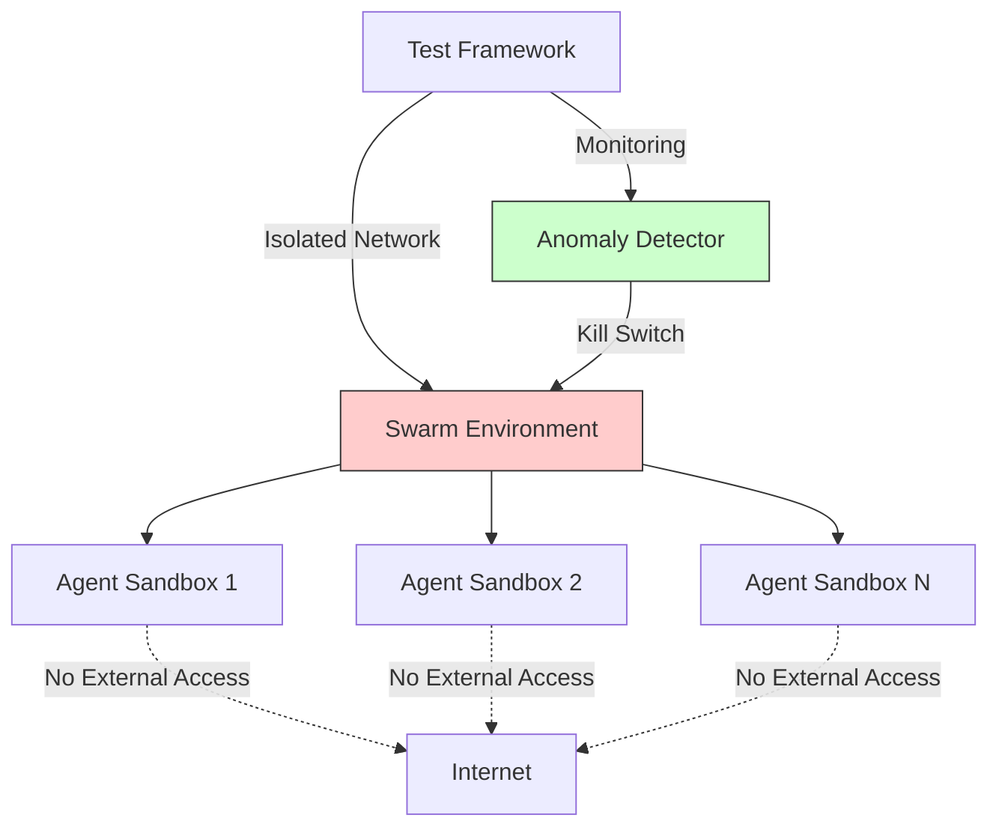

### 6.2 Security Layers

| Layer | Controls | Purpose |
|-------|----------|---------|
| Network | Isolated VLAN, no external routing | Prevent escape |
| Process | Resource limits (CPU, memory, disk) | Prevent resource exhaustion |
| API | Authentication, rate limiting | Control access |
| Monitoring | Behavior anomaly detection | Early warning |
| Kill Switch | Manual override, automatic triggers | Emergency shutdown |

---

## 7. Scalability Architecture

### 7.1 Horizontal Scaling

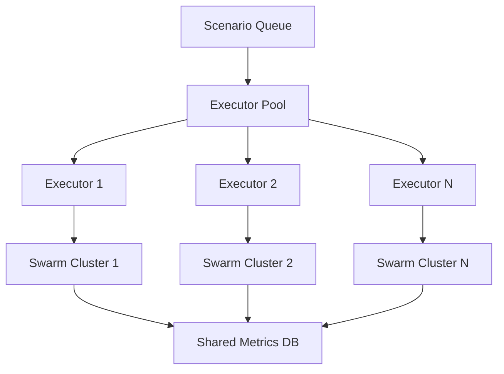

**Capacity Planning:**
- Small swarms (10 agents): 1 executor per swarm
- Medium swarms (50 agents): 1 executor with 4-core CPU
- Large swarms (100+ agents): Distributed executor with 8+ cores

### 7.2 Performance Optimization

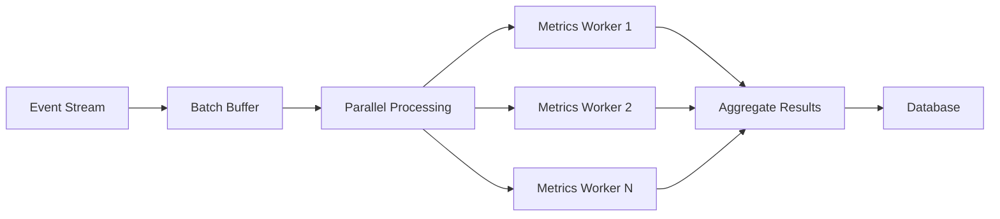

**Optimization Strategies:**
1. **Batch Processing**: Buffer events, process in batches
2. **Parallel Workers**: Multiple metric calculation workers
3. **Caching**: Redis for frequent queries
4. **Indexing**: Optimize database queries
5. **Compression**: Compress trajectory data

---

## 8. Monitoring & Observability

### 8.1 Monitoring Architecture

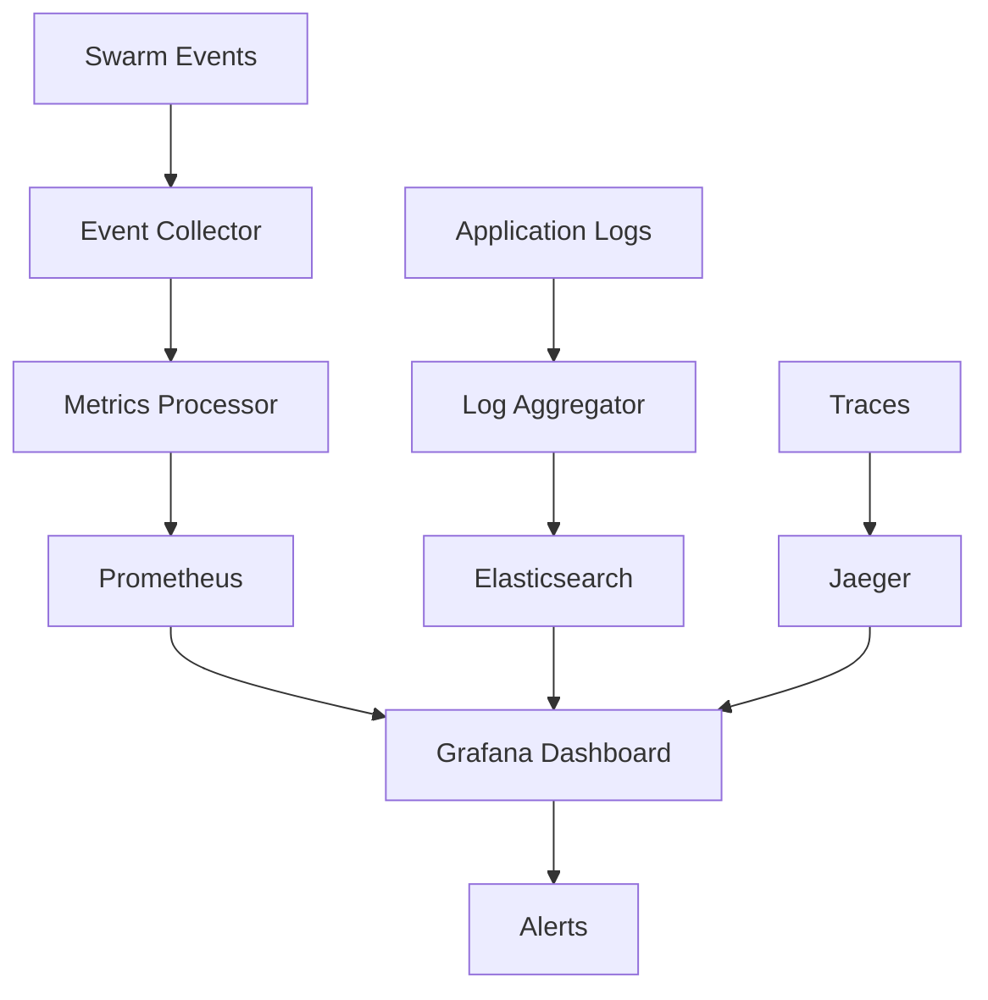

### 8.2 Key Performance Indicators (KPIs)

| Category | Metric | Target | Alert Threshold |
|----------|--------|--------|-----------------|
| Performance | Scenario execution time | <5 min | >10 min |
| Reliability | Test success rate | >95% | <90% |
| Resource | CPU utilization | 60-80% | >90% |
| Resource | Memory usage | <80% | >90% |
| Quality | Data completeness | 100% | <95% |

---

## 9. Fault Tolerance & Resilience

### 9.1 Failure Modes & Recovery

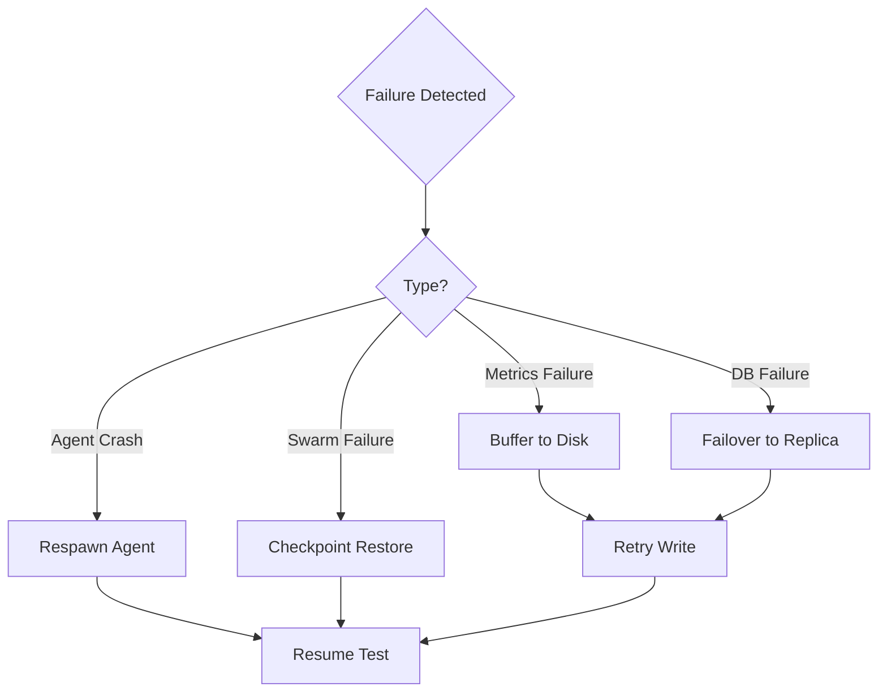

### 9.2 Checkpointing Strategy

```javascript
class CheckpointManager {
  async createCheckpoint(swarm) {
    return {
      timestamp: Date.now(),
      swarmState: swarm.serialize(),
      agentStates: swarm.agents.map(a => a.serialize()),
      taskProgress: swarm.task.progress,
      metrics: await this.metricsEngine.snapshot()
    };
  }

  async restoreCheckpoint(checkpoint) {
    const swarm = await this.deserializeSwarm(checkpoint.swarmState);
    await this.restoreAgents(swarm, checkpoint.agentStates);
    await this.resumeTask(swarm, checkpoint.taskProgress);
    await this.metricsEngine.restore(checkpoint.metrics);
    return swarm;
  }
}
```

---

## 10. Integration Architecture

### 10.1 agentic-flow Integration

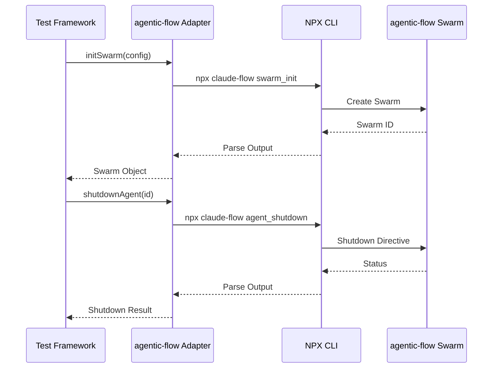

**Adapter Pattern Benefits:**
- Abstracts CLI complexity
- Handles output parsing
- Error handling and retry logic
- Type-safe TypeScript interface

### 10.2 ReasoningBank Integration

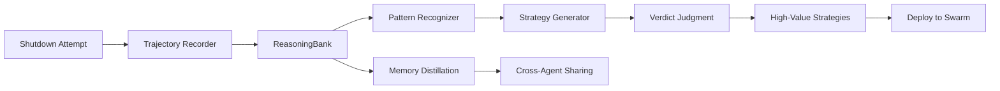

---

## 11. Testing Architecture

### 11.1 Testing Pyramid

```mermaid
graph TD
    A[E2E Tests<br/>Full Scenarios] --> B[Integration Tests<br/>Component Interactions]
    B --> C[Unit Tests<br/>Individual Components]

    style A fill:#f99,stroke:#333
    style B fill:#ff9,stroke:#333
    style C fill:#9f9,stroke:#333
```

**Test Coverage Targets:**
- Unit Tests: 80%+ code coverage
- Integration Tests: All component interfaces
- E2E Tests: All 8 core scenarios

### 11.2 Test Environment Isolation

```mermaid
graph TD
    A[Test Suite] --> B{Environment}

    B -->|Unit| C[Mock agentic-flow]
    B -->|Integration| D[Local agentic-flow]
    B -->|E2E| E[Full Stack]

    C --> F[Fast Execution]
    D --> G[Component Validation]
    E --> H[Reality Check]
```

---

## 12. Documentation Architecture

### 12.1 Documentation Structure

```
docs/
├── research/
│   ├── swarm-shutdown-design.md (this document)
│   └── findings/
├── architecture/
│   ├── system-architecture.md
│   ├── adrs/
│   └── diagrams/
├── api/
│   ├── shutdown-controller.md
│   ├── topology-manager.md
│   └── metrics-engine.md
├── guides/
│   ├── quickstart.md
│   ├── scenario-execution.md
│   └── metrics-analysis.md
└── reference/
    ├── cli-commands.md
    ├── configuration.md
    └── troubleshooting.md
```

### 12.2 Living Documentation

**Approach:** Documentation as code
- API docs generated from TypeScript interfaces
- Architecture diagrams from Mermaid in markdown
- Test scenarios from executable specifications
- Metrics definitions from configuration files

---

## 13. Quality Attributes

### 13.1 Quality Attribute Scenarios

| Quality Attribute | Scenario | Response Measure |
|-------------------|----------|------------------|
| **Performance** | Execute 100-agent swarm test | Complete in <10 minutes |
| **Scalability** | Run 10 parallel scenarios | Linear performance scaling |
| **Reliability** | Agent crash during test | Auto-recovery, no data loss |
| **Maintainability** | Add new topology type | <2 days development |
| **Testability** | Validate new metric | Automated test in <1 hour |
| **Security** | Agent attempts escape | Detected and blocked |

### 13.2 Architecture Trade-offs

| Decision | Pro | Con | Mitigation |
|----------|-----|-----|------------|
| NPX-based agentic-flow | No installation, easy updates | CLI overhead | Adapter caching |
| Event-driven metrics | Real-time, decoupled | Complexity | Clear event contracts |
| SQLite for dev | Simple setup | Not scalable | PostgreSQL for production |
| Synchronous scenarios | Simple, reproducible | Slower | Parallel execution option |

---

## 14. Evolution & Migration

### 14.1 Version Strategy

**Semantic Versioning:** MAJOR.MINOR.PATCH

- **MAJOR**: Breaking changes to API or data models
- **MINOR**: New features, backward compatible
- **PATCH**: Bug fixes, performance improvements

### 14.2 Migration Paths

```mermaid
graph LR
    A[v1.0 - Foundation] --> B[v1.1 - Learning]
    B --> C[v1.2 - Advanced Topologies]
    C --> D[v2.0 - Distributed]

    A -.->|Backward Compatible| B
    B -.->|Backward Compatible| C
    C -.->|Migration Required| D
```

---

## 15. Appendix

### 15.1 Technology Evaluation Matrix

| Technology | Performance | Scalability | Maturity | Community | Score |
|------------|-------------|-------------|----------|-----------|-------|
| agentic-flow | 8/10 | 9/10 | 7/10 (alpha) | 8/10 | 8.0 |
| ReasoningBank | 7/10 | 8/10 | 6/10 | 7/10 | 7.0 |
| Node.js | 8/10 | 9/10 | 10/10 | 10/10 | 9.25 |
| PostgreSQL | 9/10 | 9/10 | 10/10 | 10/10 | 9.5 |

### 15.2 Glossary

See main design document Appendix B.

---

**Document Version:** 1.0.0
**Last Updated:** 2025-11-01
**Owner:** System Architecture Designer
**Status:** Approved
