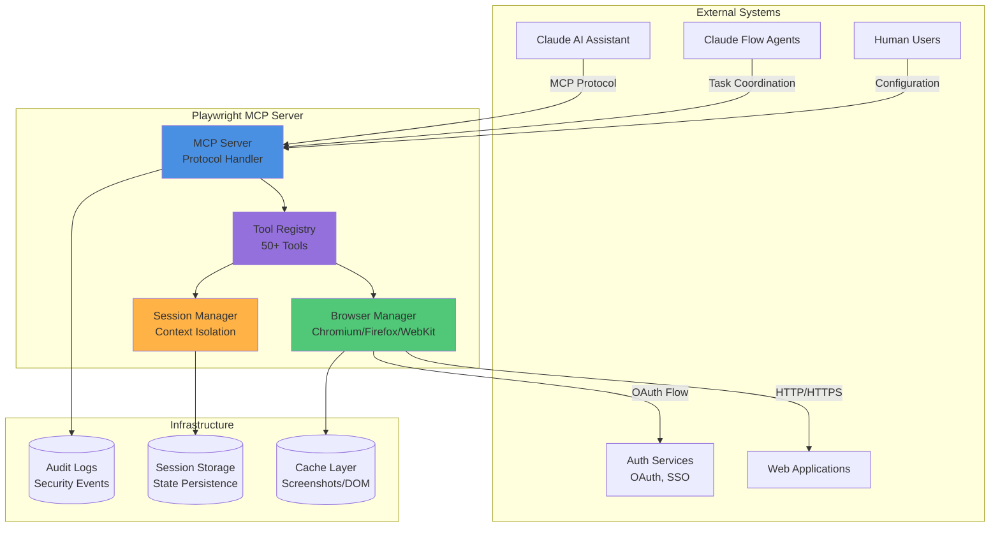
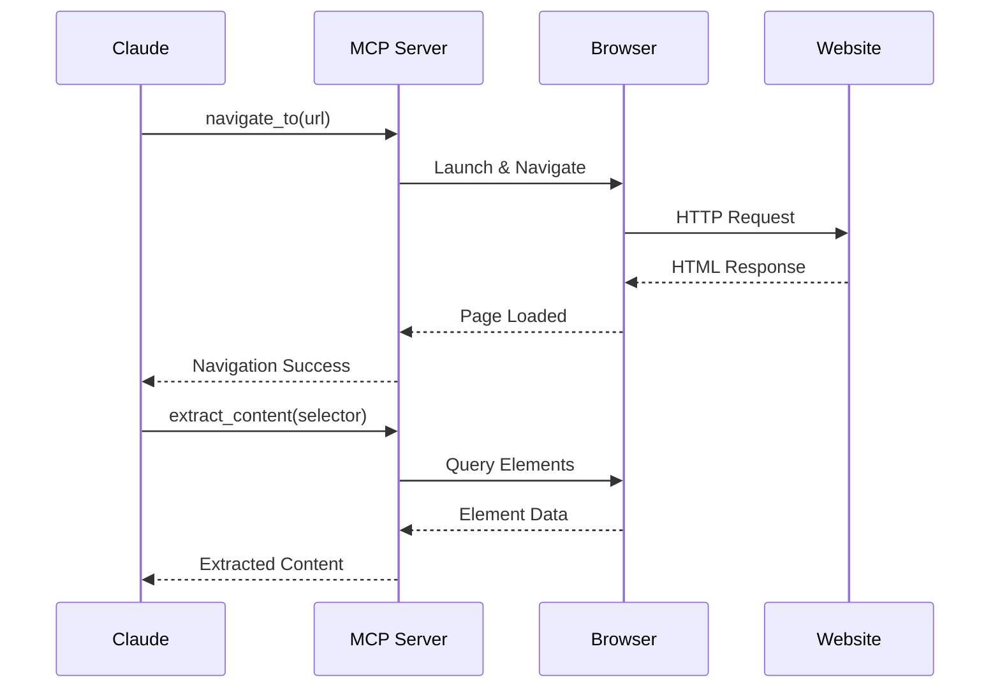
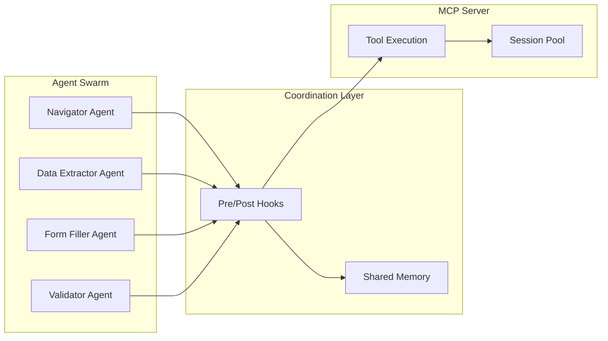
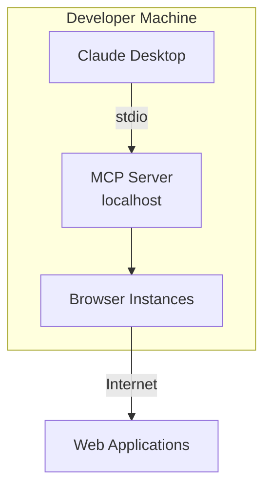
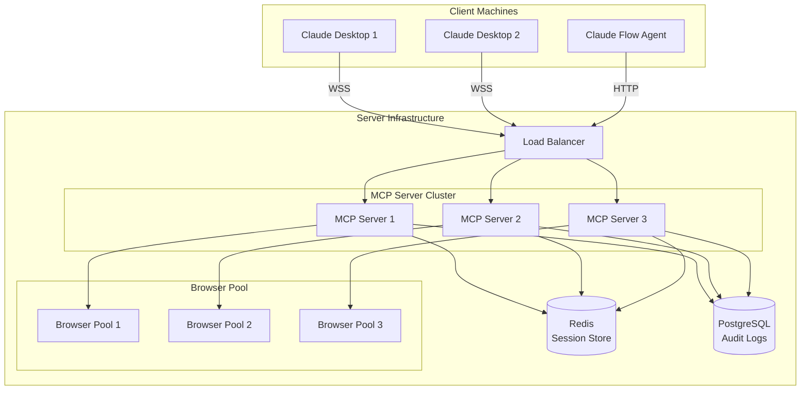
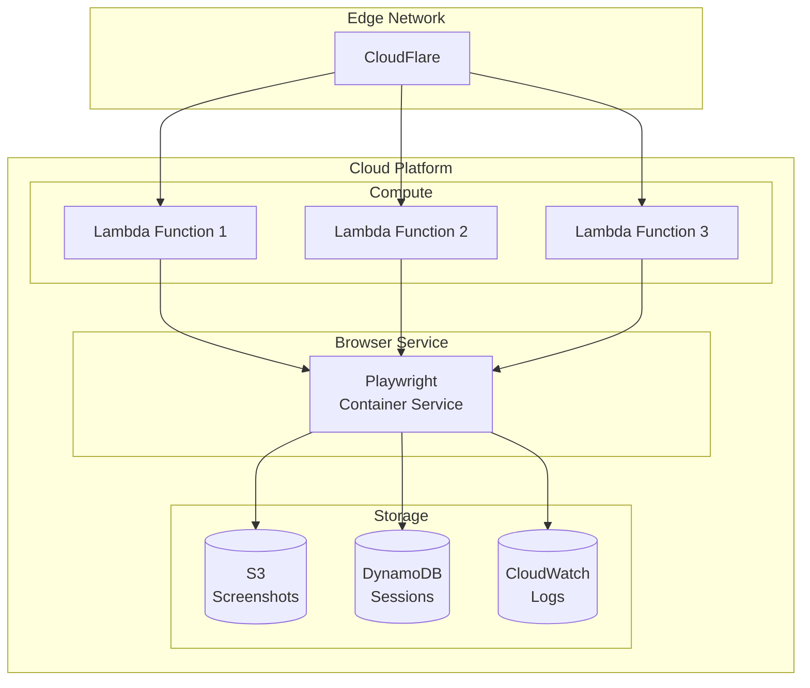
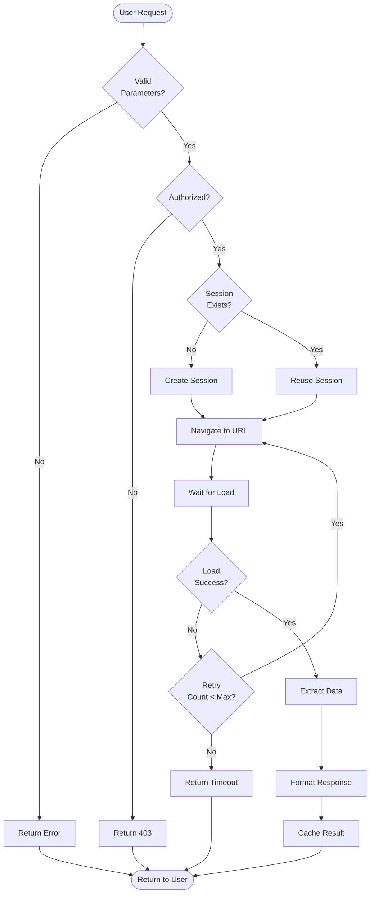
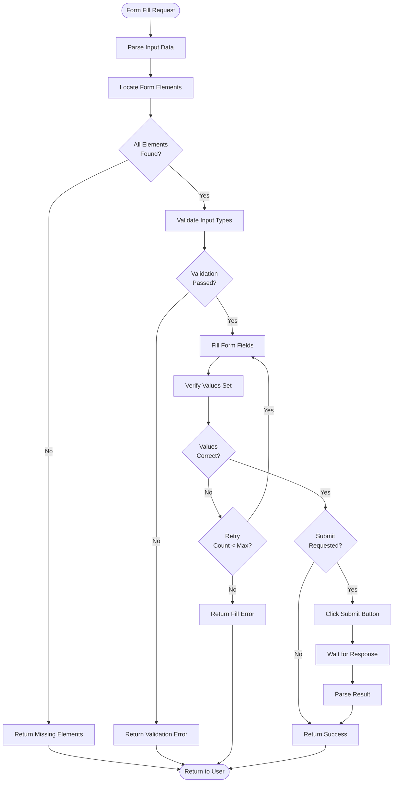
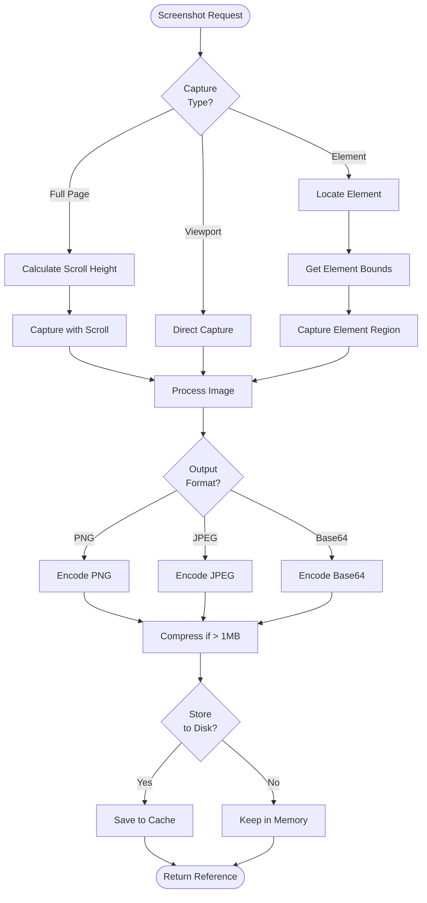

# System Overview - Playwright MCP Server

## Executive Summary

The Playwright MCP Server is a production-grade Model Context Protocol server that provides AI agents with comprehensive browser automation capabilities. It enables Claude and other AI assistants to interact with web applications through a standardized interface, supporting navigation, interaction, data extraction, and testing workflows.

## System Context Diagram (C4 Level 1)



## High-Level Architecture Layers

### Layer 1: Protocol Layer
**Responsibilities:**
- MCP protocol compliance (JSON-RPC 2.0)
- Message parsing and validation
- Transport abstraction (stdio, HTTP, WebSocket)
- Authentication and authorization
- Rate limiting and throttling

**Key Components:**
- `MCPServer`: Main server instance
- `TransportManager`: Multi-transport support
- `RequestValidator`: Input validation
- `AuthenticationMiddleware`: Security layer

**Technologies:**
- Node.js 18+ (LTS)
- TypeScript 5.0+
- @modelcontextprotocol/sdk

### Layer 2: Tool Execution Layer
**Responsibilities:**
- Tool registration and discovery
- Parameter validation and coercion
- Execution orchestration
- Error handling and recovery
- Result formatting

**Key Components:**
- `ToolRegistry`: Tool management
- `ToolExecutor`: Execution engine
- `ParameterValidator`: Type checking
- `ResultFormatter`: Response standardization

**Technologies:**
- Zod for schema validation
- Custom execution pipeline
- Event-driven architecture

### Layer 3: Browser Automation Layer
**Responsibilities:**
- Browser lifecycle management
- Page and context creation
- Element location and interaction
- Network interception
- Screenshot and recording

**Key Components:**
- `BrowserManager`: Pool management
- `PageController`: Page operations
- `ElementLocator`: Element finding
- `ActionExecutor`: User interactions
- `NetworkInterceptor`: Traffic control

**Technologies:**
- Playwright 1.40+
- Chromium, Firefox, WebKit engines
- Custom retry and timeout logic

### Layer 4: Session Management Layer
**Responsibilities:**
- Context isolation
- State persistence
- Session recovery
- Cookie and storage management
- Authentication state

**Key Components:**
- `SessionManager`: Lifecycle control
- `ContextStore`: State persistence
- `CookieManager`: Cookie handling
- `StorageManager`: Local/session storage

**Technologies:**
- SQLite for persistence
- Memory-backed cache
- Encryption at rest

### Layer 5: Data Processing Layer
**Responsibilities:**
- Content extraction
- Data transformation
- Screenshot processing
- PDF generation
- Accessibility tree parsing

**Key Components:**
- `DataExtractor`: Content parsing
- `ScreenshotProcessor`: Image handling
- `PDFGenerator`: Document creation
- `AccessibilityParser`: A11y tree

**Technologies:**
- Cheerio for HTML parsing
- Sharp for image processing
- PDF-lib for PDF generation

## External System Integrations

### Claude AI Integration


**Integration Points:**
- Tool calls via MCP protocol
- Resource access for page state
- Prompt templates for guidance
- Streaming updates for long operations

### Claude Flow Agent Integration


**Coordination Features:**
- Shared session pools across agents
- Memory-backed state sharing
- Hook-based progress tracking
- Concurrent operation support

### Web Application Integration
**Supported Scenarios:**
- Public websites (no auth)
- Username/password authentication
- OAuth 2.0 flows
- SSO integrations
- Multi-factor authentication
- API token authentication

**Integration Patterns:**
- Cookie persistence
- Local storage management
- Session restoration
- Credential injection
- Token refresh

## Deployment Topology Options

### Option 1: Local Development Mode


**Characteristics:**
- Single user
- stdio transport
- Local browser instances
- No authentication required
- Full system access

**Use Cases:**
- Development and testing
- Personal automation tasks
- Local web scraping
- UI testing

### Option 2: Server Deployment Mode


**Characteristics:**
- Multi-user support
- WebSocket transport
- Horizontal scalability
- Centralized session management
- Authentication required
- Resource limits per user

**Use Cases:**
- Team collaboration
- Production automation
- Continuous testing
- Enterprise integration

### Option 3: Cloud/Serverless Mode


**Characteristics:**
- Auto-scaling
- Pay-per-use
- Global distribution
- Managed infrastructure
- Stateless execution
- Cold start optimization

**Use Cases:**
- Sporadic automation tasks
- Global web monitoring
- Cost-sensitive workloads
- Event-driven automation

## Data Flow Diagrams

### Primary Data Flow: Navigation & Extraction


### Secondary Data Flow: Form Interaction


### Tertiary Data Flow: Screenshot Capture


## Technology Stack Justification

### Runtime Environment
**Selected: Node.js 18+ LTS**

**Rationale:**
- Native async/await support for Playwright
- Excellent TypeScript integration
- Large ecosystem of MCP tools
- Good performance for I/O-bound operations
- Wide deployment support

**Alternatives Considered:**
- Python: Slower async performance, weaker typing
- Go: Limited Playwright support, MCP SDK immature
- Rust: High development complexity, small ecosystem

### Browser Automation
**Selected: Playwright 1.40+**

**Rationale:**
- Multi-browser support (Chromium, Firefox, WebKit)
- Modern web features (Shadow DOM, iframes)
- Auto-waiting reduces flakiness
- Network interception built-in
- Strong TypeScript support
- Active development and community

**Alternatives Considered:**
- Puppeteer: Chromium-only, less features
- Selenium: Slower, more complex, legacy architecture
- Cypress: Not suitable for server-side automation

### Type System
**Selected: TypeScript 5.0+**

**Rationale:**
- Compile-time error detection
- Better IDE integration
- Self-documenting code
- MCP SDK provides TypeScript types
- Easier refactoring

**Alternatives Considered:**
- JavaScript: Lack of type safety
- Flow: Smaller ecosystem, declining support

### Validation Library
**Selected: Zod**

**Rationale:**
- Runtime type validation
- TypeScript type inference
- Composable schemas
- Excellent error messages
- Small bundle size

**Alternatives Considered:**
- Joi: Weaker TypeScript integration
- Yup: Less powerful inference
- AJV: More verbose, JSON Schema focused

### Session Storage
**Selected: SQLite (local), Redis (server)**

**Rationale:**
- SQLite: Zero-config, embedded, ACID compliant
- Redis: Fast, distributed, session store optimized
- Both support encryption at rest
- Good Node.js drivers

**Alternatives Considered:**
- PostgreSQL: Overkill for local mode
- MongoDB: Weak consistency guarantees
- File system: No query capabilities

### Logging & Monitoring
**Selected: Winston + Prometheus**

**Rationale:**
- Winston: Structured logging, multiple transports
- Prometheus: Industry standard, good visualization
- Both integrate well with Node.js
- Support for alerting

**Alternatives Considered:**
- Bunyan: Less maintained
- Pino: Minimal features
- Custom solution: Reinventing the wheel

## Performance Targets

### Latency Requirements
- Tool execution initiation: < 50ms
- Browser launch: < 2s (warm pool), < 5s (cold start)
- Page navigation: < 5s (excluding network)
- Element location: < 100ms (simple), < 500ms (complex)
- Data extraction: < 200ms per element
- Screenshot capture: < 1s (viewport), < 3s (full page)

### Throughput Requirements
- Concurrent sessions: 10 (local), 100+ (server), 1000+ (cloud)
- Requests per session: 1000/minute
- Tool calls per second: 50/session
- Browser instances: 5 (local), 50 (server), auto-scale (cloud)

### Resource Limits
- Memory per browser: 512MB - 2GB
- Disk space for cache: 1GB - 10GB
- CPU per browser: 1-2 cores
- Network bandwidth: 10Mbps per browser

## Scalability Considerations

### Horizontal Scaling
- Stateless server design
- Session affinity via Redis
- Browser pool per server instance
- Load balancing with sticky sessions
- Auto-scaling based on CPU/memory

### Vertical Scaling
- Multi-core browser pool
- Memory-efficient context reuse
- Aggressive cache eviction
- Resource pooling and recycling

### Cost Optimization
- Browser instance reuse
- Lazy browser launching
- Aggressive timeout configuration
- Screenshot compression
- Cache TTL management
- Auto-shutdown idle resources

## Deployment Architecture

### Docker Container
```dockerfile
FROM mcr.microsoft.com/playwright:v1.40.0-focal

# Install Node.js dependencies
WORKDIR /app
COPY package*.json ./
RUN npm ci --production

# Copy application code
COPY . .

# Build TypeScript
RUN npm run build

# Run as non-root user
USER pwuser

# Health check
HEALTHCHECK --interval=30s --timeout=3s \
  CMD node -e "require('http').get('http://localhost:3000/health', (r) => process.exit(r.statusCode === 200 ? 0 : 1))"

# Start server
CMD ["node", "dist/server.js"]
```

### Kubernetes Deployment
```yaml
apiVersion: apps/v1
kind: Deployment
metadata:
  name: playwright-mcp-server
spec:
  replicas: 3
  selector:
    matchLabels:
      app: playwright-mcp
  template:
    metadata:
      labels:
        app: playwright-mcp
    spec:
      containers:
      - name: mcp-server
        image: playwright-mcp:latest
        ports:
        - containerPort: 3000
        resources:
          requests:
            memory: "2Gi"
            cpu: "1000m"
          limits:
            memory: "4Gi"
            cpu: "2000m"
        env:
        - name: MAX_BROWSERS
          value: "10"
        - name: REDIS_URL
          valueFrom:
            secretKeyRef:
              name: redis-secret
              key: url
        livenessProbe:
          httpGet:
            path: /health
            port: 3000
          initialDelaySeconds: 30
          periodSeconds: 10
        readinessProbe:
          httpGet:
            path: /ready
            port: 3000
          initialDelaySeconds: 5
          periodSeconds: 5
```

## Disaster Recovery

### Backup Strategy
- Session state: Replicated to Redis cluster
- Screenshots: S3 with versioning
- Audit logs: PostgreSQL with daily backups
- Configuration: Git-based versioning

### Recovery Procedures
- Browser crash: Auto-restart with session recovery
- Server failure: Load balancer redirects to healthy instance
- Data corruption: Restore from last known good state
- Network partition: Graceful degradation with caching

### Business Continuity
- Multi-region deployment
- Active-active configuration
- 99.9% uptime SLA
- < 5 minute RTO (Recovery Time Objective)
- < 1 minute RPO (Recovery Point Objective)

## Compliance & Governance

### Data Retention
- Session data: 24 hours
- Screenshots: 7 days
- Audit logs: 90 days (configurable)
- Error logs: 30 days

### Privacy Considerations
- No persistent cookie storage (except explicit sessions)
- Automatic PII redaction in logs
- Encrypted storage at rest
- TLS 1.3 for data in transit
- GDPR compliance ready

### Audit Requirements
- All tool executions logged
- User attribution tracked
- URL access logged
- Timestamp precision to millisecond
- Immutable audit trail

---

**Document Version:** 1.0
**Last Updated:** 2025-11-27
**Status:** Architecture Phase - System Overview
**Next Phase:** Component Design
