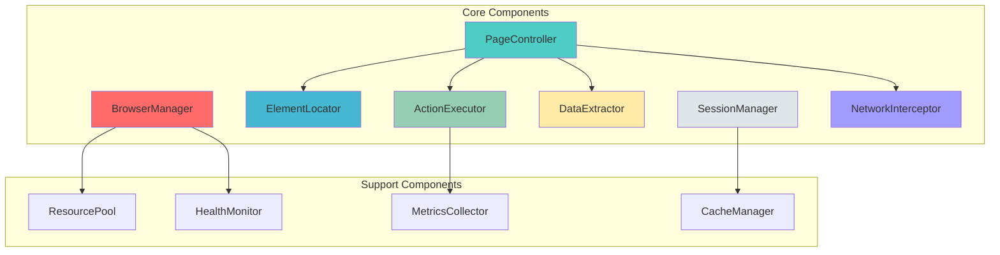

# Component Design - Playwright MCP Server

## Component Architecture Overview



## Component 1: BrowserManager

### Overview
The BrowserManager is responsible for browser lifecycle management, including launching, pooling, health monitoring, and graceful shutdown of browser instances.

### Interface Definition

```typescript
interface BrowserManagerConfig {
  browsers: {
    chromium: BrowserTypeConfig;
    firefox: BrowserTypeConfig;
    webkit: BrowserTypeConfig;
  };
  pool: {
    minInstances: number;
    maxInstances: number;
    idleTimeout: number; // milliseconds
    warmupOnStart: boolean;
  };
  health: {
    checkInterval: number; // milliseconds
    maxFailures: number;
    recoveryStrategy: 'restart' | 'replace' | 'ignore';
  };
  launch: {
    headless: boolean;
    args: string[];
    timeout: number;
    slowMo: number;
  };
}

interface BrowserTypeConfig {
  enabled: boolean;
  channel?: 'chrome' | 'msedge' | 'chrome-beta';
  executablePath?: string;
  proxy?: ProxySettings;
}

interface BrowserInstance {
  id: string;
  type: 'chromium' | 'firefox' | 'webkit';
  browser: Browser;
  contexts: BrowserContext[];
  health: HealthStatus;
  metrics: BrowserMetrics;
  createdAt: Date;
  lastUsedAt: Date;
}

interface HealthStatus {
  status: 'healthy' | 'degraded' | 'unhealthy';
  lastCheck: Date;
  consecutiveFailures: number;
  checks: {
    responsive: boolean;
    memoryUsage: number;
    contextCount: number;
  };
}

interface BrowserMetrics {
  totalContexts: number;
  totalPages: number;
  totalRequests: number;
  totalNavigations: number;
  averageResponseTime: number;
  errorRate: number;
  memoryUsage: number;
  cpuUsage: number;
}

class BrowserManager {
  private config: BrowserManagerConfig;
  private pool: Map<string, BrowserInstance>;
  private queue: AsyncQueue<BrowserRequest>;
  private healthMonitor: HealthMonitor;
  private metricsCollector: MetricsCollector;

  constructor(config: BrowserManagerConfig);

  // Lifecycle Management
  async initialize(): Promise<void>;
  async shutdown(graceful?: boolean): Promise<void>;
  async restart(browserId: string): Promise<void>;

  // Pool Management
  async acquireBrowser(
    type: BrowserType,
    priority?: 'high' | 'normal' | 'low'
  ): Promise<BrowserInstance>;
  async releaseBrowser(browserId: string): Promise<void>;
  async warmPool(count: number): Promise<void>;
  async drainPool(): Promise<void>;

  // Health & Monitoring
  async checkHealth(browserId: string): Promise<HealthStatus>;
  async getAllHealth(): Promise<Map<string, HealthStatus>>;
  async getMetrics(browserId?: string): Promise<BrowserMetrics>;

  // Configuration
  async updateConfig(config: Partial<BrowserManagerConfig>): Promise<void>;
  getConfig(): BrowserManagerConfig;

  // Events
  on(event: BrowserManagerEvent, handler: EventHandler): void;
  off(event: BrowserManagerEvent, handler: EventHandler): void;
}

type BrowserManagerEvent =
  | 'browser-launched'
  | 'browser-closed'
  | 'browser-crashed'
  | 'health-degraded'
  | 'pool-full'
  | 'pool-empty'
  | 'metrics-collected';
```

### Responsibilities

1. **Browser Lifecycle**
   - Launch browser instances on-demand
   - Maintain browser process health
   - Handle browser crashes and recovery
   - Graceful shutdown with context cleanup

2. **Resource Pooling**
   - Maintain min/max pool sizes
   - Implement fair allocation strategies
   - Handle request queuing when pool is full
   - Automatic scaling based on demand

3. **Health Monitoring**
   - Periodic health checks (ping, memory, CPU)
   - Detect zombie processes
   - Automatic recovery from failures
   - Circuit breaker pattern for failing instances

4. **Performance Optimization**
   - Browser instance reuse
   - Context recycling
   - Memory leak detection
   - Automatic garbage collection triggers

### Dependencies

**Internal:**
- `HealthMonitor`: Health check execution
- `MetricsCollector`: Performance metrics
- `ResourcePool`: Generic pooling logic
- `EventEmitter`: Event notifications

**External:**
- `playwright`: Browser automation
- `systeminformation`: System metrics
- `prom-client`: Prometheus metrics

### Configuration Options

```typescript
const defaultConfig: BrowserManagerConfig = {
  browsers: {
    chromium: {
      enabled: true,
      channel: 'chrome',
      args: [
        '--no-sandbox',
        '--disable-dev-shm-usage',
        '--disable-gpu',
        '--disable-software-rasterizer'
      ]
    },
    firefox: {
      enabled: false
    },
    webkit: {
      enabled: false
    }
  },
  pool: {
    minInstances: 1,
    maxInstances: 10,
    idleTimeout: 300000, // 5 minutes
    warmupOnStart: true
  },
  health: {
    checkInterval: 30000, // 30 seconds
    maxFailures: 3,
    recoveryStrategy: 'restart'
  },
  launch: {
    headless: true,
    args: [],
    timeout: 30000,
    slowMo: 0
  }
};
```

### Event Emissions

```typescript
// Browser launched successfully
emit('browser-launched', {
  browserId: string,
  type: BrowserType,
  timestamp: Date
});

// Browser crashed unexpectedly
emit('browser-crashed', {
  browserId: string,
  error: Error,
  recovery: 'restart' | 'replace',
  timestamp: Date
});

// Health check failed
emit('health-degraded', {
  browserId: string,
  status: HealthStatus,
  action: 'restart' | 'remove',
  timestamp: Date
});

// Pool capacity reached
emit('pool-full', {
  maxInstances: number,
  queueLength: number,
  timestamp: Date
});
```

---

## Component 2: PageController

### Overview
The PageController manages page-level operations including navigation, lifecycle events, state management, and coordination between other components.

### Interface Definition

```typescript
interface PageControllerConfig {
  navigation: {
    timeout: number;
    waitUntil: 'load' | 'domcontentloaded' | 'networkidle';
    referer?: string;
  };
  viewport: {
    width: number;
    height: number;
    deviceScaleFactor: number;
    isMobile: boolean;
    hasTouch: boolean;
  };
  emulation: {
    userAgent?: string;
    locale?: string;
    timezoneId?: string;
    geolocation?: Geolocation;
    colorScheme?: 'light' | 'dark' | 'no-preference';
  };
  interaction: {
    actionTimeout: number;
    retryAttempts: number;
    retryDelay: number;
    strictMode: boolean;
  };
}

interface PageState {
  url: string;
  title: string;
  loaded: boolean;
  error?: string;
  readyState: 'loading' | 'interactive' | 'complete';
  frameCount: number;
  metadata: PageMetadata;
}

interface PageMetadata {
  description?: string;
  keywords?: string[];
  ogTitle?: string;
  ogImage?: string;
  favicon?: string;
  canonicalUrl?: string;
}

class PageController {
  private page: Page;
  private config: PageControllerConfig;
  private elementLocator: ElementLocator;
  private actionExecutor: ActionExecutor;
  private dataExtractor: DataExtractor;
  private networkInterceptor: NetworkInterceptor;
  private state: PageState;
  private listeners: Map<string, Function[]>;

  constructor(
    page: Page,
    config: PageControllerConfig,
    dependencies: PageControllerDependencies
  );

  // Navigation
  async goto(
    url: string,
    options?: NavigationOptions
  ): Promise<NavigationResult>;
  async goBack(): Promise<void>;
  async goForward(): Promise<void>;
  async reload(options?: ReloadOptions): Promise<void>;

  // Page State
  getState(): PageState;
  async waitForState(state: PageReadyState, timeout?: number): Promise<void>;
  async waitForLoad(options?: WaitForLoadOptions): Promise<void>;
  async waitForIdle(timeout?: number): Promise<void>;

  // Element Operations (delegates to ElementLocator)
  async findElement(selector: string, options?: FindOptions): Promise<ElementHandle>;
  async findElements(selector: string, options?: FindOptions): Promise<ElementHandle[]>;
  async waitForElement(
    selector: string,
    options?: WaitForElementOptions
  ): Promise<ElementHandle>;

  // Actions (delegates to ActionExecutor)
  async click(selector: string, options?: ClickOptions): Promise<void>;
  async fill(selector: string, value: string, options?: FillOptions): Promise<void>;
  async select(selector: string, values: string[], options?: SelectOptions): Promise<void>;
  async type(selector: string, text: string, options?: TypeOptions): Promise<void>;

  // Data Extraction (delegates to DataExtractor)
  async extractText(selector: string): Promise<string>;
  async extractAttribute(selector: string, attribute: string): Promise<string>;
  async extractHtml(selector: string): Promise<string>;
  async extractData(schema: ExtractionSchema): Promise<any>;

  // Network Control (delegates to NetworkInterceptor)
  async setExtraHTTPHeaders(headers: Record<string, string>): Promise<void>;
  async setUserAgent(userAgent: string): Promise<void>;
  async route(url: string | RegExp, handler: RouteHandler): Promise<void>;
  async unroute(url: string | RegExp, handler?: RouteHandler): Promise<void>;

  // Screenshots & Recording
  async screenshot(options?: ScreenshotOptions): Promise<Buffer>;
  async screenshotElement(selector: string, options?: ScreenshotOptions): Promise<Buffer>;
  async pdf(options?: PDFOptions): Promise<Buffer>;

  // JavaScript Execution
  async evaluate<T>(script: string | Function, ...args: any[]): Promise<T>;
  async evaluateHandle(script: string | Function, ...args: any[]): Promise<JSHandle>;
  async addScriptTag(options: ScriptTagOptions): Promise<void>;
  async addStyleTag(options: StyleTagOptions): Promise<void>;

  // Event Handling
  on(event: PageEvent, handler: EventHandler): void;
  off(event: PageEvent, handler: EventHandler): void;
  once(event: PageEvent, handler: EventHandler): void;

  // Cleanup
  async close(): Promise<void>;
}

type PageEvent =
  | 'load'
  | 'domcontentloaded'
  | 'networkidle'
  | 'request'
  | 'response'
  | 'console'
  | 'dialog'
  | 'error'
  | 'popup'
  | 'framenavigated';
```

### Responsibilities

1. **Navigation Management**
   - URL navigation with configurable wait conditions
   - History management (back/forward)
   - Page reload with cache control
   - Timeout and error handling

2. **State Tracking**
   - Monitor page load state
   - Track document ready state
   - Maintain page metadata
   - Error state management

3. **Component Coordination**
   - Delegate element operations to ElementLocator
   - Delegate actions to ActionExecutor
   - Delegate extraction to DataExtractor
   - Coordinate with NetworkInterceptor

4. **Event Management**
   - Listen to page lifecycle events
   - Emit custom events for consumers
   - Handle console messages
   - Manage dialogs and popups

### Dependencies

**Internal:**
- `ElementLocator`: Element finding operations
- `ActionExecutor`: User interaction execution
- `DataExtractor`: Content extraction
- `NetworkInterceptor`: Network traffic control

**External:**
- `playwright.Page`: Underlying page instance

### Configuration Options

```typescript
const defaultConfig: PageControllerConfig = {
  navigation: {
    timeout: 30000,
    waitUntil: 'load'
  },
  viewport: {
    width: 1920,
    height: 1080,
    deviceScaleFactor: 1,
    isMobile: false,
    hasTouch: false
  },
  emulation: {
    userAgent: 'Mozilla/5.0 (Windows NT 10.0; Win64; x64) Chrome/120.0.0.0',
    locale: 'en-US',
    timezoneId: 'America/New_York'
  },
  interaction: {
    actionTimeout: 5000,
    retryAttempts: 3,
    retryDelay: 1000,
    strictMode: false
  }
};
```

### Event Emissions

```typescript
// Page loaded successfully
emit('load', {
  url: string,
  title: string,
  loadTime: number,
  timestamp: Date
});

// Navigation error occurred
emit('error', {
  url: string,
  error: Error,
  retry: boolean,
  timestamp: Date
});

// Console message from page
emit('console', {
  type: 'log' | 'warn' | 'error' | 'info',
  text: string,
  location: { url: string, lineNumber: number },
  timestamp: Date
});

// Dialog appeared
emit('dialog', {
  type: 'alert' | 'confirm' | 'prompt',
  message: string,
  defaultValue?: string,
  timestamp: Date
});
```

---

## Component 3: ElementLocator

### Overview
The ElementLocator provides intelligent element location using multiple strategies, caching, and resilient retry logic.

### Interface Definition

```typescript
interface ElementLocatorConfig {
  strategies: LocatorStrategy[];
  cache: {
    enabled: boolean;
    ttl: number; // milliseconds
    maxSize: number;
  };
  retry: {
    maxAttempts: number;
    initialDelay: number;
    maxDelay: number;
    backoffMultiplier: number;
  };
  timeout: {
    default: number;
    perStrategy: number;
  };
  strictMode: boolean;
}

type LocatorStrategy =
  | 'css'
  | 'xpath'
  | 'text'
  | 'role'
  | 'label'
  | 'placeholder'
  | 'alt-text'
  | 'title'
  | 'test-id'
  | 'custom';

interface FindOptions {
  strategy?: LocatorStrategy;
  timeout?: number;
  visible?: boolean;
  enabled?: boolean;
  strict?: boolean;
  state?: 'attached' | 'detached' | 'visible' | 'hidden';
}

interface ElementInfo {
  selector: string;
  strategy: LocatorStrategy;
  element: ElementHandle;
  boundingBox: BoundingBox;
  attributes: Record<string, string>;
  computedStyle: Record<string, string>;
  cached: boolean;
  timestamp: Date;
}

class ElementLocator {
  private page: Page;
  private config: ElementLocatorConfig;
  private cache: LRUCache<string, ElementInfo>;
  private strategyExecutors: Map<LocatorStrategy, StrategyExecutor>;

  constructor(page: Page, config: ElementLocatorConfig);

  // Primary Locator Methods
  async findElement(
    selector: string,
    options?: FindOptions
  ): Promise<ElementHandle | null>;

  async findElements(
    selector: string,
    options?: FindOptions
  ): Promise<ElementHandle[]>;

  async findElementWithRetry(
    selector: string,
    options?: FindOptions
  ): Promise<ElementHandle>;

  // Advanced Locators
  async findByText(
    text: string,
    options?: TextMatchOptions
  ): Promise<ElementHandle[]>;

  async findByRole(
    role: AriaRole,
    options?: RoleMatchOptions
  ): Promise<ElementHandle[]>;

  async findByLabel(label: string): Promise<ElementHandle | null>;

  async findByPlaceholder(placeholder: string): Promise<ElementHandle | null>;

  async findByTestId(testId: string): Promise<ElementHandle | null>;

  // Wait Methods
  async waitForElement(
    selector: string,
    options?: WaitForElementOptions
  ): Promise<ElementHandle>;

  async waitForVisible(
    selector: string,
    timeout?: number
  ): Promise<ElementHandle>;

  async waitForHidden(selector: string, timeout?: number): Promise<void>;

  async waitForEnabled(
    selector: string,
    timeout?: number
  ): Promise<ElementHandle>;

  // Element State Queries
  async isVisible(selector: string): Promise<boolean>;
  async isEnabled(selector: string): Promise<boolean>;
  async isChecked(selector: string): Promise<boolean>;
  async isEditable(selector: string): Promise<boolean>;

  // Element Information
  async getElementInfo(selector: string): Promise<ElementInfo>;
  async getBoundingBox(selector: string): Promise<BoundingBox>;
  async getAttributes(selector: string): Promise<Record<string, string>>;
  async getComputedStyle(selector: string): Promise<Record<string, string>>;

  // Cache Management
  async clearCache(): Promise<void>;
  async invalidateCache(selector: string): Promise<void>;
  getCacheStats(): CacheStats;

  // Custom Strategies
  registerStrategy(
    name: string,
    executor: StrategyExecutor
  ): void;

  unregisterStrategy(name: string): void;
}

interface StrategyExecutor {
  execute(
    page: Page,
    selector: string,
    options: FindOptions
  ): Promise<ElementHandle | null>;
}
```

### Responsibilities

1. **Multi-Strategy Location**
   - Support CSS, XPath, text, role, label, and custom selectors
   - Automatic strategy selection based on selector format
   - Fallback to alternative strategies on failure
   - Performance optimization for each strategy

2. **Intelligent Caching**
   - LRU cache for frequently accessed elements
   - Cache invalidation on page navigation
   - TTL-based expiration
   - Cache hit/miss metrics

3. **Resilient Retry Logic**
   - Exponential backoff for transient failures
   - Configurable retry attempts and delays
   - Different retry strategies per error type
   - Circuit breaker for permanent failures

4. **Element State Verification**
   - Check visibility before returning
   - Verify element is in DOM
   - Ensure element is interactable
   - Validate accessibility state

### Dependencies

**Internal:**
- `LRUCache`: Caching implementation
- `RetryStrategy`: Retry logic
- `MetricsCollector`: Performance tracking

**External:**
- `playwright.Page`: Page instance
- `playwright.Locator`: Playwright locator API

### Configuration Options

```typescript
const defaultConfig: ElementLocatorConfig = {
  strategies: ['css', 'xpath', 'text', 'role', 'test-id'],
  cache: {
    enabled: true,
    ttl: 30000, // 30 seconds
    maxSize: 1000
  },
  retry: {
    maxAttempts: 3,
    initialDelay: 100,
    maxDelay: 2000,
    backoffMultiplier: 2
  },
  timeout: {
    default: 5000,
    perStrategy: 1000
  },
  strictMode: false
};
```

### Event Emissions

```typescript
// Element found successfully
emit('element-found', {
  selector: string,
  strategy: LocatorStrategy,
  cached: boolean,
  duration: number,
  timestamp: Date
});

// Element not found after retries
emit('element-not-found', {
  selector: string,
  attempts: number,
  strategies: LocatorStrategy[],
  duration: number,
  timestamp: Date
});

// Cache hit
emit('cache-hit', {
  selector: string,
  age: number,
  timestamp: Date
});
```

---

## Component 4: ActionExecutor

### Overview
The ActionExecutor handles user interactions with web pages, including clicks, typing, form filling, and custom actions with automatic retry and error recovery.

### Interface Definition

```typescript
interface ActionExecutorConfig {
  timeout: {
    action: number;
    navigation: number;
    assertion: number;
  };
  retry: {
    enabled: boolean;
    maxAttempts: number;
    delay: number;
    backoff: boolean;
  };
  safety: {
    confirmDestructive: boolean;
    throttleActions: number; // ms between actions
    validateBefore: boolean;
    validateAfter: boolean;
  };
  simulation: {
    humanlike: boolean;
    clickDelay: [number, number]; // min, max ms
    typeDelay: [number, number];
    movementSpeed: 'instant' | 'fast' | 'normal' | 'slow';
  };
}

interface ActionResult {
  success: boolean;
  action: string;
  selector?: string;
  duration: number;
  attempts: number;
  error?: Error;
  metadata: ActionMetadata;
}

interface ActionMetadata {
  beforeState: ElementState;
  afterState: ElementState;
  sideEffects: SideEffect[];
  navigation: boolean;
}

interface ElementState {
  visible: boolean;
  enabled: boolean;
  focused: boolean;
  value?: string;
  checked?: boolean;
}

type SideEffect =
  | 'navigation'
  | 'popup'
  | 'download'
  | 'dialog'
  | 'network-request';

class ActionExecutor {
  private page: Page;
  private elementLocator: ElementLocator;
  private config: ActionExecutorConfig;
  private actionQueue: Queue<Action>;
  private history: ActionHistory;

  constructor(
    page: Page,
    elementLocator: ElementLocator,
    config: ActionExecutorConfig
  );

  // Click Actions
  async click(
    selector: string,
    options?: ClickOptions
  ): Promise<ActionResult>;

  async doubleClick(
    selector: string,
    options?: ClickOptions
  ): Promise<ActionResult>;

  async rightClick(
    selector: string,
    options?: ClickOptions
  ): Promise<ActionResult>;

  async hover(
    selector: string,
    options?: HoverOptions
  ): Promise<ActionResult>;

  // Input Actions
  async fill(
    selector: string,
    value: string,
    options?: FillOptions
  ): Promise<ActionResult>;

  async type(
    selector: string,
    text: string,
    options?: TypeOptions
  ): Promise<ActionResult>;

  async clear(
    selector: string,
    options?: ClearOptions
  ): Promise<ActionResult>;

  async press(
    selector: string,
    key: string,
    options?: PressOptions
  ): Promise<ActionResult>;

  // Form Actions
  async check(
    selector: string,
    options?: CheckOptions
  ): Promise<ActionResult>;

  async uncheck(
    selector: string,
    options?: CheckOptions
  ): Promise<ActionResult>;

  async selectOption(
    selector: string,
    values: string | string[],
    options?: SelectOptions
  ): Promise<ActionResult>;

  async uploadFile(
    selector: string,
    filePaths: string | string[],
    options?: UploadOptions
  ): Promise<ActionResult>;

  // Navigation Actions
  async submit(
    selector: string,
    options?: SubmitOptions
  ): Promise<ActionResult>;

  async clickAndWaitForNavigation(
    selector: string,
    options?: ClickOptions & NavigationOptions
  ): Promise<ActionResult>;

  // Scroll Actions
  async scrollIntoView(
    selector: string,
    options?: ScrollOptions
  ): Promise<ActionResult>;

  async scrollTo(
    x: number,
    y: number,
    options?: ScrollOptions
  ): Promise<ActionResult>;

  async scrollBy(
    deltaX: number,
    deltaY: number,
    options?: ScrollOptions
  ): Promise<ActionResult>;

  // Focus Actions
  async focus(
    selector: string,
    options?: FocusOptions
  ): Promise<ActionResult>;

  async blur(
    selector: string,
    options?: FocusOptions
  ): Promise<ActionResult>;

  // Drag & Drop
  async dragAndDrop(
    sourceSelector: string,
    targetSelector: string,
    options?: DragDropOptions
  ): Promise<ActionResult>;

  // Custom Actions
  async executeCustomAction(
    action: CustomAction
  ): Promise<ActionResult>;

  // Action History
  getHistory(): ActionHistory;
  async undo(steps?: number): Promise<void>;
  clearHistory(): void;

  // Batch Actions
  async executeBatch(
    actions: Action[],
    options?: BatchOptions
  ): Promise<ActionResult[]>;
}

interface ClickOptions {
  button?: 'left' | 'right' | 'middle';
  clickCount?: number;
  delay?: number;
  force?: boolean;
  modifiers?: ('Alt' | 'Control' | 'Meta' | 'Shift')[];
  position?: { x: number; y: number };
  timeout?: number;
  trial?: boolean;
  noWaitAfter?: boolean;
}

interface TypeOptions {
  delay?: number;
  timeout?: number;
  noWaitAfter?: boolean;
}

interface FillOptions {
  force?: boolean;
  timeout?: number;
  noWaitAfter?: boolean;
}
```

### Responsibilities

1. **Action Execution**
   - Execute user interactions reliably
   - Handle timing and synchronization
   - Manage focus and element state
   - Support keyboard and mouse events

2. **Error Recovery**
   - Automatic retry on transient failures
   - Intelligent error classification
   - Fallback strategies for blocked actions
   - Detailed error reporting

3. **Safety Mechanisms**
   - Pre-action validation
   - Post-action verification
   - Destructive action confirmation
   - Rate limiting to prevent abuse

4. **Human-like Simulation**
   - Randomized timing delays
   - Natural mouse movements
   - Realistic typing speed
   - Idle periods between actions

### Dependencies

**Internal:**
- `ElementLocator`: Element finding
- `MetricsCollector`: Performance tracking
- `ActionHistory`: Action tracking

**External:**
- `playwright.Page`: Page instance

### Configuration Options

```typescript
const defaultConfig: ActionExecutorConfig = {
  timeout: {
    action: 5000,
    navigation: 30000,
    assertion: 5000
  },
  retry: {
    enabled: true,
    maxAttempts: 3,
    delay: 1000,
    backoff: true
  },
  safety: {
    confirmDestructive: false,
    throttleActions: 0,
    validateBefore: true,
    validateAfter: true
  },
  simulation: {
    humanlike: false,
    clickDelay: [50, 150],
    typeDelay: [50, 150],
    movementSpeed: 'normal'
  }
};
```

### Event Emissions

```typescript
// Action executed successfully
emit('action-executed', {
  action: string,
  selector: string,
  duration: number,
  attempts: number,
  timestamp: Date
});

// Action failed after retries
emit('action-failed', {
  action: string,
  selector: string,
  error: Error,
  attempts: number,
  timestamp: Date
});

// Side effect detected
emit('side-effect', {
  action: string,
  effect: SideEffect,
  details: any,
  timestamp: Date
});
```

---

## Component 5: DataExtractor

### Overview
The DataExtractor provides comprehensive content extraction capabilities including text, attributes, structured data, and accessibility information.

### Interface Definition

```typescript
interface DataExtractorConfig {
  formatting: {
    trim: boolean;
    normalizeWhitespace: boolean;
    removeHidden: boolean;
    includeMetadata: boolean;
  };
  extraction: {
    timeout: number;
    followLinks: boolean;
    maxDepth: number;
    parallelRequests: number;
  };
  parsing: {
    htmlParser: 'native' | 'cheerio';
    jsonParsing: boolean;
    csvParsing: boolean;
    xmlParsing: boolean;
  };
}

interface ExtractionSchema {
  fields: FieldDefinition[];
  options?: ExtractionOptions;
}

interface FieldDefinition {
  name: string;
  selector: string;
  type: 'text' | 'html' | 'attribute' | 'property' | 'computed';
  attribute?: string;
  property?: string;
  transform?: TransformFunction;
  multiple?: boolean;
  required?: boolean;
  default?: any;
}

interface ExtractionResult<T = any> {
  data: T;
  metadata: ExtractionMetadata;
  errors: ExtractionError[];
}

interface ExtractionMetadata {
  url: string;
  title: string;
  extractedAt: Date;
  duration: number;
  fieldCount: number;
  errorCount: number;
}

class DataExtractor {
  private page: Page;
  private elementLocator: ElementLocator;
  private config: DataExtractorConfig;

  constructor(
    page: Page,
    elementLocator: ElementLocator,
    config: DataExtractorConfig
  );

  // Text Extraction
  async extractText(
    selector: string,
    options?: TextExtractionOptions
  ): Promise<string>;

  async extractAllText(
    selector: string,
    options?: TextExtractionOptions
  ): Promise<string[]>;

  async extractInnerText(selector: string): Promise<string>;

  async extractTextContent(selector: string): Promise<string>;

  // HTML Extraction
  async extractHTML(
    selector: string,
    options?: HTMLExtractionOptions
  ): Promise<string>;

  async extractOuterHTML(selector: string): Promise<string>;

  async extractInnerHTML(selector: string): Promise<string>;

  // Attribute Extraction
  async extractAttribute(
    selector: string,
    attribute: string
  ): Promise<string | null>;

  async extractAllAttributes(
    selector: string
  ): Promise<Record<string, string>>;

  async extractDataAttributes(
    selector: string
  ): Promise<Record<string, string>>;

  // Property Extraction
  async extractProperty(
    selector: string,
    property: string
  ): Promise<any>;

  async extractValue(selector: string): Promise<string>;

  async extractChecked(selector: string): Promise<boolean>;

  // Structured Data Extraction
  async extractBySchema<T>(
    schema: ExtractionSchema
  ): Promise<ExtractionResult<T>>;

  async extractTable(
    selector: string,
    options?: TableExtractionOptions
  ): Promise<TableData>;

  async extractList(
    selector: string,
    itemSelector: string,
    options?: ListExtractionOptions
  ): Promise<any[]>;

  async extractForm(
    selector: string,
    options?: FormExtractionOptions
  ): Promise<FormData>;

  // Link Extraction
  async extractLinks(
    selector?: string,
    options?: LinkExtractionOptions
  ): Promise<Link[]>;

  async extractImages(
    selector?: string,
    options?: ImageExtractionOptions
  ): Promise<Image[]>;

  // Metadata Extraction
  async extractMetaTags(): Promise<Record<string, string>>;

  async extractJSONLD(): Promise<any[]>;

  async extractOpenGraph(): Promise<Record<string, string>>;

  async extractTwitterCard(): Promise<Record<string, string>>;

  // Accessibility Extraction
  async extractAccessibilityTree(
    selector?: string
  ): Promise<AccessibilityNode>;

  async extractAriaAttributes(
    selector: string
  ): Promise<Record<string, string>>;

  // Computed Style Extraction
  async extractComputedStyle(
    selector: string,
    properties?: string[]
  ): Promise<Record<string, string>>;

  // Custom Extraction
  async extractCustom(
    evaluator: string | Function,
    ...args: any[]
  ): Promise<any>;
}

interface TableData {
  headers: string[];
  rows: any[][];
  metadata: {
    rowCount: number;
    columnCount: number;
  };
}

interface Link {
  text: string;
  href: string;
  title?: string;
  target?: string;
}

interface Image {
  src: string;
  alt?: string;
  title?: string;
  width?: number;
  height?: number;
}
```

### Responsibilities

1. **Content Extraction**
   - Text content with formatting options
   - HTML structure extraction
   - Attribute and property values
   - Computed styles

2. **Structured Data**
   - Schema-based extraction
   - Table parsing and formatting
   - List and form data extraction
   - JSON-LD and microdata

3. **Media Extraction**
   - Link discovery and parsing
   - Image source and metadata
   - Video and audio elements
   - Download links

4. **Accessibility**
   - Accessibility tree extraction
   - ARIA attributes
   - Screen reader compatibility
   - Semantic HTML analysis

### Dependencies

**Internal:**
- `ElementLocator`: Element finding
- `SchemaValidator`: Schema validation

**External:**
- `playwright.Page`: Page instance
- `cheerio`: HTML parsing (optional)

### Configuration Options

```typescript
const defaultConfig: DataExtractorConfig = {
  formatting: {
    trim: true,
    normalizeWhitespace: true,
    removeHidden: true,
    includeMetadata: false
  },
  extraction: {
    timeout: 5000,
    followLinks: false,
    maxDepth: 0,
    parallelRequests: 5
  },
  parsing: {
    htmlParser: 'native',
    jsonParsing: true,
    csvParsing: false,
    xmlParsing: false
  }
};
```

### Event Emissions

```typescript
// Data extracted successfully
emit('data-extracted', {
  schema: string,
  fieldCount: number,
  duration: number,
  timestamp: Date
});

// Extraction error
emit('extraction-error', {
  field: string,
  error: Error,
  selector: string,
  timestamp: Date
});
```

---

## Component 6: SessionManager

### Overview
The SessionManager handles browser context lifecycle, session persistence, cookie management, and isolation between different automation tasks.

### Interface Definition

```typescript
interface SessionManagerConfig {
  storage: {
    type: 'memory' | 'sqlite' | 'redis';
    path?: string;
    ttl: number;
    maxSessions: number;
  };
  isolation: {
    perUser: boolean;
    perTask: boolean;
    shareCache: boolean;
    shareCookies: boolean;
  };
  persistence: {
    cookies: boolean;
    localStorage: boolean;
    sessionStorage: boolean;
    indexedDB: boolean;
  };
  cleanup: {
    autoCleanup: boolean;
    idleTimeout: number;
    maxAge: number;
  };
}

interface Session {
  id: string;
  userId?: string;
  context: BrowserContext;
  state: SessionState;
  metadata: SessionMetadata;
  createdAt: Date;
  lastAccessedAt: Date;
  expiresAt?: Date;
}

interface SessionState {
  cookies: Cookie[];
  localStorage: Record<string, string>;
  sessionStorage: Record<string, string>;
  permissions: string[];
  geolocation?: Geolocation;
  userAgent?: string;
}

interface SessionMetadata {
  name?: string;
  tags: string[];
  persistent: boolean;
  shared: boolean;
  requestCount: number;
  errorCount: number;
}

class SessionManager {
  private browserManager: BrowserManager;
  private config: SessionManagerConfig;
  private sessions: Map<string, Session>;
  private storage: SessionStorage;
  private cleanupTimer?: NodeJS.Timeout;

  constructor(
    browserManager: BrowserManager,
    config: SessionManagerConfig
  );

  // Session Lifecycle
  async createSession(
    options?: SessionOptions
  ): Promise<Session>;

  async getSession(sessionId: string): Promise<Session | null>;

  async updateSession(
    sessionId: string,
    updates: Partial<SessionState>
  ): Promise<void>;

  async destroySession(sessionId: string): Promise<void>;

  async extendSession(
    sessionId: string,
    duration: number
  ): Promise<void>;

  // Session State Management
  async saveState(sessionId: string): Promise<void>;

  async restoreState(
    sessionId: string,
    state: SessionState
  ): Promise<void>;

  async getState(sessionId: string): Promise<SessionState>;

  async clearState(sessionId: string): Promise<void>;

  // Cookie Management
  async getCookies(
    sessionId: string,
    url?: string
  ): Promise<Cookie[]>;

  async setCookies(
    sessionId: string,
    cookies: Cookie[]
  ): Promise<void>;

  async clearCookies(
    sessionId: string,
    url?: string
  ): Promise<void>;

  // Storage Management
  async getLocalStorage(
    sessionId: string
  ): Promise<Record<string, string>>;

  async setLocalStorage(
    sessionId: string,
    data: Record<string, string>
  ): Promise<void>;

  async getSessionStorage(
    sessionId: string
  ): Promise<Record<string, string>>;

  async setSessionStorage(
    sessionId: string,
    data: Record<string, string>
  ): Promise<void>;

  // Permission Management
  async grantPermissions(
    sessionId: string,
    permissions: string[]
  ): Promise<void>;

  async clearPermissions(sessionId: string): Promise<void>;

  // Session Query
  async listSessions(filter?: SessionFilter): Promise<Session[]>;

  async getSessionCount(): Promise<number>;

  async getSessionMetrics(
    sessionId: string
  ): Promise<SessionMetrics>;

  // Cleanup
  async cleanupExpired(): Promise<number>;

  async cleanupIdle(idleTimeout: number): Promise<number>;

  async cleanupAll(): Promise<void>;

  // Import/Export
  async exportSession(sessionId: string): Promise<SessionExport>;

  async importSession(data: SessionExport): Promise<Session>;
}

interface SessionOptions {
  userId?: string;
  name?: string;
  persistent?: boolean;
  ttl?: number;
  browserType?: 'chromium' | 'firefox' | 'webkit';
  contextOptions?: BrowserContextOptions;
}

interface SessionFilter {
  userId?: string;
  tags?: string[];
  persistent?: boolean;
  createdAfter?: Date;
  createdBefore?: Date;
}

interface SessionMetrics {
  requestCount: number;
  errorCount: number;
  pageCount: number;
  totalDuration: number;
  lastActivity: Date;
}

interface SessionExport {
  metadata: SessionMetadata;
  state: SessionState;
  version: string;
  exportedAt: Date;
}
```

### Responsibilities

1. **Context Management**
   - Create isolated browser contexts
   - Manage context lifecycle
   - Resource cleanup
   - Context configuration

2. **State Persistence**
   - Save/restore cookies
   - Persist storage data
   - Session recovery after restart
   - Cross-session state sharing

3. **Isolation**
   - Per-user isolation
   - Per-task isolation
   - Cache and cookie separation
   - Permission sandboxing

4. **Cleanup**
   - Automatic expired session cleanup
   - Idle session detection
   - Resource leak prevention
   - Memory management

### Dependencies

**Internal:**
- `BrowserManager`: Browser instances
- `SessionStorage`: Persistence layer
- `CacheManager`: Cache management

**External:**
- `playwright.BrowserContext`: Context instances
- Storage backends (SQLite, Redis)

### Configuration Options

```typescript
const defaultConfig: SessionManagerConfig = {
  storage: {
    type: 'sqlite',
    path: './sessions.db',
    ttl: 86400000, // 24 hours
    maxSessions: 100
  },
  isolation: {
    perUser: true,
    perTask: false,
    shareCache: false,
    shareCookies: false
  },
  persistence: {
    cookies: true,
    localStorage: true,
    sessionStorage: false,
    indexedDB: false
  },
  cleanup: {
    autoCleanup: true,
    idleTimeout: 3600000, // 1 hour
    maxAge: 604800000 // 7 days
  }
};
```

### Event Emissions

```typescript
// Session created
emit('session-created', {
  sessionId: string,
  userId?: string,
  persistent: boolean,
  timestamp: Date
});

// Session destroyed
emit('session-destroyed', {
  sessionId: string,
  reason: 'expired' | 'idle' | 'manual',
  duration: number,
  timestamp: Date
});

// Session cleanup performed
emit('cleanup-completed', {
  expired: number,
  idle: number,
  total: number,
  timestamp: Date
});
```

---

## Component 7: NetworkInterceptor

### Overview
The NetworkInterceptor provides comprehensive network traffic control including request/response interception, modification, mocking, and monitoring.

### Interface Definition

```typescript
interface NetworkInterceptorConfig {
  interception: {
    enabled: boolean;
    patterns: RoutePattern[];
    priority: 'first' | 'last';
  };
  monitoring: {
    logRequests: boolean;
    logResponses: boolean;
    trackTiming: boolean;
    recordBodies: boolean;
  };
  modification: {
    allowHeaderOverrides: boolean;
    allowBodyOverrides: boolean;
    allowStatusOverrides: boolean;
  };
  caching: {
    enabled: boolean;
    cacheResponses: boolean;
    cacheDuration: number;
    maxCacheSize: number;
  };
}

interface RoutePattern {
  url: string | RegExp;
  method?: HTTPMethod;
  resourceType?: ResourceType;
}

type HTTPMethod = 'GET' | 'POST' | 'PUT' | 'DELETE' | 'PATCH' | 'HEAD' | 'OPTIONS';
type ResourceType =
  | 'document'
  | 'stylesheet'
  | 'image'
  | 'media'
  | 'font'
  | 'script'
  | 'texttrack'
  | 'xhr'
  | 'fetch'
  | 'eventsource'
  | 'websocket'
  | 'manifest'
  | 'other';

interface RequestInfo {
  id: string;
  url: string;
  method: HTTPMethod;
  headers: Record<string, string>;
  postData?: string;
  resourceType: ResourceType;
  timestamp: Date;
}

interface ResponseInfo {
  id: string;
  requestId: string;
  url: string;
  status: number;
  statusText: string;
  headers: Record<string, string>;
  body?: Buffer;
  timing: TimingInfo;
  fromCache: boolean;
  timestamp: Date;
}

interface TimingInfo {
  startTime: number;
  domainLookup: number;
  connect: number;
  secureConnect: number;
  request: number;
  response: number;
  total: number;
}

class NetworkInterceptor {
  private page: Page;
  private config: NetworkInterceptorConfig;
  private routes: Map<string, RouteHandler>;
  private mocks: Map<string, MockResponse>;
  private requests: Map<string, RequestInfo>;
  private responses: Map<string, ResponseInfo>;
  private cache: NetworkCache;

  constructor(page: Page, config: NetworkInterceptorConfig);

  // Route Management
  async addRoute(
    pattern: RoutePattern,
    handler: RouteHandler,
    priority?: number
  ): Promise<string>;

  async removeRoute(routeId: string): Promise<void>;

  async clearRoutes(): Promise<void>;

  async listRoutes(): Promise<RouteInfo[]>;

  // Request Interception
  async interceptRequest(
    pattern: RoutePattern,
    handler: RequestInterceptor
  ): Promise<void>;

  async blockRequest(pattern: RoutePattern): Promise<void>;

  async modifyRequest(
    pattern: RoutePattern,
    modifier: RequestModifier
  ): Promise<void>;

  // Response Interception
  async interceptResponse(
    pattern: RoutePattern,
    handler: ResponseInterceptor
  ): Promise<void>;

  async modifyResponse(
    pattern: RoutePattern,
    modifier: ResponseModifier
  ): Promise<void>;

  // Mocking
  async mockResponse(
    pattern: RoutePattern,
    response: MockResponse
  ): Promise<void>;

  async mockJSON(
    pattern: RoutePattern,
    data: any,
    status?: number
  ): Promise<void>;

  async mockFromFile(
    pattern: RoutePattern,
    filePath: string
  ): Promise<void>;

  async clearMocks(pattern?: RoutePattern): Promise<void>;

  // Network Monitoring
  async getRequests(filter?: RequestFilter): Promise<RequestInfo[]>;

  async getResponses(filter?: ResponseFilter): Promise<ResponseInfo[]>;

  async getRequest(requestId: string): Promise<RequestInfo | null>;

  async getResponse(requestId: string): Promise<ResponseInfo | null>;

  async clearHistory(): Promise<void>;

  // Traffic Control
  async setExtraHTTPHeaders(
    headers: Record<string, string>
  ): Promise<void>;

  async setUserAgent(userAgent: string): Promise<void>;

  async setOfflineMode(offline: boolean): Promise<void>;

  async throttleNetwork(
    profile: NetworkThrottleProfile
  ): Promise<void>;

  // Request Waiting
  async waitForRequest(
    pattern: RoutePattern,
    timeout?: number
  ): Promise<RequestInfo>;

  async waitForResponse(
    pattern: RoutePattern,
    timeout?: number
  ): Promise<ResponseInfo>;

  // HAR Recording
  async startHARRecording(options?: HAROptions): Promise<void>;

  async stopHARRecording(): Promise<HAR>;

  async exportHAR(): Promise<string>;

  // Metrics
  async getNetworkMetrics(): Promise<NetworkMetrics>;

  async getResourceTiming(url: string): Promise<TimingInfo>;
}

interface RouteHandler {
  (route: Route, request: Request): Promise<void>;
}

interface RequestInterceptor {
  (request: RequestInfo): Promise<RequestInfo | null>;
}

interface ResponseInterceptor {
  (response: ResponseInfo): Promise<ResponseInfo>;
}

interface RequestModifier {
  headers?: Record<string, string>;
  postData?: string;
  method?: HTTPMethod;
}

interface ResponseModifier {
  status?: number;
  headers?: Record<string, string>;
  body?: string | Buffer;
}

interface MockResponse {
  status?: number;
  statusText?: string;
  headers?: Record<string, string>;
  body?: string | Buffer;
  contentType?: string;
  delay?: number;
}

interface NetworkThrottleProfile {
  downloadThroughput: number; // bytes/s
  uploadThroughput: number; // bytes/s
  latency: number; // ms
}

interface NetworkMetrics {
  totalRequests: number;
  totalResponses: number;
  failedRequests: number;
  totalBytes: number;
  averageLatency: number;
  requestsByType: Record<ResourceType, number>;
}
```

### Responsibilities

1. **Request/Response Control**
   - Intercept all network traffic
   - Modify requests and responses
   - Block unwanted requests
   - Custom route handling

2. **Mocking**
   - Mock API responses
   - Serve local files
   - Simulate network conditions
   - Testing support

3. **Monitoring**
   - Track all requests/responses
   - Collect timing information
   - Resource type classification
   - Performance metrics

4. **Traffic Optimization**
   - Response caching
   - Request deduplication
   - Network throttling
   - Offline mode simulation

### Dependencies

**Internal:**
- `NetworkCache`: Response caching
- `MetricsCollector`: Performance tracking

**External:**
- `playwright.Page`: Page instance
- `playwright.Route`: Route handling

### Configuration Options

```typescript
const defaultConfig: NetworkInterceptorConfig = {
  interception: {
    enabled: false,
    patterns: [],
    priority: 'first'
  },
  monitoring: {
    logRequests: true,
    logResponses: true,
    trackTiming: true,
    recordBodies: false
  },
  modification: {
    allowHeaderOverrides: true,
    allowBodyOverrides: true,
    allowStatusOverrides: true
  },
  caching: {
    enabled: true,
    cacheResponses: true,
    cacheDuration: 300000, // 5 minutes
    maxCacheSize: 104857600 // 100MB
  }
};
```

### Event Emissions

```typescript
// Request intercepted
emit('request', {
  requestId: string,
  url: string,
  method: HTTPMethod,
  resourceType: ResourceType,
  timestamp: Date
});

// Response received
emit('response', {
  requestId: string,
  url: string,
  status: number,
  timing: TimingInfo,
  fromCache: boolean,
  timestamp: Date
});

// Request failed
emit('request-failed', {
  requestId: string,
  url: string,
  error: Error,
  timestamp: Date
});
```

---

**Document Version:** 1.0
**Last Updated:** 2025-11-27
**Status:** Architecture Phase - Component Design
**Next Document:** MCP Server Design
