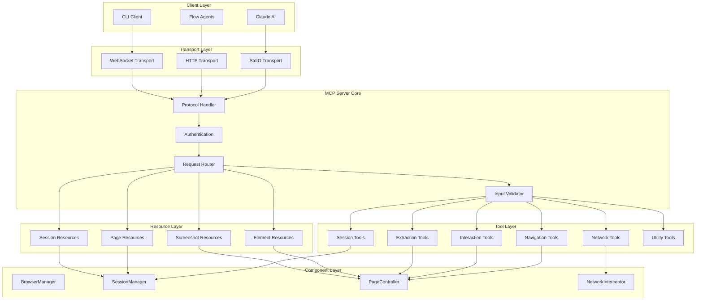
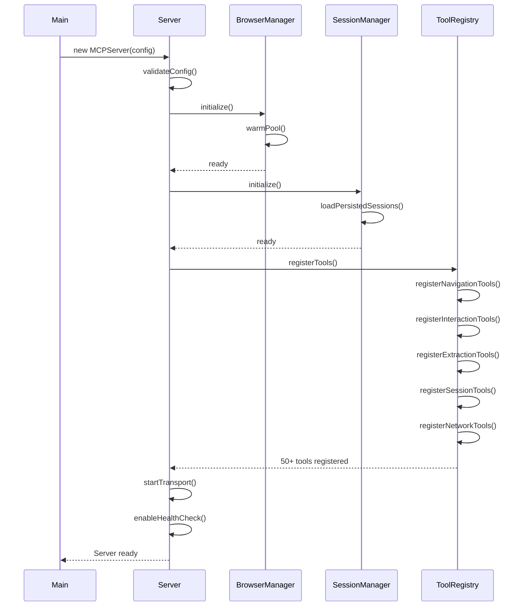

# MCP Server Design - Playwright MCP Server

## Server Architecture Overview



## Server Initialization Flow



## Tool Categories (50+ Tools)

### Category 1: Navigation Tools (10 tools)

#### Tool: navigate_to
```typescript
{
  name: "navigate_to",
  description: "Navigate to a URL and wait for page load",
  inputSchema: {
    type: "object",
    properties: {
      url: {
        type: "string",
        description: "The URL to navigate to",
        format: "uri"
      },
      sessionId: {
        type: "string",
        description: "Session ID to use (optional, creates new if not provided)"
      },
      waitUntil: {
        type: "string",
        enum: ["load", "domcontentloaded", "networkidle"],
        default: "load",
        description: "When to consider navigation complete"
      },
      timeout: {
        type: "number",
        description: "Navigation timeout in milliseconds",
        default: 30000,
        minimum: 1000,
        maximum: 120000
      },
      referer: {
        type: "string",
        description: "Referer header value"
      }
    },
    required: ["url"]
  }
}
```

#### Tool: go_back
```typescript
{
  name: "go_back",
  description: "Navigate back in browser history",
  inputSchema: {
    type: "object",
    properties: {
      sessionId: {
        type: "string",
        description: "Session ID"
      },
      waitUntil: {
        type: "string",
        enum: ["load", "domcontentloaded", "networkidle"],
        default: "load"
      }
    },
    required: ["sessionId"]
  }
}
```

#### Tool: go_forward
```typescript
{
  name: "go_forward",
  description: "Navigate forward in browser history",
  inputSchema: {
    type: "object",
    properties: {
      sessionId: {
        type: "string",
        description: "Session ID"
      },
      waitUntil: {
        type: "string",
        enum: ["load", "domcontentloaded", "networkidle"],
        default: "load"
      }
    },
    required: ["sessionId"]
  }
}
```

#### Tool: reload_page
```typescript
{
  name: "reload_page",
  description: "Reload the current page",
  inputSchema: {
    type: "object",
    properties: {
      sessionId: {
        type: "string",
        description: "Session ID"
      },
      ignoreCache: {
        type: "boolean",
        description: "Bypass cache during reload",
        default: false
      },
      waitUntil: {
        type: "string",
        enum: ["load", "domcontentloaded", "networkidle"],
        default: "load"
      }
    },
    required: ["sessionId"]
  }
}
```

#### Additional Navigation Tools:
- `wait_for_navigation`: Wait for navigation to complete
- `wait_for_load`: Wait for page load event
- `wait_for_url`: Wait for specific URL pattern
- `get_current_url`: Get current page URL
- `get_page_title`: Get current page title
- `wait_for_selector`: Wait for element to appear

### Category 2: Interaction Tools (15 tools)

#### Tool: click
```typescript
{
  name: "click",
  description: "Click on an element matching the selector",
  inputSchema: {
    type: "object",
    properties: {
      sessionId: {
        type: "string",
        description: "Session ID"
      },
      selector: {
        type: "string",
        description: "CSS, XPath, or text selector"
      },
      button: {
        type: "string",
        enum: ["left", "right", "middle"],
        default: "left",
        description: "Mouse button to click"
      },
      clickCount: {
        type: "number",
        description: "Number of clicks",
        default: 1,
        minimum: 1,
        maximum: 3
      },
      modifiers: {
        type: "array",
        items: {
          type: "string",
          enum: ["Alt", "Control", "Meta", "Shift"]
        },
        description: "Modifier keys to press during click"
      },
      position: {
        type: "object",
        properties: {
          x: { type: "number" },
          y: { type: "number" }
        },
        description: "Click position relative to element top-left corner"
      },
      force: {
        type: "boolean",
        description: "Skip actionability checks",
        default: false
      },
      timeout: {
        type: "number",
        description: "Action timeout in milliseconds",
        default: 5000
      },
      noWaitAfter: {
        type: "boolean",
        description: "Don't wait for navigation after click",
        default: false
      }
    },
    required: ["sessionId", "selector"]
  }
}
```

#### Tool: fill
```typescript
{
  name: "fill",
  description: "Fill an input field with text",
  inputSchema: {
    type: "object",
    properties: {
      sessionId: {
        type: "string",
        description: "Session ID"
      },
      selector: {
        type: "string",
        description: "Input field selector"
      },
      value: {
        type: "string",
        description: "Text to fill"
      },
      force: {
        type: "boolean",
        description: "Skip actionability checks",
        default: false
      },
      timeout: {
        type: "number",
        description: "Action timeout in milliseconds",
        default: 5000
      }
    },
    required: ["sessionId", "selector", "value"]
  }
}
```

#### Tool: type
```typescript
{
  name: "type",
  description: "Type text character by character",
  inputSchema: {
    type: "object",
    properties: {
      sessionId: {
        type: "string",
        description: "Session ID"
      },
      selector: {
        type: "string",
        description: "Element selector to type into"
      },
      text: {
        type: "string",
        description: "Text to type"
      },
      delay: {
        type: "number",
        description: "Delay between key presses in milliseconds",
        default: 0,
        minimum: 0,
        maximum: 1000
      },
      timeout: {
        type: "number",
        description: "Action timeout in milliseconds",
        default: 5000
      }
    },
    required: ["sessionId", "selector", "text"]
  }
}
```

#### Additional Interaction Tools:
- `double_click`: Double-click element
- `right_click`: Right-click element
- `hover`: Hover over element
- `press`: Press keyboard key
- `focus`: Focus on element
- `blur`: Remove focus from element
- `check`: Check checkbox
- `uncheck`: Uncheck checkbox
- `select_option`: Select dropdown option
- `clear`: Clear input field
- `drag_and_drop`: Drag element to another
- `upload_file`: Upload file to input

### Category 3: Extraction Tools (10 tools)

#### Tool: extract_text
```typescript
{
  name: "extract_text",
  description: "Extract text content from elements",
  inputSchema: {
    type: "object",
    properties: {
      sessionId: {
        type: "string",
        description: "Session ID"
      },
      selector: {
        type: "string",
        description: "Element selector"
      },
      all: {
        type: "boolean",
        description: "Extract from all matching elements",
        default: false
      },
      trim: {
        type: "boolean",
        description: "Trim whitespace",
        default: true
      },
      normalizeWhitespace: {
        type: "boolean",
        description: "Normalize whitespace",
        default: true
      }
    },
    required: ["sessionId", "selector"]
  }
}
```

#### Tool: extract_html
```typescript
{
  name: "extract_html",
  description: "Extract HTML content from elements",
  inputSchema: {
    type: "object",
    properties: {
      sessionId: {
        type: "string",
        description: "Session ID"
      },
      selector: {
        type: "string",
        description: "Element selector"
      },
      inner: {
        type: "boolean",
        description: "Extract innerHTML instead of outerHTML",
        default: true
      },
      all: {
        type: "boolean",
        description: "Extract from all matching elements",
        default: false
      }
    },
    required: ["sessionId", "selector"]
  }
}
```

#### Tool: extract_attribute
```typescript
{
  name: "extract_attribute",
  description: "Extract attribute value from element",
  inputSchema: {
    type: "object",
    properties: {
      sessionId: {
        type: "string",
        description: "Session ID"
      },
      selector: {
        type: "string",
        description: "Element selector"
      },
      attribute: {
        type: "string",
        description: "Attribute name to extract",
        examples: ["href", "src", "class", "id", "data-*"]
      },
      all: {
        type: "boolean",
        description: "Extract from all matching elements",
        default: false
      }
    },
    required: ["sessionId", "selector", "attribute"]
  }
}
```

#### Additional Extraction Tools:
- `extract_data`: Extract structured data using schema
- `extract_table`: Extract table data
- `extract_links`: Extract all links
- `extract_images`: Extract all images
- `extract_metadata`: Extract page metadata
- `extract_computed_style`: Extract computed CSS
- `evaluate_script`: Execute JavaScript and return result

### Category 4: Session Tools (8 tools)

#### Tool: create_session
```typescript
{
  name: "create_session",
  description: "Create a new browser session with isolated context",
  inputSchema: {
    type: "object",
    properties: {
      userId: {
        type: "string",
        description: "User ID for session isolation"
      },
      name: {
        type: "string",
        description: "Friendly session name"
      },
      persistent: {
        type: "boolean",
        description: "Persist session state to disk",
        default: false
      },
      ttl: {
        type: "number",
        description: "Session time-to-live in milliseconds",
        default: 86400000
      },
      browserType: {
        type: "string",
        enum: ["chromium", "firefox", "webkit"],
        default: "chromium",
        description: "Browser engine to use"
      },
      viewport: {
        type: "object",
        properties: {
          width: { type: "number", default: 1920 },
          height: { type: "number", default: 1080 }
        }
      },
      userAgent: {
        type: "string",
        description: "Custom user agent"
      },
      locale: {
        type: "string",
        description: "Locale (e.g., en-US)",
        default: "en-US"
      },
      timezone: {
        type: "string",
        description: "Timezone ID (e.g., America/New_York)"
      },
      permissions: {
        type: "array",
        items: {
          type: "string",
          enum: ["geolocation", "notifications", "camera", "microphone"]
        },
        description: "Browser permissions to grant"
      },
      proxy: {
        type: "object",
        properties: {
          server: { type: "string" },
          username: { type: "string" },
          password: { type: "string" }
        }
      }
    }
  }
}
```

#### Tool: get_session
```typescript
{
  name: "get_session",
  description: "Get session information",
  inputSchema: {
    type: "object",
    properties: {
      sessionId: {
        type: "string",
        description: "Session ID"
      }
    },
    required: ["sessionId"]
  }
}
```

#### Tool: list_sessions
```typescript
{
  name: "list_sessions",
  description: "List all active sessions",
  inputSchema: {
    type: "object",
    properties: {
      userId: {
        type: "string",
        description: "Filter by user ID"
      },
      persistent: {
        type: "boolean",
        description: "Filter by persistence"
      }
    }
  }
}
```

#### Additional Session Tools:
- `destroy_session`: Close and cleanup session
- `extend_session`: Extend session TTL
- `save_session_state`: Save current session state
- `restore_session_state`: Restore saved session state
- `export_session`: Export session for backup

### Category 5: Network Tools (7 tools)

#### Tool: set_extra_headers
```typescript
{
  name: "set_extra_headers",
  description: "Set extra HTTP headers for all requests",
  inputSchema: {
    type: "object",
    properties: {
      sessionId: {
        type: "string",
        description: "Session ID"
      },
      headers: {
        type: "object",
        additionalProperties: { type: "string" },
        description: "Headers as key-value pairs",
        examples: [
          {
            "Authorization": "Bearer token",
            "X-Custom-Header": "value"
          }
        ]
      }
    },
    required: ["sessionId", "headers"]
  }
}
```

#### Tool: mock_response
```typescript
{
  name: "mock_response",
  description: "Mock network responses for testing",
  inputSchema: {
    type: "object",
    properties: {
      sessionId: {
        type: "string",
        description: "Session ID"
      },
      pattern: {
        type: "string",
        description: "URL pattern to match (supports wildcards and regex)"
      },
      method: {
        type: "string",
        enum: ["GET", "POST", "PUT", "DELETE", "PATCH"],
        description: "HTTP method to match"
      },
      status: {
        type: "number",
        description: "HTTP status code",
        default: 200,
        minimum: 100,
        maximum: 599
      },
      headers: {
        type: "object",
        additionalProperties: { type: "string" },
        description: "Response headers"
      },
      body: {
        type: "string",
        description: "Response body"
      },
      contentType: {
        type: "string",
        description: "Content-Type header",
        default: "application/json"
      },
      delay: {
        type: "number",
        description: "Response delay in milliseconds",
        default: 0
      }
    },
    required: ["sessionId", "pattern"]
  }
}
```

#### Tool: block_requests
```typescript
{
  name: "block_requests",
  description: "Block network requests matching patterns",
  inputSchema: {
    type: "object",
    properties: {
      sessionId: {
        type: "string",
        description: "Session ID"
      },
      patterns: {
        type: "array",
        items: { type: "string" },
        description: "URL patterns to block",
        examples: [
          ["*.google-analytics.com/*", "*.facebook.net/*"]
        ]
      },
      resourceTypes: {
        type: "array",
        items: {
          type: "string",
          enum: ["image", "stylesheet", "font", "script", "xhr", "fetch"]
        },
        description: "Resource types to block"
      }
    },
    required: ["sessionId"]
  }
}
```

#### Additional Network Tools:
- `wait_for_request`: Wait for specific request
- `wait_for_response`: Wait for specific response
- `get_network_log`: Get network activity log
- `export_har`: Export network activity as HAR

### Category 6: Screenshot & Media Tools (5 tools)

#### Tool: screenshot
```typescript
{
  name: "screenshot",
  description: "Take a screenshot of the page or element",
  inputSchema: {
    type: "object",
    properties: {
      sessionId: {
        type: "string",
        description: "Session ID"
      },
      selector: {
        type: "string",
        description: "Element selector (optional, full page if not provided)"
      },
      fullPage: {
        type: "boolean",
        description: "Capture full scrollable page",
        default: false
      },
      type: {
        type: "string",
        enum: ["png", "jpeg"],
        default: "png",
        description: "Image format"
      },
      quality: {
        type: "number",
        description: "JPEG quality (0-100)",
        minimum: 0,
        maximum: 100,
        default: 80
      },
      omitBackground: {
        type: "boolean",
        description: "Transparent background",
        default: false
      },
      clip: {
        type: "object",
        properties: {
          x: { type: "number" },
          y: { type: "number" },
          width: { type: "number" },
          height: { type: "number" }
        },
        description: "Clip region"
      }
    },
    required: ["sessionId"]
  }
}
```

#### Additional Media Tools:
- `generate_pdf`: Generate PDF of page
- `record_video`: Start/stop video recording
- `get_screenshot_as_base64`: Get screenshot as base64
- `compare_screenshots`: Compare two screenshots for differences

### Category 7: Utility Tools (5 tools)

#### Tool: wait
```typescript
{
  name: "wait",
  description: "Wait for a specified duration",
  inputSchema: {
    type: "object",
    properties: {
      sessionId: {
        type: "string",
        description: "Session ID"
      },
      duration: {
        type: "number",
        description: "Duration to wait in milliseconds",
        minimum: 0,
        maximum: 60000
      }
    },
    required: ["sessionId", "duration"]
  }
}
```

#### Additional Utility Tools:
- `get_cookies`: Get cookies from session
- `set_cookies`: Set cookies in session
- `clear_cookies`: Clear cookies
- `execute_script`: Execute JavaScript

## Resource Definitions

### Resource: Page State
```typescript
{
  uri: "page://{sessionId}",
  name: "Current page state",
  description: "Real-time page information including URL, title, and load state",
  mimeType: "application/json",
  schema: {
    type: "object",
    properties: {
      url: { type: "string" },
      title: { type: "string" },
      readyState: {
        type: "string",
        enum: ["loading", "interactive", "complete"]
      },
      loaded: { type: "boolean" },
      frameCount: { type: "number" },
      metadata: {
        type: "object",
        properties: {
          description: { type: "string" },
          keywords: { type: "array", items: { type: "string" } },
          ogTitle: { type: "string" },
          ogImage: { type: "string" }
        }
      }
    }
  }
}
```

### Resource: Element Information
```typescript
{
  uri: "element://{sessionId}/{selector}",
  name: "Element information",
  description: "Detailed information about a specific element",
  mimeType: "application/json",
  schema: {
    type: "object",
    properties: {
      selector: { type: "string" },
      exists: { type: "boolean" },
      visible: { type: "boolean" },
      enabled: { type: "boolean" },
      boundingBox: {
        type: "object",
        properties: {
          x: { type: "number" },
          y: { type: "number" },
          width: { type: "number" },
          height: { type: "number" }
        }
      },
      attributes: {
        type: "object",
        additionalProperties: { type: "string" }
      },
      text: { type: "string" },
      html: { type: "string" }
    }
  }
}
```

### Resource: Screenshot
```typescript
{
  uri: "screenshot://{sessionId}/{screenshotId}",
  name: "Page screenshot",
  description: "Screenshot image data",
  mimeType: "image/png",
  binary: true
}
```

### Resource: Session Information
```typescript
{
  uri: "session://{sessionId}",
  name: "Session information",
  description: "Current session state and metadata",
  mimeType: "application/json",
  schema: {
    type: "object",
    properties: {
      id: { type: "string" },
      userId: { type: "string" },
      createdAt: { type: "string", format: "date-time" },
      lastAccessedAt: { type: "string", format: "date-time" },
      persistent: { type: "boolean" },
      browserType: { type: "string" },
      pageCount: { type: "number" },
      requestCount: { type: "number" },
      errorCount: { type: "number" }
    }
  }
}
```

## Prompt Templates

### Template: Web Scraping
```typescript
{
  name: "scrape_website",
  description: "Extract structured data from a website",
  template: `I need to scrape data from {{url}}.

The data I need:
{{#each fields}}
- {{name}}: {{description}} (selector: {{selector}})
{{/each}}

Please:
1. Navigate to {{url}}
2. Wait for the page to load completely
3. Extract each field using the provided selectors
4. Format the results as JSON
5. Handle any errors gracefully

{{#if pagination}}
Also handle pagination:
- Next page selector: {{pagination.nextSelector}}
- Max pages: {{pagination.maxPages}}
{{/if}}`,
  arguments: {
    url: {
      type: "string",
      description: "URL to scrape",
      required: true
    },
    fields: {
      type: "array",
      description: "Fields to extract",
      required: true
    },
    pagination: {
      type: "object",
      description: "Pagination settings",
      required: false
    }
  }
}
```

### Template: Form Automation
```typescript
{
  name: "fill_form",
  description: "Automate form filling and submission",
  template: `I need to fill out a form at {{url}}.

Form fields:
{{#each fields}}
- {{label}}: {{value}} (type: {{type}}, selector: {{selector}})
{{/each}}

{{#if submit}}
After filling, click the submit button: {{submit.selector}}
{{#if submit.waitForNavigation}}
Wait for navigation after submit.
{{/if}}
{{/if}}

Please:
1. Navigate to the form page
2. Wait for all form fields to be visible
3. Fill each field carefully
4. Verify the values were set correctly
{{#if submit}}
5. Submit the form
6. Capture the result page
{{/if}}`,
  arguments: {
    url: {
      type: "string",
      description: "Form URL",
      required: true
    },
    fields: {
      type: "array",
      description: "Form fields to fill",
      required: true
    },
    submit: {
      type: "object",
      description: "Submit button configuration",
      required: false
    }
  }
}
```

### Template: Screenshot Capture
```typescript
{
  name: "capture_screenshots",
  description: "Capture screenshots of pages or elements",
  template: `I need screenshots from {{url}}.

Capture requirements:
{{#if fullPage}}
- Full page screenshot (scrolling)
{{else if selector}}
- Element screenshot: {{selector}}
{{else}}
- Viewport screenshot
{{/if}}

{{#if viewport}}
Viewport: {{viewport.width}}x{{viewport.height}}
{{/if}}

{{#if waitFor}}
Wait for: {{waitFor.selector}} (timeout: {{waitFor.timeout}}ms)
{{/if}}

Image format: {{format}} (quality: {{quality}})`,
  arguments: {
    url: {
      type: "string",
      description: "URL to capture",
      required: true
    },
    fullPage: {
      type: "boolean",
      default: false
    },
    selector: {
      type: "string",
      required: false
    },
    format: {
      type: "string",
      enum: ["png", "jpeg"],
      default: "png"
    },
    quality: {
      type: "number",
      default: 80
    }
  }
}
```

## Error Response Standardization

### Error Response Schema
```typescript
interface ErrorResponse {
  error: {
    code: string;
    message: string;
    details?: ErrorDetails;
    timestamp: string;
    requestId: string;
  };
}

interface ErrorDetails {
  tool?: string;
  sessionId?: string;
  selector?: string;
  url?: string;
  stack?: string;
  context?: Record<string, any>;
}
```

### Error Codes
```typescript
enum ErrorCode {
  // Client Errors (4xx)
  INVALID_REQUEST = "INVALID_REQUEST",
  INVALID_SELECTOR = "INVALID_SELECTOR",
  ELEMENT_NOT_FOUND = "ELEMENT_NOT_FOUND",
  ELEMENT_NOT_INTERACTABLE = "ELEMENT_NOT_INTERACTABLE",
  SESSION_NOT_FOUND = "SESSION_NOT_FOUND",
  SESSION_EXPIRED = "SESSION_EXPIRED",
  UNAUTHORIZED = "UNAUTHORIZED",
  FORBIDDEN = "FORBIDDEN",
  RATE_LIMITED = "RATE_LIMITED",
  VALIDATION_ERROR = "VALIDATION_ERROR",

  // Server Errors (5xx)
  INTERNAL_ERROR = "INTERNAL_ERROR",
  BROWSER_LAUNCH_FAILED = "BROWSER_LAUNCH_FAILED",
  BROWSER_CRASHED = "BROWSER_CRASHED",
  NAVIGATION_FAILED = "NAVIGATION_FAILED",
  TIMEOUT = "TIMEOUT",
  NETWORK_ERROR = "NETWORK_ERROR",
  SCRIPT_EXECUTION_FAILED = "SCRIPT_EXECUTION_FAILED",
  RESOURCE_EXHAUSTED = "RESOURCE_EXHAUSTED",
  SERVICE_UNAVAILABLE = "SERVICE_UNAVAILABLE"
}
```

### Error Response Examples
```typescript
// Element not found
{
  error: {
    code: "ELEMENT_NOT_FOUND",
    message: "Element matching selector '.login-button' not found after 5000ms",
    details: {
      tool: "click",
      sessionId: "sess_abc123",
      selector: ".login-button",
      url: "https://example.com/login",
      context: {
        timeout: 5000,
        retries: 3,
        lastError: "TimeoutError: waiting for selector..."
      }
    },
    timestamp: "2025-11-27T10:30:00.000Z",
    requestId: "req_xyz789"
  }
}

// Navigation failed
{
  error: {
    code: "NAVIGATION_FAILED",
    message: "Navigation to https://example.com/page timed out",
    details: {
      tool: "navigate_to",
      sessionId: "sess_abc123",
      url: "https://example.com/page",
      context: {
        timeout: 30000,
        waitUntil: "load",
        networkError: "net::ERR_CONNECTION_TIMED_OUT"
      }
    },
    timestamp: "2025-11-27T10:30:00.000Z",
    requestId: "req_xyz789"
  }
}

// Browser crashed
{
  error: {
    code: "BROWSER_CRASHED",
    message: "Browser instance crashed unexpectedly",
    details: {
      sessionId: "sess_abc123",
      context: {
        browserId: "browser_def456",
        lastUrl: "https://example.com/",
        memoryUsage: "1.5GB",
        crashReason: "Aw, Snap!"
      }
    },
    timestamp: "2025-11-27T10:30:00.000Z",
    requestId: "req_xyz789"
  }
}
```

## Transport Options

### Option 1: stdio Transport (Default)
```typescript
interface StdioTransportConfig {
  type: "stdio";
  encoding: "utf-8";
  maxMessageSize: number; // bytes
  debug: boolean;
}

// Usage with Claude Desktop
{
  "mcpServers": {
    "playwright": {
      "command": "node",
      "args": ["/path/to/playwright-mcp/dist/index.js"],
      "env": {
        "PLAYWRIGHT_BROWSERS_PATH": "/opt/browsers"
      }
    }
  }
}
```

**Characteristics:**
- Simple setup
- No network overhead
- Best for local Claude Desktop
- Single client per process
- No authentication needed

### Option 2: HTTP Transport
```typescript
interface HTTPTransportConfig {
  type: "http";
  host: string;
  port: number;
  path: string;
  cors: {
    enabled: boolean;
    origins: string[];
  };
  rateLimit: {
    enabled: boolean;
    windowMs: number;
    max: number;
  };
  auth: {
    type: "bearer" | "api-key" | "none";
    secret?: string;
  };
}

// Server configuration
const server = new MCPServer({
  transport: {
    type: "http",
    host: "0.0.0.0",
    port: 3000,
    path: "/mcp",
    cors: {
      enabled: true,
      origins: ["https://app.example.com"]
    },
    rateLimit: {
      enabled: true,
      windowMs: 60000,
      max: 100
    },
    auth: {
      type: "bearer",
      secret: process.env.AUTH_SECRET
    }
  }
});
```

**Characteristics:**
- Multi-client support
- Network access required
- Authentication supported
- Rate limiting built-in
- Best for server deployment

### Option 3: WebSocket Transport
```typescript
interface WebSocketTransportConfig {
  type: "websocket";
  host: string;
  port: number;
  path: string;
  secure: boolean;
  auth: {
    type: "token" | "session" | "none";
    validateToken?: (token: string) => Promise<boolean>;
  };
  heartbeat: {
    enabled: boolean;
    interval: number;
    timeout: number;
  };
  reconnect: {
    enabled: boolean;
    maxAttempts: number;
    delay: number;
  };
}

// Server configuration
const server = new MCPServer({
  transport: {
    type: "websocket",
    host: "0.0.0.0",
    port: 3001,
    path: "/ws",
    secure: true,
    auth: {
      type: "token",
      validateToken: async (token) => {
        return await validateJWT(token);
      }
    },
    heartbeat: {
      enabled: true,
      interval: 30000,
      timeout: 5000
    },
    reconnect: {
      enabled: true,
      maxAttempts: 5,
      delay: 1000
    }
  }
});
```

**Characteristics:**
- Real-time bidirectional communication
- Long-lived connections
- Event streaming support
- Best for interactive applications
- Automatic reconnection

## Server Configuration

### Complete Server Configuration
```typescript
interface ServerConfig {
  server: {
    name: string;
    version: string;
    description: string;
  };
  transport: TransportConfig;
  browser: BrowserManagerConfig;
  session: SessionManagerConfig;
  tools: ToolsConfig;
  resources: ResourcesConfig;
  security: SecurityConfig;
  logging: LoggingConfig;
  metrics: MetricsConfig;
}

const defaultConfig: ServerConfig = {
  server: {
    name: "playwright-mcp",
    version: "1.0.0",
    description: "Playwright browser automation MCP server"
  },
  transport: {
    type: "stdio",
    maxMessageSize: 10485760 // 10MB
  },
  browser: {
    pool: {
      minInstances: 1,
      maxInstances: 10,
      idleTimeout: 300000
    },
    launch: {
      headless: true,
      timeout: 30000
    }
  },
  session: {
    storage: {
      type: "sqlite",
      ttl: 86400000
    },
    cleanup: {
      autoCleanup: true,
      idleTimeout: 3600000
    }
  },
  tools: {
    navigation: { enabled: true },
    interaction: { enabled: true },
    extraction: { enabled: true },
    session: { enabled: true },
    network: { enabled: true }
  },
  resources: {
    pages: { enabled: true, cacheTTL: 60000 },
    elements: { enabled: true, cacheTTL: 30000 },
    screenshots: { enabled: true, cacheTTL: 300000 },
    sessions: { enabled: true }
  },
  security: {
    authentication: { required: false },
    authorization: { enabled: false },
    urlWhitelist: [],
    urlBlacklist: ["file://", "javascript:"]
  },
  logging: {
    level: "info",
    format: "json",
    output: "stdout"
  },
  metrics: {
    enabled: true,
    port: 9090,
    prefix: "playwright_mcp_"
  }
};
```

---

**Document Version:** 1.0
**Last Updated:** 2025-11-27
**Status:** Architecture Phase - MCP Server Design
**Next Document:** Agent Design
