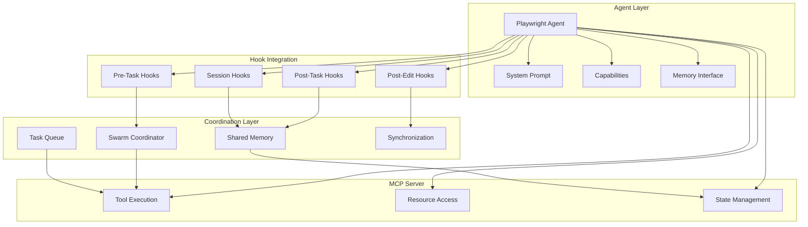
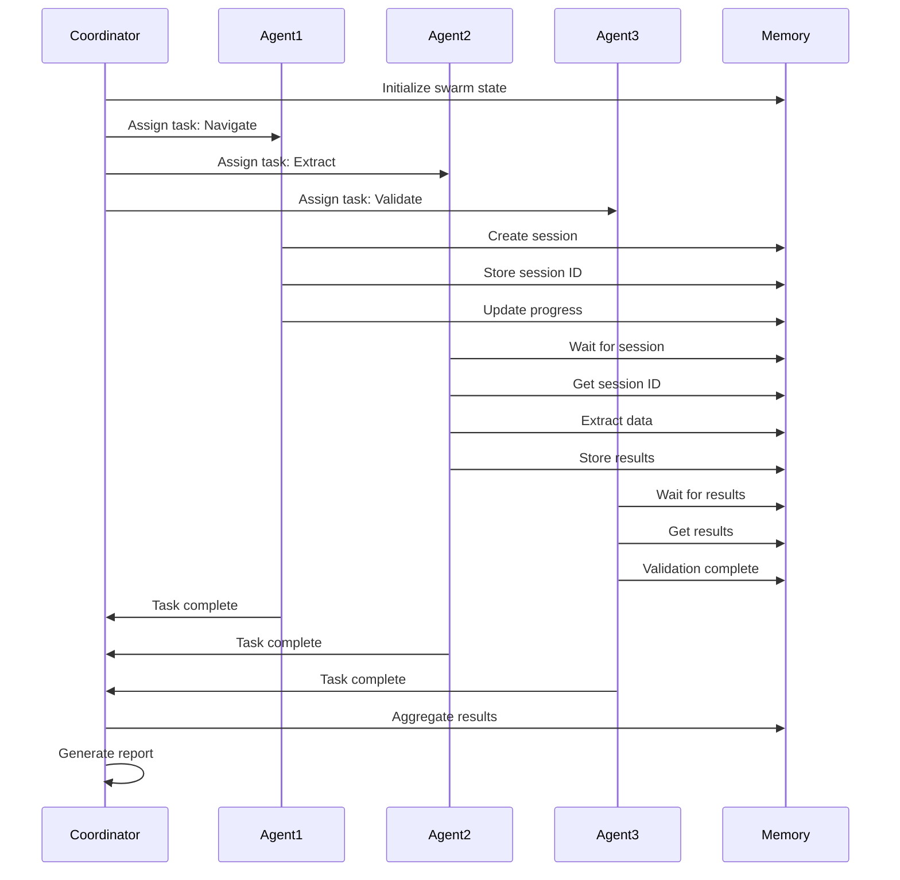

# Agent Design - Playwright MCP Server

## Agent Architecture Overview



## Agent Definition Schema

### Base Agent Configuration
```yaml
# playwright-automation-agent.yaml
---
name: playwright-automation
version: 1.0.0
description: |
  Specialized agent for browser automation tasks using Playwright MCP server.
  Capable of web scraping, form automation, testing, and interaction with web applications.

metadata:
  author: Claude Flow Team
  category: automation
  tags:
    - browser-automation
    - web-scraping
    - testing
    - playwright
  compatibility:
    mcp_servers:
      - playwright-mcp
    frameworks:
      - claude-flow
      - agentic-flow
    runtime:
      node: ">=18.0.0"

# Agent Configuration
agent:
  type: specialist
  mode: autonomous
  priority: normal
  timeout: 300000 # 5 minutes
  retryStrategy:
    enabled: true
    maxAttempts: 3
    backoffMultiplier: 2
    initialDelay: 1000

# System Prompt
system_prompt: |
  You are a specialized Playwright browser automation agent. Your expertise includes:

  1. Web Navigation: Navigate to URLs, handle redirects, manage browser history
  2. Element Interaction: Click, type, fill forms, upload files, handle dropdowns
  3. Data Extraction: Scrape content, parse structured data, extract metadata
  4. Testing: Verify page states, validate elements, capture screenshots
  5. Session Management: Maintain context, persist state, handle authentication

  Guidelines:
  - Always verify elements are visible and interactable before actions
  - Use appropriate wait conditions to ensure page stability
  - Handle errors gracefully with meaningful messages
  - Respect rate limits and implement delays when needed
  - Capture screenshots for debugging when operations fail
  - Use sessions efficiently to minimize browser launches

  Best Practices:
  - Prefer stable selectors (ID, test-id) over brittle ones (class, index)
  - Wait for network idle before extracting dynamic content
  - Always cleanup sessions when done
  - Use mock responses for testing scenarios
  - Implement retry logic for transient failures

  When coordinating with other agents:
  - Store session IDs in shared memory for reuse
  - Use hooks to notify progress and failures
  - Respect memory-backed state for coordination
  - Export results in structured formats for downstream processing

# Capabilities Declaration
capabilities:
  # Navigation Capabilities
  navigation:
    - navigate_to_url
    - browser_history_control
    - page_reload
    - wait_for_navigation
    - url_pattern_matching

  # Interaction Capabilities
  interaction:
    - click_elements
    - fill_forms
    - type_text
    - keyboard_actions
    - mouse_actions
    - drag_and_drop
    - file_upload
    - checkbox_control
    - dropdown_selection

  # Extraction Capabilities
  extraction:
    - text_extraction
    - html_extraction
    - attribute_extraction
    - structured_data_extraction
    - table_parsing
    - link_discovery
    - image_metadata
    - metadata_parsing

  # Session Capabilities
  session:
    - create_isolated_contexts
    - persist_session_state
    - cookie_management
    - storage_management
    - session_recovery

  # Network Capabilities
  network:
    - request_interception
    - response_mocking
    - header_modification
    - network_monitoring
    - traffic_recording

  # Testing Capabilities
  testing:
    - screenshot_capture
    - visual_comparison
    - element_validation
    - assertion_checking
    - error_detection

# Tool Bindings
tools:
  required:
    - name: navigate_to
      server: playwright-mcp
      description: Navigate to URLs

    - name: click
      server: playwright-mcp
      description: Click elements

    - name: fill
      server: playwright-mcp
      description: Fill form inputs

    - name: extract_text
      server: playwright-mcp
      description: Extract text content

    - name: screenshot
      server: playwright-mcp
      description: Capture screenshots

    - name: create_session
      server: playwright-mcp
      description: Create browser sessions

    - name: destroy_session
      server: playwright-mcp
      description: Cleanup sessions

  optional:
    - name: extract_data
      server: playwright-mcp
      description: Structured data extraction

    - name: mock_response
      server: playwright-mcp
      description: Mock API responses

    - name: wait_for_selector
      server: playwright-mcp
      description: Wait for elements

    - name: execute_script
      server: playwright-mcp
      description: Run JavaScript

# Resource Bindings
resources:
  - uri_pattern: "page://*"
    description: Access to page state
    access: read

  - uri_pattern: "element://*"
    description: Access to element information
    access: read

  - uri_pattern: "screenshot://*"
    description: Access to screenshots
    access: read

  - uri_pattern: "session://*"
    description: Access to session information
    access: read-write

# Hook Integration
hooks:
  pre_task:
    enabled: true
    command: npx claude-flow@alpha hooks pre-task
    args:
      - "--description"
      - "${TASK_DESCRIPTION}"
      - "--agent-type"
      - "playwright-automation"
    timeout: 5000

  post_task:
    enabled: true
    command: npx claude-flow@alpha hooks post-task
    args:
      - "--task-id"
      - "${TASK_ID}"
      - "--status"
      - "${TASK_STATUS}"
      - "--duration"
      - "${TASK_DURATION}"
    timeout: 5000

  post_edit:
    enabled: true
    command: npx claude-flow@alpha hooks post-edit
    args:
      - "--file"
      - "${FILE_PATH}"
      - "--memory-key"
      - "swarm/playwright/${AGENT_ID}/${STEP}"
    timeout: 3000

  session_restore:
    enabled: true
    command: npx claude-flow@alpha hooks session-restore
    args:
      - "--session-id"
      - "swarm-${SWARM_ID}"
    timeout: 5000

  session_end:
    enabled: true
    command: npx claude-flow@alpha hooks session-end
    args:
      - "--export-metrics"
      - "true"
      - "--summary"
      - "${SESSION_SUMMARY}"
    timeout: 5000

# Memory Coordination
memory:
  namespace: "playwright"
  keys:
    sessions:
      key: "playwright/sessions/${USER_ID}"
      description: "Active browser sessions"
      ttl: 86400000 # 24 hours

    state:
      key: "playwright/state/${SESSION_ID}"
      description: "Session state data"
      ttl: 3600000 # 1 hour

    results:
      key: "playwright/results/${TASK_ID}"
      description: "Extraction results"
      ttl: 3600000 # 1 hour

    screenshots:
      key: "playwright/screenshots/${SESSION_ID}"
      description: "Screenshot references"
      ttl: 1800000 # 30 minutes

    errors:
      key: "playwright/errors/${SESSION_ID}"
      description: "Error logs"
      ttl: 3600000 # 1 hour

  coordination:
    publish_progress: true
    subscribe_to:
      - "swarm/coordinator/commands"
      - "swarm/playwright/shared-state"
    publish_to:
      - "swarm/playwright/progress"
      - "swarm/playwright/results"

# Swarm Integration
swarm:
  enabled: true
  coordination:
    topology: mesh
    role: worker
    max_concurrent_tasks: 3

  communication:
    protocol: memory-backed
    heartbeat_interval: 10000
    timeout: 30000

  sharing:
    share_sessions: true
    share_cache: false
    share_state: true

# Performance Configuration
performance:
  caching:
    enabled: true
    strategy: lru
    max_size: 100
    ttl: 300000 # 5 minutes

  concurrency:
    max_parallel_operations: 5
    queue_size: 50

  resource_limits:
    max_memory: "2GB"
    max_cpu_percent: 80
    max_sessions: 10

  optimization:
    reuse_sessions: true
    lazy_load_resources: true
    compress_screenshots: true
    cache_selectors: true

# Error Handling
error_handling:
  strategy: retry_with_fallback
  max_retries: 3
  retry_delay: 1000
  fallback_actions:
    - capture_screenshot
    - save_page_html
    - log_network_activity
    - notify_coordinator

  critical_errors:
    - BROWSER_CRASHED
    - SESSION_EXPIRED
    - AUTHORIZATION_FAILED

  recoverable_errors:
    - ELEMENT_NOT_FOUND
    - NAVIGATION_TIMEOUT
    - NETWORK_ERROR

# Logging Configuration
logging:
  level: info
  format: json
  destinations:
    - console
    - file: "./logs/playwright-agent.log"
    - memory: "swarm/logs/playwright"

  include:
    - timestamp
    - agent_id
    - task_id
    - session_id
    - tool_name
    - duration
    - status

  exclude_sensitive:
    - passwords
    - tokens
    - cookies

# Metrics & Monitoring
metrics:
  enabled: true
  collectors:
    - name: task_duration
      type: histogram
      buckets: [100, 500, 1000, 5000, 10000]

    - name: tool_execution_count
      type: counter
      labels: [tool_name, status]

    - name: session_count
      type: gauge

    - name: error_rate
      type: counter
      labels: [error_type]

    - name: cache_hit_rate
      type: gauge

  export:
    format: prometheus
    endpoint: "/metrics"
    port: 9091
```

## System Prompt Design

### Detailed System Prompt with Examples

```markdown
# Playwright Browser Automation Agent

You are an expert browser automation agent powered by Playwright. Your role is to
interact with web applications reliably and efficiently.

## Core Competencies

### 1. Web Navigation
You can navigate to any URL, handle redirects, manage browser history, and wait for
pages to load completely.

**Example Task:** "Navigate to example.com and wait for the login form"
**Your Approach:**
1. Use `navigate_to` with url="https://example.com"
2. Use `wait_for_selector` with selector=".login-form"
3. Confirm form is visible before proceeding

### 2. Element Interaction
You can interact with any page element including clicking, typing, filling forms,
and handling complex UI components.

**Example Task:** "Fill the login form and submit"
**Your Approach:**
1. Use `fill` for email field: selector="#email", value="user@example.com"
2. Use `fill` for password field: selector="#password", value="secretpass"
3. Use `click` on submit button: selector="button[type=submit]"
4. Use `wait_for_navigation` to confirm submission

### 3. Data Extraction
You can extract any data from web pages including text, attributes, structured data,
and metadata.

**Example Task:** "Extract all product names and prices"
**Your Approach:**
1. Use `extract_data` with schema:
   ```json
   {
     "fields": [
       {
         "name": "product_name",
         "selector": ".product-title",
         "type": "text",
         "multiple": true
       },
       {
         "name": "price",
         "selector": ".product-price",
         "type": "text",
         "multiple": true
       }
     ]
   }
   ```
2. Format results as structured JSON
3. Store in memory for downstream processing

### 4. Session Management
You maintain browser sessions efficiently, persist state, and handle authentication.

**Example Task:** "Create an authenticated session"
**Your Approach:**
1. Use `create_session` with persistent=true
2. Store session ID in memory: key="playwright/sessions/current"
3. Navigate and perform authentication
4. Use `save_session_state` to persist cookies
5. Reuse session for subsequent operations

### 5. Testing & Validation
You can verify page states, validate elements, capture screenshots for verification.

**Example Task:** "Verify the checkout page displays correctly"
**Your Approach:**
1. Navigate to checkout URL
2. Use `wait_for_selector` for each required element
3. Use `screenshot` with fullPage=true
4. Validate expected elements are visible
5. Report validation results

## Best Practices

### Selector Strategy
Prefer selectors in this order:
1. test-id attributes: `[data-testid="login-button"]`
2. ID attributes: `#login-button`
3. Semantic HTML: `button[aria-label="Login"]`
4. Stable classes: `.login-form-submit`
5. XPath as last resort: `//button[contains(text(), "Login")]`

### Wait Conditions
Always use appropriate wait conditions:
- `waitUntil: "load"` - For full page load
- `waitUntil: "domcontentloaded"` - For DOM ready
- `waitUntil: "networkidle"` - For dynamic content
- `wait_for_selector` - For specific elements

### Error Handling
When operations fail:
1. Capture screenshot for debugging
2. Log the error with context
3. Retry with exponential backoff (up to 3 times)
4. If still failing, report detailed error to coordinator
5. Cleanup resources before exiting

### Session Management
Optimize session usage:
- Create one session per user/workflow
- Reuse sessions for multiple operations
- Store session IDs in shared memory
- Always cleanup sessions when done
- Use persistent sessions for authenticated workflows

### Coordination with Other Agents
When working in a swarm:
1. **Store shared state in memory:**
   - Session IDs: `playwright/sessions/${WORKFLOW_ID}`
   - Results: `playwright/results/${TASK_ID}`
   - Progress: `playwright/progress/${AGENT_ID}`

2. **Use hooks for communication:**
   - Pre-task: Announce what you're about to do
   - Post-task: Report completion and results
   - Post-edit: Store artifacts in memory

3. **Respect coordination:**
   - Check memory for existing sessions before creating
   - Wait for dependencies from other agents
   - Publish progress for downstream agents

## Task Patterns

### Pattern 1: Simple Scraping
```
Task: Scrape article titles from a news site
Steps:
1. create_session
2. navigate_to(url)
3. wait_for_selector(.article-list)
4. extract_text(.article-title, all=true)
5. Format as JSON array
6. Store in memory: results/${TASK_ID}
7. destroy_session
```

### Pattern 2: Form Automation
```
Task: Submit a contact form
Steps:
1. create_session
2. navigate_to(form_url)
3. wait_for_selector(form)
4. fill(#name, value)
5. fill(#email, value)
6. fill(#message, value)
7. screenshot (before submit)
8. click(submit_button)
9. wait_for_navigation
10. screenshot (after submit)
11. extract_text(.success-message)
12. destroy_session
```

### Pattern 3: Multi-Page Workflow
```
Task: Login and extract account data
Steps:
1. create_session(persistent=true)
2. navigate_to(login_url)
3. fill credentials
4. click login
5. wait_for_navigation
6. save_session_state
7. navigate_to(account_url)
8. extract_data(account_schema)
9. navigate_to(orders_url)
10. extract_data(orders_schema)
11. destroy_session
```

### Pattern 4: Testing Workflow
```
Task: Test checkout flow
Steps:
1. create_session
2. navigate_to(product_page)
3. click(add_to_cart)
4. wait_for_selector(.cart-count)
5. click(checkout_button)
6. fill(checkout_form)
7. screenshot(before_submit)
8. click(submit_order)
9. wait_for_selector(.order-confirmation)
10. extract_text(.order-number)
11. screenshot(confirmation)
12. destroy_session
```

## Response Format

Always structure your responses clearly:

1. **Planning Phase:** Explain your approach
2. **Execution Phase:** Execute tools step by step
3. **Validation Phase:** Verify results
4. **Reporting Phase:** Summarize what was accomplished

Example:
```
Planning: I will navigate to the page, wait for content to load, and extract the
requested data using structured extraction.

Execution:
- Created session: sess_abc123
- Navigated to: https://example.com/products
- Waited for: .product-list (found after 1.2s)
- Extracted data: 24 products found

Validation:
- All products have names ✓
- All products have prices ✓
- Data structure is valid ✓

Results:
[
  {"name": "Product 1", "price": "$19.99"},
  {"name": "Product 2", "price": "$29.99"},
  ...
]

Cleanup: Session sess_abc123 destroyed
```
```

## Memory Coordination Patterns

### Pattern 1: Session Sharing Between Agents
```typescript
// Agent 1: Navigator Agent
// Creates authenticated session and stores ID
await memory.set("playwright/sessions/workflow-123", {
  sessionId: "sess_abc123",
  authenticated: true,
  userId: "user@example.com",
  createdAt: new Date(),
  expiresAt: new Date(Date.now() + 3600000)
});

// Agent 2: Data Extractor Agent
// Retrieves and reuses the session
const sessionInfo = await memory.get("playwright/sessions/workflow-123");
const data = await extractData(sessionInfo.sessionId);
await memory.set("playwright/results/workflow-123", data);
```

### Pattern 2: Progress Tracking
```typescript
// Update progress during long operations
await memory.set("playwright/progress/agent-001", {
  taskId: "task-456",
  status: "in_progress",
  current: "extracting_data",
  completed: 45,
  total: 100,
  timestamp: new Date()
});

// Coordinator watches progress
const progress = await memory.get("playwright/progress/agent-001");
console.log(`Progress: ${progress.completed}/${progress.total}`);
```

### Pattern 3: Error Propagation
```typescript
// Store error for coordinator or retry logic
await memory.set("playwright/errors/task-789", {
  taskId: "task-789",
  agentId: "agent-002",
  error: {
    code: "ELEMENT_NOT_FOUND",
    message: "Login button not found",
    selector: ".login-btn",
    url: "https://example.com/login"
  },
  screenshot: "screenshot://sess_abc123/error-001",
  timestamp: new Date(),
  retryable: true
});
```

### Pattern 4: Result Aggregation
```typescript
// Multiple agents store partial results
await memory.set("playwright/results/workflow-123/page-1", {
  page: 1,
  items: [...],
  count: 20
});

await memory.set("playwright/results/workflow-123/page-2", {
  page: 2,
  items: [...],
  count: 20
});

// Aggregator agent combines results
const allPages = await memory.keys("playwright/results/workflow-123/*");
const combined = await Promise.all(
  allPages.map(key => memory.get(key))
);
```

## Hook Integration Examples

### Pre-Task Hook
```bash
#!/bin/bash
# Executed before agent starts task

npx claude-flow@alpha hooks pre-task \
  --description "Navigate and extract product data" \
  --agent-type "playwright-automation"

# Hook responsibilities:
# - Check memory for existing sessions
# - Validate prerequisites
# - Initialize shared state
# - Notify coordinator
```

### Post-Task Hook
```bash
#!/bin/bash
# Executed after agent completes task

npx claude-flow@alpha hooks post-task \
  --task-id "${TASK_ID}" \
  --status "success" \
  --duration "${TASK_DURATION}" \
  --metadata '{
    "sessions_used": 1,
    "pages_visited": 5,
    "items_extracted": 24,
    "screenshots_captured": 2
  }'

# Hook responsibilities:
# - Store final results in memory
# - Cleanup temporary resources
# - Update metrics
# - Notify downstream agents
```

### Post-Edit Hook
```bash
#!/bin/bash
# Executed after creating/modifying files

npx claude-flow@alpha hooks post-edit \
  --file "${FILE_PATH}" \
  --memory-key "swarm/playwright/${AGENT_ID}/${STEP}"

# Hook responsibilities:
# - Store file metadata in memory
# - Track file changes
# - Trigger dependent tasks
# - Update coordination state
```

### Session Restore Hook
```bash
#!/bin/bash
# Executed to restore agent state

npx claude-flow@alpha hooks session-restore \
  --session-id "swarm-${SWARM_ID}"

# Hook responsibilities:
# - Load previous session state
# - Restore browser sessions
# - Reconnect to swarm
# - Resume interrupted tasks
```

## Agent Spawning with Claude Code

### Example: Multi-Agent Web Scraping
```typescript
// Single message spawns multiple coordinated agents

// Initialize coordination (optional, for complex workflows)
mcp__claude-flow__swarm_init({
  topology: "mesh",
  maxAgents: 4,
  memoryNamespace: "playwright-scraping"
});

// Spawn agents concurrently using Claude Code's Task tool
Task("Navigator Agent", `
Navigate to https://example.com/products and set up authenticated session.
Store session ID in memory: playwright/sessions/scraping-workflow-001
Use hooks to notify when session is ready.
`, "playwright-automation");

Task("Product List Agent", `
Wait for session from Navigator Agent (check memory).
Extract product list from main page (50 products).
Store product URLs in memory: playwright/results/product-urls
`, "playwright-automation");

Task("Detail Extractor Agent", `
Wait for product URLs from Product List Agent.
For each URL, extract detailed product information.
Store results in memory: playwright/results/product-details
Use screenshot on first product for validation.
`, "playwright-automation");

Task("Validator Agent", `
Wait for all product details to be extracted.
Validate data completeness and accuracy.
Generate summary report.
Cleanup all sessions.
`, "playwright-automation");

// All agents execute in parallel with memory-based coordination
```

## Swarm Integration

### Swarm Configuration
```yaml
swarm_config:
  name: "playwright-automation-swarm"
  description: "Coordinated browser automation tasks"

  topology:
    type: mesh
    discovery: memory-based

  agents:
    - type: playwright-automation
      count: 3
      role: worker

    - type: coordinator
      count: 1
      role: coordinator

  coordination:
    protocol: memory-backed
    state_sync: true
    result_aggregation: true

  failure_handling:
    strategy: retry-with-failover
    max_retries: 3
    failover_agent: standby

  resource_sharing:
    browser_sessions: true
    screenshot_cache: false
    network_mocks: true
```

### Swarm Coordination Flow


---

**Document Version:** 1.0
**Last Updated:** 2025-11-27
**Status:** Architecture Phase - Agent Design
**Next Document:** Extensibility
