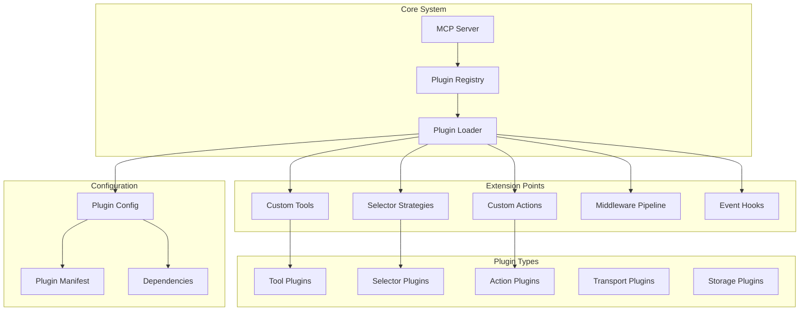

# Extensibility - Playwright MCP Server

## Extensibility Architecture



## Plugin Architecture Design

### Plugin System Overview

```typescript
interface Plugin {
  name: string;
  version: string;
  description: string;
  author: string;
  type: PluginType;
  dependencies?: PluginDependency[];

  // Lifecycle hooks
  initialize?(context: PluginContext): Promise<void>;
  activate?(context: PluginContext): Promise<void>;
  deactivate?(): Promise<void>;
  destroy?(): Promise<void>;
}

type PluginType =
  | 'tool'
  | 'selector-strategy'
  | 'action'
  | 'middleware'
  | 'transport'
  | 'storage'
  | 'hook';

interface PluginContext {
  server: MCPServer;
  browserManager: BrowserManager;
  sessionManager: SessionManager;
  config: ServerConfig;
  logger: Logger;
  metrics: MetricsCollector;
}

interface PluginDependency {
  name: string;
  version: string;
  optional?: boolean;
}

class PluginRegistry {
  private plugins: Map<string, Plugin>;
  private loadOrder: string[];
  private context: PluginContext;

  async register(plugin: Plugin): Promise<void>;
  async unregister(pluginName: string): Promise<void>;
  async load(pluginName: string): Promise<void>;
  async unload(pluginName: string): Promise<void>;
  async loadAll(): Promise<void>;
  async reload(pluginName: string): Promise<void>;

  getPlugin(name: string): Plugin | undefined;
  listPlugins(): Plugin[];
  isLoaded(name: string): boolean;

  on(event: PluginEvent, handler: EventHandler): void;
}

type PluginEvent =
  | 'plugin-registered'
  | 'plugin-loaded'
  | 'plugin-unloaded'
  | 'plugin-error';
```

### Plugin Manifest Schema

```json
{
  "$schema": "https://playwright-mcp.io/schemas/plugin-manifest.json",
  "name": "custom-tool-plugin",
  "version": "1.0.0",
  "description": "Custom tools for specialized automation",
  "author": "Your Name <your.email@example.com>",
  "license": "MIT",

  "type": "tool",
  "main": "./dist/index.js",
  "types": "./dist/index.d.ts",

  "compatibility": {
    "server": ">=1.0.0",
    "node": ">=18.0.0",
    "playwright": ">=1.40.0"
  },

  "dependencies": {
    "cheerio": "^1.0.0",
    "zod": "^3.22.0"
  },

  "peerDependencies": {
    "playwright": ">=1.40.0"
  },

  "configuration": {
    "schema": {
      "type": "object",
      "properties": {
        "apiKey": {
          "type": "string",
          "description": "API key for external service"
        },
        "endpoint": {
          "type": "string",
          "format": "uri",
          "description": "API endpoint URL"
        },
        "timeout": {
          "type": "number",
          "default": 30000,
          "description": "Request timeout in milliseconds"
        }
      },
      "required": ["apiKey"]
    }
  },

  "permissions": [
    "network:request",
    "filesystem:read",
    "memory:write"
  ],

  "provides": {
    "tools": [
      "custom_scrape",
      "custom_analyze",
      "custom_validate"
    ],
    "selectors": [
      "semantic",
      "visual"
    ]
  },

  "hooks": {
    "pre_tool_execution": true,
    "post_tool_execution": true,
    "session_created": true
  }
}
```

## Custom Tool Registration

### Tool Plugin Interface

```typescript
interface ToolPlugin extends Plugin {
  type: 'tool';
  tools: ToolDefinition[];

  registerTools(registry: ToolRegistry): Promise<void>;
  executeToolbeforeTool?(tool: string, params: any): Promise<void>;
  afterTool?(tool: string, result: any): Promise<void>;
}

interface ToolDefinition {
  name: string;
  description: string;
  inputSchema: JSONSchema;
  outputSchema?: JSONSchema;
  handler: ToolHandler;
  options?: ToolOptions;
}

interface ToolHandler {
  (params: any, context: ToolContext): Promise<any>;
}

interface ToolContext {
  sessionId?: string;
  page?: Page;
  browserContext?: BrowserContext;
  sessionManager: SessionManager;
  logger: Logger;
  cache: CacheManager;
}

interface ToolOptions {
  timeout?: number;
  retryable?: boolean;
  maxRetries?: number;
  cache?: {
    enabled: boolean;
    ttl: number;
  };
  rateLimit?: {
    requests: number;
    window: number;
  };
}
```

### Example: Custom Tool Plugin

```typescript
// plugins/semantic-scraper/index.ts
import { ToolPlugin, ToolContext } from '@playwright-mcp/plugin-sdk';
import { z } from 'zod';
import * as cheerio from 'cheerio';

export class SemanticScraperPlugin implements ToolPlugin {
  name = 'semantic-scraper';
  version = '1.0.0';
  description = 'Semantic HTML scraping with AI-powered data extraction';
  author = 'Your Name';
  type = 'tool' as const;

  tools = [
    {
      name: 'extract_semantic_data',
      description: 'Extract structured data using semantic HTML analysis',
      inputSchema: {
        type: 'object',
        properties: {
          sessionId: { type: 'string' },
          schema: {
            type: 'object',
            description: 'Data schema to extract',
            additionalProperties: true
          },
          includeMetadata: { type: 'boolean', default: true }
        },
        required: ['sessionId', 'schema']
      },
      handler: this.extractSemanticData.bind(this),
      options: {
        timeout: 30000,
        retryable: true,
        maxRetries: 3,
        cache: {
          enabled: true,
          ttl: 300000 // 5 minutes
        }
      }
    }
  ];

  private config: any;

  async initialize(context: PluginContext): Promise<void> {
    this.config = context.config.plugins?.[this.name] || {};
    context.logger.info(`Initializing ${this.name} plugin`);
  }

  async activate(context: PluginContext): Promise<void> {
    context.logger.info(`Activating ${this.name} plugin`);
  }

  async registerTools(registry: ToolRegistry): Promise<void> {
    for (const tool of this.tools) {
      await registry.register(tool);
    }
  }

  private async extractSemanticData(
    params: any,
    context: ToolContext
  ): Promise<any> {
    const { sessionId, schema, includeMetadata } = params;

    // Get page content
    const page = await context.sessionManager.getPage(sessionId);
    const html = await page.content();

    // Parse with Cheerio
    const $ = cheerio.load(html);

    // Extract semantic data
    const data = this.extractBySchema($, schema);

    // Add metadata if requested
    if (includeMetadata) {
      data._metadata = {
        url: page.url(),
        title: await page.title(),
        extractedAt: new Date(),
        schema: schema
      };
    }

    context.logger.info(`Extracted semantic data`, {
      sessionId,
      fieldCount: Object.keys(data).length
    });

    return data;
  }

  private extractBySchema($: cheerio.CheerioAPI, schema: any): any {
    const result: any = {};

    for (const [key, config] of Object.entries(schema)) {
      const fieldConfig = config as any;

      if (fieldConfig.semantic) {
        // Use semantic HTML selectors
        result[key] = this.extractSemantic($, fieldConfig);
      } else if (fieldConfig.selector) {
        // Use traditional selectors
        result[key] = $(fieldConfig.selector).text().trim();
      }
    }

    return result;
  }

  private extractSemantic($: cheerio.CheerioAPI, config: any): any {
    // Semantic extraction logic
    // This could use microdata, JSON-LD, RDFa, etc.

    switch (config.semantic) {
      case 'article':
        return {
          title: $('article h1, [itemprop="headline"]').first().text(),
          author: $('[itemprop="author"], [rel="author"]').first().text(),
          date: $('[itemprop="datePublished"], time[datetime]').first().attr('datetime'),
          content: $('article [itemprop="articleBody"], article .content').first().text()
        };

      case 'product':
        return {
          name: $('[itemprop="name"]').first().text(),
          price: $('[itemprop="price"]').first().text(),
          currency: $('[itemprop="priceCurrency"]').first().attr('content'),
          availability: $('[itemprop="availability"]').first().attr('content'),
          image: $('[itemprop="image"]').first().attr('src')
        };

      default:
        return null;
    }
  }
}

// Export plugin
export default new SemanticScraperPlugin();
```

### Plugin Usage

```typescript
// Load and register plugin
const pluginRegistry = new PluginRegistry(context);
await pluginRegistry.register(SemanticScraperPlugin);
await pluginRegistry.load('semantic-scraper');

// Use custom tool
const result = await mcpServer.executeTool('extract_semantic_data', {
  sessionId: 'sess_abc123',
  schema: {
    article: {
      semantic: 'article'
    },
    product: {
      semantic: 'product'
    }
  },
  includeMetadata: true
});
```

## Custom Selector Strategies

### Selector Strategy Plugin Interface

```typescript
interface SelectorStrategyPlugin extends Plugin {
  type: 'selector-strategy';
  strategies: SelectorStrategy[];

  registerStrategies(locator: ElementLocator): Promise<void>;
}

interface SelectorStrategy {
  name: string;
  description: string;
  priority: number;
  matcher: (selector: string) => boolean;
  executor: SelectorExecutor;
}

interface SelectorExecutor {
  (
    page: Page,
    selector: string,
    options: FindOptions
  ): Promise<ElementHandle | null>;
}
```

### Example: Visual Selector Strategy

```typescript
// plugins/visual-selector/index.ts
import { SelectorStrategyPlugin, SelectorExecutor } from '@playwright-mcp/plugin-sdk';
import cv from '@u4/opencv4nodejs';

export class VisualSelectorPlugin implements SelectorStrategyPlugin {
  name = 'visual-selector';
  version = '1.0.0';
  description = 'Find elements by visual appearance using computer vision';
  type = 'selector-strategy' as const;

  strategies = [
    {
      name: 'visual',
      description: 'Locate elements by visual template matching',
      priority: 50,
      matcher: (selector: string) => selector.startsWith('visual:'),
      executor: this.findByVisual.bind(this)
    },
    {
      name: 'color',
      description: 'Locate elements by color',
      priority: 45,
      matcher: (selector: string) => selector.startsWith('color:'),
      executor: this.findByColor.bind(this)
    }
  ];

  async registerStrategies(locator: ElementLocator): Promise<void> {
    for (const strategy of this.strategies) {
      locator.registerStrategy(strategy.name, strategy.executor);
    }
  }

  private async findByVisual(
    page: Page,
    selector: string,
    options: FindOptions
  ): Promise<ElementHandle | null> {
    // Remove 'visual:' prefix
    const templatePath = selector.substring(7);

    // Capture page screenshot
    const screenshot = await page.screenshot();
    const pageImage = cv.imdecode(screenshot);

    // Load template image
    const template = cv.imread(templatePath);

    // Perform template matching
    const matched = pageImage.matchTemplate(template, cv.TM_CCOEFF_NORMED);
    const minMax = matched.minMaxLoc();

    if (minMax.maxVal > 0.8) { // 80% match threshold
      const { x, y } = minMax.maxLoc;

      // Find element at those coordinates
      const element = await page.locator('body').evaluateHandle(
        (body, coords) => {
          return document.elementFromPoint(coords.x, coords.y);
        },
        { x, y }
      );

      return element as ElementHandle;
    }

    return null;
  }

  private async findByColor(
    page: Page,
    selector: string,
    options: FindOptions
  ): Promise<ElementHandle | null> {
    // Parse color selector: color:#FF0000
    const color = selector.substring(6);

    // Find elements with matching background color
    const element = await page.evaluateHandle(
      (targetColor) => {
        const elements = Array.from(document.querySelectorAll('*'));

        for (const el of elements) {
          const style = window.getComputedStyle(el);
          const bgColor = style.backgroundColor;

          // Convert to hex and compare
          if (this.rgbToHex(bgColor) === targetColor) {
            return el;
          }
        }

        return null;
      },
      color
    );

    return element as ElementHandle;
  }
}

export default new VisualSelectorPlugin();
```

## Middleware Pipeline

### Middleware System

```typescript
interface Middleware {
  name: string;
  priority: number;

  // Request middleware
  onRequest?(
    request: MCPRequest,
    context: MiddlewareContext
  ): Promise<MCPRequest | null>;

  // Response middleware
  onResponse?(
    response: MCPResponse,
    context: MiddlewareContext
  ): Promise<MCPResponse>;

  // Error middleware
  onError?(
    error: Error,
    context: MiddlewareContext
  ): Promise<Error | null>;
}

interface MiddlewareContext {
  server: MCPServer;
  sessionId?: string;
  toolName?: string;
  logger: Logger;
  metrics: MetricsCollector;
  cache: CacheManager;
  abort: () => void;
}

class MiddlewarePipeline {
  private middlewares: Middleware[] = [];

  use(middleware: Middleware): void;
  remove(name: string): void;

  async executeRequest(
    request: MCPRequest,
    context: MiddlewareContext
  ): Promise<MCPRequest | null>;

  async executeResponse(
    response: MCPResponse,
    context: MiddlewareContext
  ): Promise<MCPResponse>;

  async executeError(
    error: Error,
    context: MiddlewareContext
  ): Promise<Error | null>;
}
```

### Example: Logging Middleware

```typescript
// plugins/logging-middleware/index.ts
export class LoggingMiddleware implements Middleware {
  name = 'logging';
  priority = 100; // High priority

  async onRequest(
    request: MCPRequest,
    context: MiddlewareContext
  ): Promise<MCPRequest> {
    context.logger.info('Incoming request', {
      tool: request.method,
      params: request.params,
      timestamp: new Date()
    });

    // Attach request ID
    request.requestId = this.generateRequestId();

    return request;
  }

  async onResponse(
    response: MCPResponse,
    context: MiddlewareContext
  ): Promise<MCPResponse> {
    context.logger.info('Outgoing response', {
      requestId: response.requestId,
      duration: response.duration,
      success: !response.error,
      timestamp: new Date()
    });

    return response;
  }

  async onError(
    error: Error,
    context: MiddlewareContext
  ): Promise<Error> {
    context.logger.error('Request error', {
      error: error.message,
      stack: error.stack,
      tool: context.toolName,
      sessionId: context.sessionId,
      timestamp: new Date()
    });

    return error;
  }

  private generateRequestId(): string {
    return `req_${Date.now()}_${Math.random().toString(36).substr(2, 9)}`;
  }
}
```

### Example: Caching Middleware

```typescript
// plugins/caching-middleware/index.ts
export class CachingMiddleware implements Middleware {
  name = 'caching';
  priority = 90;

  private cacheableTools = new Set([
    'extract_text',
    'extract_html',
    'extract_metadata',
    'screenshot'
  ]);

  async onRequest(
    request: MCPRequest,
    context: MiddlewareContext
  ): Promise<MCPRequest | null> {
    if (!this.cacheableTools.has(request.method)) {
      return request;
    }

    // Generate cache key
    const cacheKey = this.generateCacheKey(request);

    // Check cache
    const cached = await context.cache.get(cacheKey);

    if (cached) {
      context.logger.debug('Cache hit', { cacheKey, tool: request.method });

      // Return cached response (abort request)
      context.abort();
      return null;
    }

    // Cache miss, attach cache key for response middleware
    request.cacheKey = cacheKey;

    return request;
  }

  async onResponse(
    response: MCPResponse,
    context: MiddlewareContext
  ): Promise<MCPResponse> {
    const cacheKey = response.request?.cacheKey;

    if (cacheKey && !response.error) {
      // Cache successful response
      await context.cache.set(cacheKey, response.result, {
        ttl: 300000 // 5 minutes
      });

      context.logger.debug('Response cached', { cacheKey });
    }

    return response;
  }

  private generateCacheKey(request: MCPRequest): string {
    return `${request.method}:${JSON.stringify(request.params)}`;
  }
}
```

### Example: Rate Limiting Middleware

```typescript
// plugins/rate-limit-middleware/index.ts
export class RateLimitMiddleware implements Middleware {
  name = 'rate-limit';
  priority = 95;

  private limits = new Map<string, RateLimitBucket>();

  async onRequest(
    request: MCPRequest,
    context: MiddlewareContext
  ): Promise<MCPRequest> {
    const key = context.sessionId || 'global';

    if (!this.checkLimit(key)) {
      throw new Error('Rate limit exceeded. Please try again later.');
    }

    this.increment(key);

    return request;
  }

  private checkLimit(key: string): boolean {
    const bucket = this.getBucket(key);
    return bucket.tokens > 0;
  }

  private increment(key: string): void {
    const bucket = this.getBucket(key);
    bucket.tokens--;
    bucket.lastRequest = Date.now();
  }

  private getBucket(key: string): RateLimitBucket {
    if (!this.limits.has(key)) {
      this.limits.set(key, {
        tokens: 100,
        maxTokens: 100,
        refillRate: 1, // 1 token per second
        lastRefill: Date.now(),
        lastRequest: Date.now()
      });
    }

    const bucket = this.limits.get(key)!;
    this.refillBucket(bucket);

    return bucket;
  }

  private refillBucket(bucket: RateLimitBucket): void {
    const now = Date.now();
    const elapsed = now - bucket.lastRefill;
    const tokensToAdd = Math.floor(elapsed / 1000) * bucket.refillRate;

    if (tokensToAdd > 0) {
      bucket.tokens = Math.min(bucket.tokens + tokensToAdd, bucket.maxTokens);
      bucket.lastRefill = now;
    }
  }
}

interface RateLimitBucket {
  tokens: number;
  maxTokens: number;
  refillRate: number;
  lastRefill: number;
  lastRequest: number;
}
```

## Event Hook System

### Hook System Interface

```typescript
interface HookSystem {
  register(hook: Hook): void;
  unregister(hookName: string): void;
  trigger(event: string, data: any): Promise<void>;
  on(event: string, handler: HookHandler): void;
  off(event: string, handler: HookHandler): void;
}

interface Hook {
  name: string;
  events: string[];
  priority: number;
  handler: HookHandler;
  filter?: (data: any) => boolean;
}

interface HookHandler {
  (event: string, data: any, context: HookContext): Promise<void>;
}

interface HookContext {
  server: MCPServer;
  logger: Logger;
  metrics: MetricsCollector;
  preventDefault: () => void;
  stopPropagation: () => void;
}

// Available events
type HookEvent =
  | 'server:start'
  | 'server:stop'
  | 'session:created'
  | 'session:destroyed'
  | 'tool:before'
  | 'tool:after'
  | 'tool:error'
  | 'browser:launched'
  | 'browser:crashed'
  | 'page:load'
  | 'page:error'
  | 'element:found'
  | 'element:not-found'
  | 'network:request'
  | 'network:response';
```

### Example: Analytics Hook

```typescript
// plugins/analytics-hook/index.ts
export class AnalyticsHook implements Hook {
  name = 'analytics';
  events = [
    'tool:after',
    'tool:error',
    'session:created',
    'session:destroyed'
  ];
  priority = 50;

  private analytics: AnalyticsClient;

  constructor() {
    this.analytics = new AnalyticsClient({
      apiKey: process.env.ANALYTICS_API_KEY
    });
  }

  async handler(
    event: string,
    data: any,
    context: HookContext
  ): Promise<void> {
    switch (event) {
      case 'tool:after':
        await this.trackToolUsage(data, context);
        break;

      case 'tool:error':
        await this.trackError(data, context);
        break;

      case 'session:created':
        await this.trackSessionStart(data, context);
        break;

      case 'session:destroyed':
        await this.trackSessionEnd(data, context);
        break;
    }
  }

  private async trackToolUsage(data: any, context: HookContext): Promise<void> {
    await this.analytics.track('tool_executed', {
      tool_name: data.toolName,
      duration: data.duration,
      success: true,
      session_id: data.sessionId,
      timestamp: new Date()
    });
  }

  private async trackError(data: any, context: HookContext): Promise<void> {
    await this.analytics.track('tool_error', {
      tool_name: data.toolName,
      error_code: data.error.code,
      error_message: data.error.message,
      session_id: data.sessionId,
      timestamp: new Date()
    });
  }
}
```

## Configuration Extension Points

### Plugin Configuration Schema

```typescript
interface PluginConfig {
  enabled: boolean;
  priority?: number;
  options?: Record<string, any>;
  permissions?: string[];
}

// Server configuration with plugins
interface ServerConfigWithPlugins extends ServerConfig {
  plugins: {
    directory: string;
    autoLoad: boolean;
    configs: Record<string, PluginConfig>;
  };
}

// Example configuration
const config: ServerConfigWithPlugins = {
  // ... base server config ...

  plugins: {
    directory: './plugins',
    autoLoad: true,
    configs: {
      'semantic-scraper': {
        enabled: true,
        priority: 100,
        options: {
          apiKey: process.env.SEMANTIC_API_KEY,
          timeout: 30000
        },
        permissions: ['network:request']
      },
      'visual-selector': {
        enabled: true,
        priority: 90,
        options: {
          matchThreshold: 0.8,
          cacheTemplates: true
        }
      },
      'logging-middleware': {
        enabled: true,
        priority: 100
      },
      'caching-middleware': {
        enabled: true,
        priority: 90,
        options: {
          ttl: 300000,
          maxSize: 1000
        }
      }
    }
  }
};
```

### Dynamic Configuration Reload

```typescript
class ConfigManager {
  private config: ServerConfigWithPlugins;
  private watchers: Map<string, FSWatcher> = new Map();

  async loadConfig(path: string): Promise<void>;
  async reloadConfig(): Promise<void>;
  async updatePluginConfig(
    pluginName: string,
    config: Partial<PluginConfig>
  ): Promise<void>;

  watch(callback: (config: ServerConfigWithPlugins) => void): void;
  unwatch(): void;
}
```

---

**Document Version:** 1.0
**Last Updated:** 2025-11-27
**Status:** Architecture Phase - Extensibility
**Next Document:** Security
