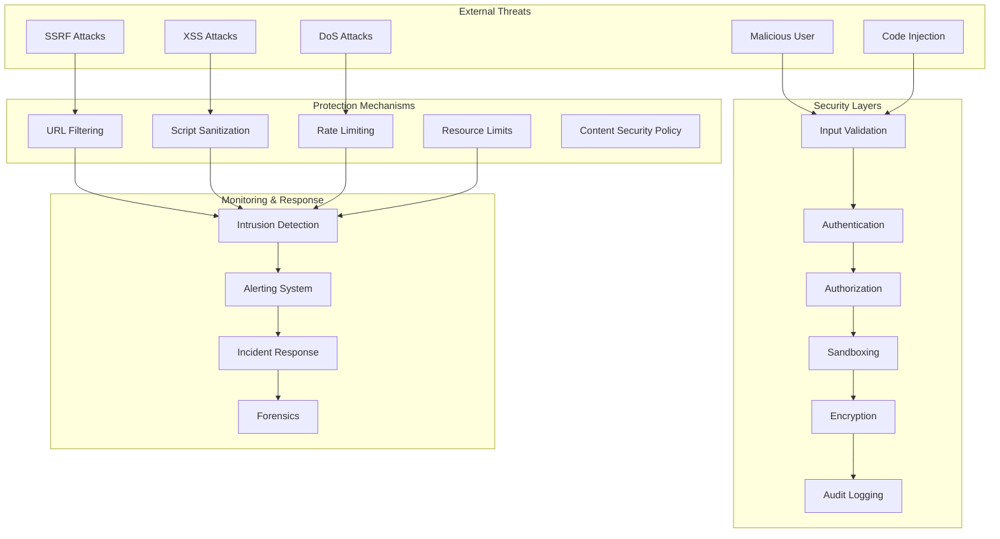

# Security - Playwright MCP Server

## Security Architecture Overview



## Threat Model

### Threat Categories

#### 1. Input-Based Threats
```typescript
interface InputThreat {
  category: 'input';
  type:
    | 'malicious_url'
    | 'script_injection'
    | 'selector_injection'
    | 'parameter_tampering'
    | 'buffer_overflow';
  severity: 'low' | 'medium' | 'high' | 'critical';
  description: string;
  mitigation: string[];
}

const inputThreats: InputThreat[] = [
  {
    category: 'input',
    type: 'malicious_url',
    severity: 'high',
    description: 'Attacker provides URLs to internal services or file:// protocol',
    mitigation: [
      'URL whitelist/blacklist',
      'Protocol filtering (allow only http/https)',
      'Private IP range blocking',
      'DNS rebinding protection'
    ]
  },
  {
    category: 'input',
    type: 'script_injection',
    severity: 'critical',
    description: 'Attacker injects malicious JavaScript via evaluate/executeScript',
    mitigation: [
      'Script content validation',
      'Allowlist of safe functions',
      'Sandboxed execution context',
      'CSP headers'
    ]
  },
  {
    category: 'input',
    type: 'selector_injection',
    severity: 'medium',
    description: 'Attacker crafts selectors to access sensitive DOM elements',
    mitigation: [
      'Selector syntax validation',
      'XPath injection prevention',
      'Restricted DOM access'
    ]
  }
];
```

#### 2. Session-Based Threats
```typescript
interface SessionThreat {
  category: 'session';
  type:
    | 'session_hijacking'
    | 'session_fixation'
    | 'cross_session_access'
    | 'session_poisoning';
  severity: 'low' | 'medium' | 'high' | 'critical';
  description: string;
  mitigation: string[];
}

const sessionThreats: SessionThreat[] = [
  {
    category: 'session',
    type: 'session_hijacking',
    severity: 'critical',
    description: 'Attacker steals session ID to impersonate user',
    mitigation: [
      'Session ID encryption',
      'Secure session storage',
      'Session binding to IP/user-agent',
      'Regular session rotation'
    ]
  },
  {
    category: 'session',
    type: 'cross_session_access',
    severity: 'high',
    description: 'User accesses another user\'s session',
    mitigation: [
      'Session ownership validation',
      'User isolation',
      'Authorization checks on all operations'
    ]
  }
];
```

#### 3. Resource Exhaustion Threats
```typescript
interface ResourceThreat {
  category: 'resource';
  type:
    | 'memory_exhaustion'
    | 'cpu_exhaustion'
    | 'disk_exhaustion'
    | 'browser_bomb'
    | 'network_flood';
  severity: 'low' | 'medium' | 'high' | 'critical';
  description: string;
  mitigation: string[];
}

const resourceThreats: ResourceThreat[] = [
  {
    category: 'resource',
    type: 'browser_bomb',
    severity: 'high',
    description: 'Attacker navigates to page that spawns infinite popups/tabs',
    mitigation: [
      'Popup blocking',
      'Tab limit per session',
      'Navigation rate limiting',
      'Automatic session termination on anomalies'
    ]
  },
  {
    category: 'resource',
    type: 'memory_exhaustion',
    severity: 'high',
    description: 'Attacker creates many sessions or large screenshots',
    mitigation: [
      'Session count limits per user',
      'Memory quotas per session',
      'Screenshot size limits',
      'Aggressive cleanup of idle sessions'
    ]
  }
];
```

## URL Validation and Restrictions

### URL Filter System

```typescript
interface URLFilterConfig {
  mode: 'allowlist' | 'blocklist' | 'hybrid';
  allowedProtocols: string[];
  blockedProtocols: string[];
  allowedDomains: string[];
  blockedDomains: string[];
  allowedPatterns: RegExp[];
  blockedPatterns: RegExp[];
  blockPrivateIPs: boolean;
  blockLocalhost: boolean;
  validateDNS: boolean;
  maxRedirects: number;
}

class URLValidator {
  private config: URLFilterConfig;
  private dnsCache: Map<string, DNSRecord>;

  constructor(config: URLFilterConfig);

  async validate(url: string): Promise<ValidationResult>;

  private validateProtocol(url: URL): boolean;
  private validateDomain(hostname: string): boolean;
  private validateIP(hostname: string): boolean;
  private checkDNSRebinding(hostname: string): Promise<boolean>;
  private checkPrivateIP(ip: string): boolean;
}

interface ValidationResult {
  valid: boolean;
  reason?: string;
  url: string;
  sanitizedUrl?: string;
}

// Default secure configuration
const secureURLConfig: URLFilterConfig = {
  mode: 'hybrid',

  // Only allow HTTP and HTTPS
  allowedProtocols: ['http:', 'https:'],
  blockedProtocols: ['file:', 'ftp:', 'data:', 'javascript:', 'about:'],

  // Block dangerous domains
  blockedDomains: [
    'localhost',
    '127.0.0.1',
    '0.0.0.0',
    '[::]',
    'metadata.google.internal', // Cloud metadata
    '169.254.169.254' // AWS metadata
  ],

  // Block private IP ranges
  blockedPatterns: [
    /^10\..*/,          // 10.0.0.0/8
    /^172\.(1[6-9]|2[0-9]|3[0-1])\..*/, // 172.16.0.0/12
    /^192\.168\..*/ ,   // 192.168.0.0/16
    /^fc00:.*/ ,        // IPv6 private
    /^fe80:.*/          // IPv6 link-local
  ],

  blockPrivateIPs: true,
  blockLocalhost: true,
  validateDNS: true,
  maxRedirects: 5
};

// Implementation
class URLValidator {
  async validate(url: string): Promise<ValidationResult> {
    let parsedURL: URL;

    try {
      parsedURL = new URL(url);
    } catch (error) {
      return {
        valid: false,
        reason: 'Invalid URL format',
        url
      };
    }

    // Protocol validation
    if (!this.validateProtocol(parsedURL)) {
      return {
        valid: false,
        reason: `Protocol ${parsedURL.protocol} is not allowed`,
        url
      };
    }

    // Domain/IP validation
    const hostname = parsedURL.hostname;

    // Check blocked domains
    if (this.config.blockedDomains.includes(hostname)) {
      return {
        valid: false,
        reason: `Domain ${hostname} is blocked`,
        url
      };
    }

    // Check if hostname is an IP address
    if (this.isIPAddress(hostname)) {
      if (this.config.blockPrivateIPs && this.checkPrivateIP(hostname)) {
        return {
          valid: false,
          reason: `Private IP addresses are not allowed`,
          url
        };
      }
    }

    // DNS rebinding check
    if (this.config.validateDNS) {
      const isDNSRebinding = await this.checkDNSRebinding(hostname);
      if (isDNSRebinding) {
        return {
          valid: false,
          reason: 'Potential DNS rebinding attack detected',
          url
        };
      }
    }

    // Pattern matching
    for (const pattern of this.config.blockedPatterns) {
      if (pattern.test(hostname)) {
        return {
          valid: false,
          reason: `Hostname matches blocked pattern`,
          url
        };
      }
    }

    // In allowlist mode, must match allowed domain
    if (this.config.mode === 'allowlist') {
      if (!this.validateDomain(hostname)) {
        return {
          valid: false,
          reason: 'Domain not in allowlist',
          url
        };
      }
    }

    return {
      valid: true,
      url,
      sanitizedUrl: parsedURL.toString()
    };
  }

  private checkPrivateIP(ip: string): boolean {
    // Check IPv4 private ranges
    const ipv4Parts = ip.split('.').map(Number);

    if (ipv4Parts.length === 4) {
      const [a, b, c, d] = ipv4Parts;

      // 10.0.0.0/8
      if (a === 10) return true;

      // 172.16.0.0/12
      if (a === 172 && b >= 16 && b <= 31) return true;

      // 192.168.0.0/16
      if (a === 192 && b === 168) return true;

      // 127.0.0.0/8 (localhost)
      if (a === 127) return true;

      // 169.254.0.0/16 (link-local)
      if (a === 169 && b === 254) return true;
    }

    // Check IPv6 private ranges
    if (ip.includes(':')) {
      if (ip.startsWith('fc') || ip.startsWith('fd')) return true; // ULA
      if (ip.startsWith('fe80')) return true; // Link-local
      if (ip === '::1') return true; // Localhost
    }

    return false;
  }

  private async checkDNSRebinding(hostname: string): Promise<boolean> {
    // Resolve DNS and check if it points to private IP
    try {
      const addresses = await dns.resolve4(hostname);

      for (const address of addresses) {
        if (this.checkPrivateIP(address)) {
          return true; // DNS rebinding detected
        }
      }

      return false;
    } catch (error) {
      // DNS resolution failed, block by default
      return true;
    }
  }
}
```

## Script Injection Prevention

### Script Execution Sandbox

```typescript
interface ScriptSandboxConfig {
  allowEval: boolean;
  allowFunctionConstructor: boolean;
  allowedGlobals: string[];
  blockedGlobals: string[];
  timeout: number;
  memoryLimit: number;
}

class ScriptSandbox {
  private config: ScriptSandboxConfig;

  constructor(config: ScriptSandboxConfig);

  async execute(
    script: string,
    context: Record<string, any>
  ): Promise<any>;

  validate(script: string): ValidationResult;
  sanitize(script: string): string;
}

// Secure sandbox configuration
const secureSandboxConfig: ScriptSandboxConfig = {
  allowEval: false,
  allowFunctionConstructor: false,

  allowedGlobals: [
    'Math',
    'Date',
    'JSON',
    'Object',
    'Array',
    'String',
    'Number',
    'Boolean'
  ],

  blockedGlobals: [
    'window',
    'document',
    'eval',
    'Function',
    'XMLHttpRequest',
    'fetch',
    'WebSocket',
    'importScripts',
    'postMessage',
    'localStorage',
    'sessionStorage',
    'indexedDB'
  ],

  timeout: 5000,
  memoryLimit: 50 * 1024 * 1024 // 50MB
};

class ScriptSandbox {
  validate(script: string): ValidationResult {
    // Check for dangerous patterns
    const dangerousPatterns = [
      /eval\(/,
      /Function\(/,
      /setTimeout\(/,
      /setInterval\(/,
      /require\(/,
      /import\(/,
      /__proto__/,
      /constructor\[/,
      /process\./,
      /global\./,
      /window\./,
      /document\./
    ];

    for (const pattern of dangerousPatterns) {
      if (pattern.test(script)) {
        return {
          valid: false,
          reason: `Script contains dangerous pattern: ${pattern}`,
          url: ''
        };
      }
    }

    // Parse and validate AST
    try {
      const ast = this.parseScript(script);
      const hasViolation = this.checkAST(ast);

      if (hasViolation) {
        return {
          valid: false,
          reason: 'Script contains forbidden constructs',
          url: ''
        };
      }
    } catch (error) {
      return {
        valid: false,
        reason: `Script parsing failed: ${error.message}`,
        url: ''
      };
    }

    return { valid: true, url: '' };
  }

  async execute(
    script: string,
    context: Record<string, any>
  ): Promise<any> {
    // Validate first
    const validation = this.validate(script);
    if (!validation.valid) {
      throw new Error(`Script validation failed: ${validation.reason}`);
    }

    // Create isolated context
    const sandbox = this.createSandbox(context);

    // Execute with timeout
    return await this.executeWithTimeout(script, sandbox, this.config.timeout);
  }

  private createSandbox(context: Record<string, any>): Record<string, any> {
    const sandbox: Record<string, any> = {};

    // Add allowed globals
    for (const global of this.config.allowedGlobals) {
      sandbox[global] = (globalThis as any)[global];
    }

    // Add provided context
    Object.assign(sandbox, context);

    return sandbox;
  }

  private async executeWithTimeout(
    script: string,
    sandbox: Record<string, any>,
    timeout: number
  ): Promise<any> {
    return new Promise((resolve, reject) => {
      const timer = setTimeout(() => {
        reject(new Error('Script execution timeout'));
      }, timeout);

      try {
        // Use vm2 or isolated-vm for actual isolation
        const result = this.runInSandbox(script, sandbox);
        clearTimeout(timer);
        resolve(result);
      } catch (error) {
        clearTimeout(timer);
        reject(error);
      }
    });
  }
}
```

## Resource Access Controls

### Resource Permissions System

```typescript
interface ResourcePermissions {
  user: string;
  resources: ResourcePermission[];
}

interface ResourcePermission {
  uri: string;
  actions: ('read' | 'write' | 'delete')[];
  conditions?: PermissionCondition[];
}

interface PermissionCondition {
  type: 'time' | 'ip' | 'session' | 'custom';
  value: any;
}

class ResourceAccessControl {
  private permissions: Map<string, ResourcePermissions>;

  async checkPermission(
    user: string,
    resource: string,
    action: 'read' | 'write' | 'delete',
    context: PermissionContext
  ): Promise<boolean>;

  async grantPermission(
    user: string,
    resource: string,
    actions: string[]
  ): Promise<void>;

  async revokePermission(
    user: string,
    resource: string
  ): Promise<void>;
}

interface PermissionContext {
  sessionId: string;
  ipAddress: string;
  timestamp: Date;
  userAgent: string;
}

// Example permission configuration
const permissions: ResourcePermissions = {
  user: 'user-123',
  resources: [
    {
      uri: 'session://user-123/*',
      actions: ['read', 'write', 'delete'],
      conditions: []
    },
    {
      uri: 'screenshot://*/user-123/*',
      actions: ['read', 'write'],
      conditions: [
        {
          type: 'time',
          value: { start: '09:00', end: '17:00' }
        }
      ]
    },
    {
      uri: 'page://*/user-123/*',
      actions: ['read'],
      conditions: []
    }
  ]
};
```

## Sandboxing Strategies

### Browser Sandboxing

```typescript
interface SandboxConfig {
  // Chromium sandbox flags
  chromiumArgs: string[];

  // Security policies
  policies: {
    disableJavaScript?: boolean;
    disableWebSecurity?: boolean;
    allowPlugins?: boolean;
    allowPopups?: boolean;
  };

  // Resource limits
  limits: {
    maxMemory: number;
    maxCPU: number;
    maxNetworkBandwidth: number;
  };
}

const secureSandboxConfig: SandboxConfig = {
  chromiumArgs: [
    '--no-sandbox',              // Note: Required in containers
    '--disable-setuid-sandbox',  // Note: Required in containers
    '--disable-dev-shm-usage',   // Use /tmp instead of /dev/shm
    '--disable-gpu',             // Disable GPU acceleration
    '--disable-software-rasterizer',
    '--disable-extensions',
    '--disable-plugins',
    '--disable-sync',
    '--disable-translate',
    '--disable-background-networking',
    '--disable-default-apps',
    '--disable-component-extensions-with-background-pages',
    '--mute-audio',
    '--no-first-run',
    '--no-default-browser-check',
    '--autoplay-policy=user-gesture-required',
    '--disable-features=TranslateUI,BlinkGenPropertyTrees'
  ],

  policies: {
    disableJavaScript: false,    // Allow JS but sanitize
    disableWebSecurity: false,   // Never disable in production
    allowPlugins: false,
    allowPopups: false
  },

  limits: {
    maxMemory: 2 * 1024 * 1024 * 1024, // 2GB
    maxCPU: 80, // 80% of one core
    maxNetworkBandwidth: 10 * 1024 * 1024 // 10 Mbps
  }
};
```

### Container Sandboxing

```yaml
# Docker container security configuration
services:
  playwright-mcp:
    image: playwright-mcp:latest

    # Security options
    security_opt:
      - no-new-privileges:true
      - seccomp:unconfined  # Required for Chrome sandboxing

    # Capabilities
    cap_drop:
      - ALL
    cap_add:
      - SYS_ADMIN  # Required for Chrome sandboxing

    # Read-only root filesystem
    read_only: true

    # Temporary volumes
    tmpfs:
      - /tmp
      - /var/tmp
      - /home/pwuser/.cache

    # Resource limits
    deploy:
      resources:
        limits:
          cpus: '2'
          memory: 4G
        reservations:
          cpus: '1'
          memory: 2G

    # Network isolation
    networks:
      - isolated

    # User
    user: "pwuser:pwuser"

    # Environment
    environment:
      NODE_ENV: production
      PLAYWRIGHT_BROWSERS_PATH: /home/pwuser/.cache/ms-playwright
```

## Authentication Handling

### Authentication Methods

```typescript
interface AuthConfig {
  methods: AuthMethod[];
  sessionDuration: number;
  refreshTokenDuration: number;
  mfaRequired: boolean;
}

type AuthMethod =
  | { type: 'bearer'; secret: string }
  | { type: 'api-key'; keys: string[] }
  | { type: 'oauth2'; provider: OAuth2Config }
  | { type: 'basic'; users: BasicAuthUser[] }
  | { type: 'jwt'; secret: string; algorithm: string };

interface OAuth2Config {
  authorizationURL: string;
  tokenURL: string;
  clientID: string;
  clientSecret: string;
  scope: string[];
  callbackURL: string;
}

interface BasicAuthUser {
  username: string;
  passwordHash: string;
  roles: string[];
}

class AuthenticationManager {
  private config: AuthConfig;
  private sessions: Map<string, AuthSession>;

  async authenticate(
    credentials: AuthCredentials
  ): Promise<AuthResult>;

  async validateToken(token: string): Promise<boolean>;

  async refreshToken(refreshToken: string): Promise<AuthResult>;

  async revokeToken(token: string): Promise<void>;

  async requireMFA(userId: string): Promise<MFAChallenge>;

  async verifyMFA(
    userId: string,
    code: string
  ): Promise<boolean>;
}

interface AuthSession {
  userId: string;
  token: string;
  refreshToken: string;
  expiresAt: Date;
  mfaVerified: boolean;
  permissions: string[];
}

interface AuthResult {
  success: boolean;
  token?: string;
  refreshToken?: string;
  expiresIn?: number;
  error?: string;
}
```

### Session Security

```typescript
class SessionSecurity {
  // Session binding
  bindToIP(sessionId: string, ip: string): void;
  bindToUserAgent(sessionId: string, ua: string): void;

  // Session validation
  validateBinding(
    sessionId: string,
    context: RequestContext
  ): boolean;

  // Session rotation
  rotateSessionId(sessionId: string): string;

  // Session invalidation
  invalidateSession(sessionId: string): void;
  invalidateAllSessions(userId: string): void;
}

interface RequestContext {
  ipAddress: string;
  userAgent: string;
  timestamp: Date;
}
```

## Data Encryption

### Encryption at Rest

```typescript
interface EncryptionConfig {
  algorithm: 'aes-256-gcm' | 'chacha20-poly1305';
  keyDerivation: 'pbkdf2' | 'scrypt' | 'argon2';
  keyRotation: {
    enabled: boolean;
    interval: number; // days
  };
}

class DataEncryption {
  private config: EncryptionConfig;
  private currentKey: Buffer;
  private oldKeys: Buffer[];

  encrypt(data: Buffer | string): EncryptedData;
  decrypt(encrypted: EncryptedData): Buffer;

  encryptSession(session: Session): EncryptedSession;
  decryptSession(encrypted: EncryptedSession): Session;

  async rotateKeys(): Promise<void>;
}

interface EncryptedData {
  ciphertext: string;
  iv: string;
  authTag: string;
  keyVersion: number;
}

// Example: Encrypt session cookies
class SecureSessionStorage {
  async saveSession(session: Session): Promise<void> {
    const encrypted = this.encryption.encryptSession(session);
    await this.storage.set(session.id, encrypted);
  }

  async loadSession(sessionId: string): Promise<Session> {
    const encrypted = await this.storage.get(sessionId);
    if (!encrypted) throw new Error('Session not found');

    return this.encryption.decryptSession(encrypted);
  }
}
```

### Encryption in Transit

```typescript
interface TLSConfig {
  minVersion: 'TLSv1.2' | 'TLSv1.3';
  ciphers: string[];
  cert: string;
  key: string;
  ca?: string;
  rejectUnauthorized: boolean;
}

const secureTLSConfig: TLSConfig = {
  minVersion: 'TLSv1.3',
  ciphers: [
    'TLS_AES_256_GCM_SHA384',
    'TLS_CHACHA20_POLY1305_SHA256',
    'TLS_AES_128_GCM_SHA256'
  ],
  cert: fs.readFileSync('./certs/server.crt'),
  key: fs.readFileSync('./certs/server.key'),
  rejectUnauthorized: true
};

// HTTPS server with secure TLS
const server = https.createServer(secureTLSConfig, app);
```

## Audit Logging

### Audit Log System

```typescript
interface AuditLog {
  id: string;
  timestamp: Date;
  userId?: string;
  sessionId?: string;
  action: string;
  resource: string;
  result: 'success' | 'failure';
  metadata: Record<string, any>;
  ipAddress: string;
  userAgent: string;
}

class AuditLogger {
  async log(entry: Omit<AuditLog, 'id' | 'timestamp'>): Promise<void>;

  async query(filter: AuditLogFilter): Promise<AuditLog[]>;

  async export(
    startDate: Date,
    endDate: Date,
    format: 'json' | 'csv'
  ): Promise<string>;
}

interface AuditLogFilter {
  userId?: string;
  sessionId?: string;
  action?: string;
  resource?: string;
  result?: 'success' | 'failure';
  startDate?: Date;
  endDate?: Date;
}

// Audit all tool executions
class AuditMiddleware implements Middleware {
  async onRequest(request: MCPRequest, context: MiddlewareContext) {
    await this.auditLogger.log({
      userId: context.userId,
      sessionId: context.sessionId,
      action: `tool:${request.method}`,
      resource: request.params?.url || request.params?.selector,
      result: 'success',
      metadata: {
        params: request.params
      },
      ipAddress: context.ipAddress,
      userAgent: context.userAgent
    });

    return request;
  }

  async onError(error: Error, context: MiddlewareContext) {
    await this.auditLogger.log({
      userId: context.userId,
      sessionId: context.sessionId,
      action: `tool:${context.toolName}`,
      resource: context.resource,
      result: 'failure',
      metadata: {
        error: error.message,
        stack: error.stack
      },
      ipAddress: context.ipAddress,
      userAgent: context.userAgent
    });

    return error;
  }
}
```

### Security Event Monitoring

```typescript
interface SecurityEvent {
  id: string;
  timestamp: Date;
  type: SecurityEventType;
  severity: 'low' | 'medium' | 'high' | 'critical';
  description: string;
  source: {
    userId?: string;
    sessionId?: string;
    ipAddress: string;
  };
  details: Record<string, any>;
}

type SecurityEventType =
  | 'authentication_failure'
  | 'authorization_failure'
  | 'suspicious_activity'
  | 'rate_limit_exceeded'
  | 'invalid_input'
  | 'privilege_escalation'
  | 'data_exfiltration'
  | 'anomalous_behavior';

class SecurityMonitor {
  async recordEvent(event: Omit<SecurityEvent, 'id' | 'timestamp'>): Promise<void>;

  async detectAnomalies(): Promise<SecurityEvent[]>;

  async alertOnCritical(event: SecurityEvent): Promise<void>;

  // Pattern-based detection
  async detectBruteForce(userId: string): Promise<boolean>;
  async detectSQLInjection(input: string): Promise<boolean>;
  async detectXSS(input: string): Promise<boolean>;
  async detectSSRF(url: string): Promise<boolean>;
}

// Example: Detect brute force
class BruteForceDetector {
  private attempts: Map<string, number[]> = new Map();

  async check(userId: string): Promise<boolean> {
    const now = Date.now();
    const attempts = this.attempts.get(userId) || [];

    // Clean old attempts (older than 5 minutes)
    const recentAttempts = attempts.filter(
      t => now - t < 5 * 60 * 1000
    );

    // More than 5 failed attempts in 5 minutes = brute force
    if (recentAttempts.length >= 5) {
      await this.securityMonitor.recordEvent({
        type: 'suspicious_activity',
        severity: 'high',
        description: 'Possible brute force attack detected',
        source: {
          userId,
          ipAddress: this.getIPAddress(userId)
        },
        details: {
          attemptCount: recentAttempts.length,
          timeWindow: '5 minutes'
        }
      });

      return true;
    }

    recentAttempts.push(now);
    this.attempts.set(userId, recentAttempts);

    return false;
  }
}
```

## Security Best Practices

### Development Guidelines

```typescript
/**
 * Security Checklist for Playwright MCP Server
 */

const securityChecklist = {
  input_validation: [
    '✓ Validate all URLs before navigation',
    '✓ Sanitize all selectors before use',
    '✓ Validate all script content before execution',
    '✓ Limit parameter sizes to prevent buffer overflows',
    '✓ Use parameterized queries for database operations'
  ],

  authentication: [
    '✓ Require authentication for all sensitive operations',
    '✓ Implement MFA for administrative actions',
    '✓ Use secure session management',
    '✓ Rotate session IDs regularly',
    '✓ Implement account lockout after failed attempts'
  ],

  authorization: [
    '✓ Implement principle of least privilege',
    '✓ Validate user permissions on every operation',
    '✓ Enforce resource ownership checks',
    '✓ Log all authorization failures'
  ],

  data_protection: [
    '✓ Encrypt sensitive data at rest',
    '✓ Use TLS 1.3 for all network communication',
    '✓ Never log passwords or tokens',
    '✓ Implement secure key management',
    '✓ Rotate encryption keys periodically'
  ],

  resource_limits: [
    '✓ Implement rate limiting on all endpoints',
    '✓ Set memory limits per session',
    '✓ Limit number of concurrent sessions per user',
    '✓ Set timeouts on all operations',
    '✓ Implement browser resource quotas'
  ],

  monitoring: [
    '✓ Log all security-relevant events',
    '✓ Monitor for suspicious patterns',
    '✓ Set up alerting for critical events',
    '✓ Implement automated incident response',
    '✓ Regular security audit reviews'
  ],

  dependencies: [
    '✓ Keep all dependencies up to date',
    '✓ Run regular security scans',
    '✓ Monitor for known vulnerabilities',
    '✓ Use dependency pinning',
    '✓ Review dependency licenses'
  ]
};
```

### Incident Response Plan

```typescript
interface IncidentResponsePlan {
  detection: {
    monitoring: string[];
    alerting: string[];
    escalation: EscalationPath[];
  };

  containment: {
    immediate: string[];
    shortTerm: string[];
    longTerm: string[];
  };

  recovery: {
    steps: string[];
    verification: string[];
    monitoring: string[];
  };

  postIncident: {
    analysis: string[];
    documentation: string[];
    improvements: string[];
  };
}

const incidentPlan: IncidentResponsePlan = {
  detection: {
    monitoring: [
      'Real-time security event monitoring',
      'Anomaly detection algorithms',
      'Failed authentication tracking',
      'Resource usage monitoring'
    ],
    alerting: [
      'Critical: Page security team immediately',
      'High: Alert within 15 minutes',
      'Medium: Alert within 1 hour',
      'Low: Daily summary report'
    ],
    escalation: [
      { level: 1, role: 'On-call engineer', time: 0 },
      { level: 2, role: 'Security team', time: 15 },
      { level: 3, role: 'Management', time: 60 }
    ]
  },

  containment: {
    immediate: [
      'Isolate affected sessions',
      'Revoke compromised credentials',
      'Block malicious IP addresses',
      'Enable enhanced logging'
    ],
    shortTerm: [
      'Analyze attack patterns',
      'Identify affected users',
      'Patch vulnerabilities',
      'Update security rules'
    ],
    longTerm: [
      'Architecture review',
      'Security audit',
      'Policy updates',
      'Training improvements'
    ]
  },

  recovery: {
    steps: [
      'Verify threat eliminated',
      'Restore from clean backup if needed',
      'Reset all credentials',
      'Gradual service restoration'
    ],
    verification: [
      'Security scan of restored systems',
      'Penetration testing',
      'Log analysis',
      'User acceptance testing'
    ],
    monitoring: [
      'Enhanced monitoring for 30 days',
      'Regular security scans',
      'User behavior analysis',
      'Threat intelligence updates'
    ]
  },

  postIncident: {
    analysis: [
      'Root cause analysis',
      'Timeline reconstruction',
      'Impact assessment',
      'Lessons learned documentation'
    ],
    documentation: [
      'Incident report',
      'Technical writeup',
      'User notification (if required)',
      'Regulatory reporting (if required)'
    ],
    improvements: [
      'Security control enhancements',
      'Process improvements',
      'Training updates',
      'Architecture changes'
    ]
  }
};

interface EscalationPath {
  level: number;
  role: string;
  time: number; // minutes
}
```

---

**Document Version:** 1.0
**Last Updated:** 2025-11-27
**Status:** Architecture Phase - Security
**Phase Status:** COMPLETE

## Summary

This completes the SPARC Architecture phase for the Playwright MCP Server. All six architecture documents have been created:

1. **01-system-overview.md**: System architecture, deployment topologies, and infrastructure design
2. **02-component-design.md**: Detailed specifications for 7 core components
3. **03-mcp-server-design.md**: MCP server implementation with 50+ tools
4. **04-agent-design.md**: Agent integration with Claude Flow and swarm coordination
5. **05-extensibility.md**: Plugin architecture and extension points
6. **06-security.md**: Comprehensive security architecture and threat mitigation

**Next Phase**: Refinement (Implementation using TDD)
