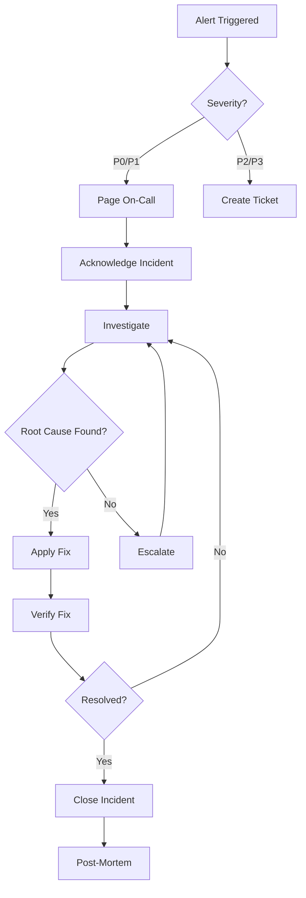
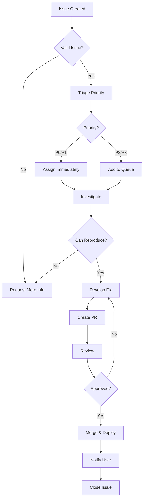

# SPARC Completion Phase: Maintenance & Operations
# Playwright Browser Automation Agent

## Version: 1.0.0
## Phase: Completion - Maintenance
## Date: 2025-11-27

---

## Table of Contents

1. [Maintenance Overview](#maintenance-overview)
2. [Monitoring Setup](#monitoring-setup)
3. [Logging Strategy](#logging-strategy)
4. [Incident Response](#incident-response)
5. [Update Procedures](#update-procedures)
6. [Support Procedures](#support-procedures)
7. [Performance Monitoring](#performance-monitoring)
8. [Backup & Recovery](#backup--recovery)
9. [Health Checks](#health-checks)
10. [Runbook Templates](#runbook-templates)

---

## Maintenance Overview

### Maintenance Philosophy

```
┌─────────────────────────────────────────────────────────────┐
│                    Maintenance Strategy                      │
├─────────────────────────────────────────────────────────────┤
│                                                               │
│  ┌──────────────┐  ┌──────────────┐  ┌──────────────┐      │
│  │  Proactive   │  │   Reactive   │  │  Continuous  │      │
│  │  Monitoring  │  │   Response   │  │ Improvement  │      │
│  └──────────────┘  └──────────────┘  └──────────────┘      │
│                                                               │
│  ┌────────────────────────────────────────────────────┐     │
│  │                 Monitoring Layer                    │     │
│  │  • Health Checks    • Metrics    • Alerts          │     │
│  └────────────────────────────────────────────────────┘     │
│                                                               │
│  ┌────────────────────────────────────────────────────┐     │
│  │                  Logging Layer                      │     │
│  │  • Structured Logs  • Aggregation  • Analysis      │     │
│  └────────────────────────────────────────────────────┘     │
│                                                               │
│  ┌────────────────────────────────────────────────────┐     │
│  │                 Response Layer                      │     │
│  │  • Incident Mgmt    • Runbooks    • Escalation     │     │
│  └────────────────────────────────────────────────────┘     │
│                                                               │
└─────────────────────────────────────────────────────────────┘
```

### Maintenance Objectives

1. **Availability**: 99.9% uptime target
2. **Performance**: Response time < 500ms (p95)
3. **Reliability**: Error rate < 0.1%
4. **Security**: Zero unpatched vulnerabilities
5. **Support**: Response time < 4 hours

---

## Monitoring Setup

### 1. Prometheus Metrics

#### Metrics Exporter Implementation

**File**: `src/monitoring/prometheus.ts`

```typescript
import { Counter, Histogram, Gauge, Registry } from 'prom-client';
import express from 'express';

export class PrometheusMetrics {
  private registry: Registry;

  // Counters
  public browserLaunchesTotal: Counter;
  public pageNavigationsTotal: Counter;
  public toolExecutionsTotal: Counter;
  public errorsTotal: Counter;

  // Histograms
  public browserLaunchDuration: Histogram;
  public pageNavigationDuration: Histogram;
  public toolExecutionDuration: Histogram;
  public requestDuration: Histogram;

  // Gauges
  public activeBrowsers: Gauge;
  public activePages: Gauge;
  public activeSessions: Gauge;
  public memoryUsage: Gauge;
  public cpuUsage: Gauge;

  constructor() {
    this.registry = new Registry();

    // Browser launch metrics
    this.browserLaunchesTotal = new Counter({
      name: 'playwright_browser_launches_total',
      help: 'Total number of browser launches',
      labelNames: ['browser_type', 'headless', 'success'],
      registers: [this.registry],
    });

    this.browserLaunchDuration = new Histogram({
      name: 'playwright_browser_launch_duration_seconds',
      help: 'Browser launch duration in seconds',
      labelNames: ['browser_type'],
      buckets: [0.1, 0.5, 1, 2, 5, 10],
      registers: [this.registry],
    });

    // Page navigation metrics
    this.pageNavigationsTotal = new Counter({
      name: 'playwright_page_navigations_total',
      help: 'Total number of page navigations',
      labelNames: ['success', 'status_code'],
      registers: [this.registry],
    });

    this.pageNavigationDuration = new Histogram({
      name: 'playwright_page_navigation_duration_seconds',
      help: 'Page navigation duration in seconds',
      buckets: [0.1, 0.5, 1, 2, 5, 10, 30],
      registers: [this.registry],
    });

    // Tool execution metrics
    this.toolExecutionsTotal = new Counter({
      name: 'playwright_tool_executions_total',
      help: 'Total number of tool executions',
      labelNames: ['tool_name', 'success'],
      registers: [this.registry],
    });

    this.toolExecutionDuration = new Histogram({
      name: 'playwright_tool_execution_duration_seconds',
      help: 'Tool execution duration in seconds',
      labelNames: ['tool_name'],
      buckets: [0.01, 0.05, 0.1, 0.5, 1, 5],
      registers: [this.registry],
    });

    // Error metrics
    this.errorsTotal = new Counter({
      name: 'playwright_errors_total',
      help: 'Total number of errors',
      labelNames: ['error_type', 'error_code'],
      registers: [this.registry],
    });

    // Resource metrics
    this.activeBrowsers = new Gauge({
      name: 'playwright_active_browsers',
      help: 'Number of active browser instances',
      labelNames: ['browser_type'],
      registers: [this.registry],
    });

    this.activePages = new Gauge({
      name: 'playwright_active_pages',
      help: 'Number of active pages',
      registers: [this.registry],
    });

    this.activeSessions = new Gauge({
      name: 'playwright_active_sessions',
      help: 'Number of active sessions',
      registers: [this.registry],
    });

    this.memoryUsage = new Gauge({
      name: 'playwright_memory_usage_bytes',
      help: 'Memory usage in bytes',
      labelNames: ['type'],
      registers: [this.registry],
    });

    this.cpuUsage = new Gauge({
      name: 'playwright_cpu_usage_percent',
      help: 'CPU usage percentage',
      registers: [this.registry],
    });

    // Start collecting default metrics
    this.registry.setDefaultLabels({
      app: 'playwright-agent',
      version: process.env.npm_package_version || '1.0.0',
    });

    // Collect process metrics
    this.collectProcessMetrics();
  }

  private collectProcessMetrics(): void {
    setInterval(() => {
      const memUsage = process.memoryUsage();
      this.memoryUsage.set({ type: 'rss' }, memUsage.rss);
      this.memoryUsage.set({ type: 'heapTotal' }, memUsage.heapTotal);
      this.memoryUsage.set({ type: 'heapUsed' }, memUsage.heapUsed);
      this.memoryUsage.set({ type: 'external' }, memUsage.external);

      const cpuUsage = process.cpuUsage();
      this.cpuUsage.set((cpuUsage.user + cpuUsage.system) / 1000000);
    }, 10000); // Every 10 seconds
  }

  getRegistry(): Registry {
    return this.registry;
  }

  // Metrics server
  startServer(port: number = 9090): void {
    const app = express();

    app.get('/metrics', async (req, res) => {
      res.set('Content-Type', this.registry.contentType);
      res.end(await this.registry.metrics());
    });

    app.get('/health', (req, res) => {
      res.json({ status: 'healthy' });
    });

    app.listen(port, () => {
      console.log(`📊 Metrics server listening on port ${port}`);
    });
  }
}

// Singleton instance
export const metrics = new PrometheusMetrics();
```

#### Prometheus Configuration

**File**: `monitoring/prometheus.yml`

```yaml
global:
  scrape_interval: 15s
  evaluation_interval: 15s
  external_labels:
    cluster: 'playwright-cluster'
    environment: 'production'

# Alertmanager configuration
alerting:
  alertmanagers:
    - static_configs:
        - targets:
            - 'alertmanager:9093'

# Load rules once and periodically evaluate them
rule_files:
  - 'alerts/*.yml'

# Scrape configurations
scrape_configs:
  # Playwright agent metrics
  - job_name: 'playwright-agent'
    static_configs:
      - targets: ['playwright-agent:9090']
    metrics_path: '/metrics'
    scrape_interval: 10s

  # Kubernetes service discovery
  - job_name: 'playwright-k8s'
    kubernetes_sd_configs:
      - role: pod
        namespaces:
          names:
            - automation
    relabel_configs:
      - source_labels: [__meta_kubernetes_pod_label_app]
        action: keep
        regex: playwright-agent
      - source_labels: [__meta_kubernetes_pod_name]
        target_label: pod
      - source_labels: [__meta_kubernetes_namespace]
        target_label: namespace
```

#### Alert Rules

**File**: `monitoring/alerts/playwright-alerts.yml`

```yaml
groups:
  - name: playwright-alerts
    interval: 30s
    rules:
      # High error rate
      - alert: HighErrorRate
        expr: |
          rate(playwright_errors_total[5m]) > 0.01
        for: 5m
        labels:
          severity: critical
          component: playwright-agent
        annotations:
          summary: "High error rate detected"
          description: "Error rate is {{ $value | humanizePercentage }} (threshold: 1%)"

      # Browser launch failures
      - alert: BrowserLaunchFailures
        expr: |
          rate(playwright_browser_launches_total{success="false"}[5m]) > 0.05
        for: 3m
        labels:
          severity: warning
          component: playwright-agent
        annotations:
          summary: "Browser launch failures detected"
          description: "{{ $value | humanize }} browser launches failing per second"

      # High response time
      - alert: HighResponseTime
        expr: |
          histogram_quantile(0.95,
            rate(playwright_tool_execution_duration_seconds_bucket[5m])
          ) > 1
        for: 5m
        labels:
          severity: warning
          component: playwright-agent
        annotations:
          summary: "High response time (p95)"
          description: "95th percentile response time is {{ $value }}s (threshold: 1s)"

      # Memory usage high
      - alert: HighMemoryUsage
        expr: |
          playwright_memory_usage_bytes{type="heapUsed"} /
          playwright_memory_usage_bytes{type="heapTotal"} > 0.9
        for: 10m
        labels:
          severity: warning
          component: playwright-agent
        annotations:
          summary: "High memory usage"
          description: "Memory usage is {{ $value | humanizePercentage }} (threshold: 90%)"

      # Too many active browsers
      - alert: TooManyActiveBrowsers
        expr: |
          sum(playwright_active_browsers) > 50
        for: 5m
        labels:
          severity: warning
          component: playwright-agent
        annotations:
          summary: "Too many active browsers"
          description: "{{ $value }} active browsers (threshold: 50)"

      # Service down
      - alert: ServiceDown
        expr: |
          up{job="playwright-agent"} == 0
        for: 2m
        labels:
          severity: critical
          component: playwright-agent
        annotations:
          summary: "Playwright agent is down"
          description: "Service has been down for more than 2 minutes"

      # Low success rate
      - alert: LowSuccessRate
        expr: |
          (
            sum(rate(playwright_tool_executions_total{success="true"}[5m])) /
            sum(rate(playwright_tool_executions_total[5m]))
          ) < 0.95
        for: 5m
        labels:
          severity: warning
          component: playwright-agent
        annotations:
          summary: "Low tool execution success rate"
          description: "Success rate is {{ $value | humanizePercentage }} (threshold: 95%)"
```

### 2. Grafana Dashboards

#### Dashboard Configuration

**File**: `monitoring/grafana/playwright-dashboard.json`

```json
{
  "dashboard": {
    "title": "Playwright Agent Monitoring",
    "tags": ["playwright", "automation", "browser"],
    "timezone": "browser",
    "panels": [
      {
        "id": 1,
        "title": "Request Rate",
        "type": "graph",
        "targets": [
          {
            "expr": "rate(playwright_tool_executions_total[5m])",
            "legendFormat": "{{tool_name}}"
          }
        ]
      },
      {
        "id": 2,
        "title": "Error Rate",
        "type": "graph",
        "targets": [
          {
            "expr": "rate(playwright_errors_total[5m])",
            "legendFormat": "{{error_type}}"
          }
        ]
      },
      {
        "id": 3,
        "title": "Response Time (p95)",
        "type": "graph",
        "targets": [
          {
            "expr": "histogram_quantile(0.95, rate(playwright_tool_execution_duration_seconds_bucket[5m]))",
            "legendFormat": "p95"
          }
        ]
      },
      {
        "id": 4,
        "title": "Active Resources",
        "type": "stat",
        "targets": [
          {
            "expr": "sum(playwright_active_browsers)",
            "legendFormat": "Browsers"
          },
          {
            "expr": "sum(playwright_active_pages)",
            "legendFormat": "Pages"
          },
          {
            "expr": "sum(playwright_active_sessions)",
            "legendFormat": "Sessions"
          }
        ]
      },
      {
        "id": 5,
        "title": "Memory Usage",
        "type": "graph",
        "targets": [
          {
            "expr": "playwright_memory_usage_bytes",
            "legendFormat": "{{type}}"
          }
        ]
      },
      {
        "id": 6,
        "title": "Browser Launch Duration",
        "type": "heatmap",
        "targets": [
          {
            "expr": "rate(playwright_browser_launch_duration_seconds_bucket[5m])",
            "format": "heatmap"
          }
        ]
      }
    ]
  }
}
```

### 3. Health Endpoints

**File**: `src/monitoring/health.ts`

```typescript
import { Router } from 'express';
import { chromium } from 'playwright';

export const healthRouter = Router();

// Basic health check
healthRouter.get('/health', (req, res) => {
  res.json({
    status: 'healthy',
    timestamp: new Date().toISOString(),
    uptime: process.uptime(),
    version: process.env.npm_package_version,
  });
});

// Readiness check
healthRouter.get('/ready', async (req, res) => {
  try {
    // Test browser launch
    const browser = await chromium.launch({ headless: true });
    await browser.close();

    res.json({
      status: 'ready',
      checks: {
        browser: 'ok',
        memory: 'ok',
      },
    });
  } catch (error) {
    res.status(503).json({
      status: 'not ready',
      error: error.message,
    });
  }
});

// Liveness check
healthRouter.get('/live', (req, res) => {
  res.json({
    status: 'alive',
    timestamp: new Date().toISOString(),
  });
});

// Detailed status
healthRouter.get('/status', async (req, res) => {
  const memUsage = process.memoryUsage();

  res.json({
    status: 'healthy',
    version: process.env.npm_package_version,
    uptime: process.uptime(),
    memory: {
      rss: memUsage.rss,
      heapTotal: memUsage.heapTotal,
      heapUsed: memUsage.heapUsed,
      external: memUsage.external,
    },
    cpu: process.cpuUsage(),
    pid: process.pid,
    platform: process.platform,
    nodeVersion: process.version,
  });
});
```

### 4. Alerting Rules

**File**: `monitoring/alertmanager.yml`

```yaml
global:
  resolve_timeout: 5m
  slack_api_url: '${SLACK_WEBHOOK_URL}'
  pagerduty_url: 'https://events.pagerduty.com/v2/enqueue'

route:
  receiver: 'default'
  group_by: ['alertname', 'severity']
  group_wait: 30s
  group_interval: 5m
  repeat_interval: 4h
  routes:
    # Critical alerts to PagerDuty
    - match:
        severity: critical
      receiver: 'pagerduty'
      continue: true

    # Warnings to Slack
    - match:
        severity: warning
      receiver: 'slack'

receivers:
  - name: 'default'
    webhook_configs:
      - url: 'http://webhook-receiver:8080/alerts'

  - name: 'pagerduty'
    pagerduty_configs:
      - service_key: '${PAGERDUTY_SERVICE_KEY}'
        description: '{{ .GroupLabels.alertname }}'

  - name: 'slack'
    slack_configs:
      - channel: '#alerts-playwright'
        title: '{{ .GroupLabels.alertname }}'
        text: '{{ range .Alerts }}{{ .Annotations.description }}{{ end }}'
        send_resolved: true

inhibit_rules:
  - source_match:
      severity: 'critical'
    target_match:
      severity: 'warning'
    equal: ['alertname']
```

---

## Logging Strategy

### 1. Structured Logging

**File**: `src/logging/logger.ts`

```typescript
import winston from 'winston';

// Custom log levels
const levels = {
  error: 0,
  warn: 1,
  info: 2,
  http: 3,
  debug: 4,
};

// Log colors
const colors = {
  error: 'red',
  warn: 'yellow',
  info: 'green',
  http: 'magenta',
  debug: 'blue',
};

winston.addColors(colors);

// Create logger instance
export const logger = winston.createLogger({
  level: process.env.LOG_LEVEL || 'info',
  levels,
  format: winston.format.combine(
    winston.format.timestamp({ format: 'YYYY-MM-DD HH:mm:ss' }),
    winston.format.errors({ stack: true }),
    winston.format.splat(),
    winston.format.json()
  ),
  defaultMeta: {
    service: 'playwright-agent',
    version: process.env.npm_package_version,
    hostname: process.env.HOSTNAME,
  },
  transports: [
    // Console output
    new winston.transports.Console({
      format: winston.format.combine(
        winston.format.colorize({ all: true }),
        winston.format.printf(
          (info) => `${info.timestamp} [${info.level}]: ${info.message}`
        )
      ),
    }),

    // File output - errors
    new winston.transports.File({
      filename: 'logs/error.log',
      level: 'error',
      maxsize: 5242880, // 5MB
      maxFiles: 5,
    }),

    // File output - all logs
    new winston.transports.File({
      filename: 'logs/combined.log',
      maxsize: 5242880, // 5MB
      maxFiles: 5,
    }),
  ],
});

// Context-aware logging
export function createContextLogger(context: Record<string, any>) {
  return logger.child(context);
}

// Usage examples:
export const browserLogger = createContextLogger({ component: 'browser' });
export const mcpLogger = createContextLogger({ component: 'mcp' });
export const metricsLogger = createContextLogger({ component: 'metrics' });
```

### 2. Log Aggregation

**File**: `monitoring/fluent-bit.conf`

```ini
[SERVICE]
    Flush        5
    Daemon       Off
    Log_Level    info
    Parsers_File parsers.conf

[INPUT]
    Name              tail
    Path              /var/log/playwright/*.log
    Parser            json
    Tag               playwright.*
    Refresh_Interval  5

[FILTER]
    Name    modify
    Match   *
    Add     cluster ${CLUSTER_NAME}
    Add     environment ${ENVIRONMENT}

[OUTPUT]
    Name  es
    Match *
    Host  elasticsearch
    Port  9200
    Index playwright-logs
    Type  _doc

[OUTPUT]
    Name   cloudwatch_logs
    Match  *
    region us-east-1
    log_group_name /aws/playwright-agent
    log_stream_prefix agent-
    auto_create_group true
```

### 3. Log Levels

```typescript
// Error - System errors requiring immediate attention
logger.error('Browser launch failed', {
  error: error.message,
  stack: error.stack,
  sessionId,
  browser: 'chromium',
});

// Warn - Potential issues that don't prevent operation
logger.warn('High memory usage detected', {
  memoryUsage: process.memoryUsage(),
  threshold: '90%',
});

// Info - Important business events
logger.info('Browser session started', {
  sessionId,
  browser: 'chromium',
  headless: true,
});

// HTTP - HTTP requests
logger.http('MCP request received', {
  method: 'POST',
  tool: 'browser_launch',
  requestId,
});

// Debug - Detailed diagnostic information
logger.debug('Page navigation completed', {
  sessionId,
  url,
  duration: 1234,
  statusCode: 200,
});
```

### 4. Log Retention

**File**: `scripts/log-rotation.sh`

```bash
#!/bin/bash

# Log rotation configuration
LOG_DIR="/var/log/playwright"
RETENTION_DAYS=30
ARCHIVE_DIR="/var/log/playwright/archive"

# Create archive directory
mkdir -p "$ARCHIVE_DIR"

# Find and compress logs older than 7 days
find "$LOG_DIR" -name "*.log" -mtime +7 -exec gzip {} \;

# Move compressed logs to archive
find "$LOG_DIR" -name "*.log.gz" -exec mv {} "$ARCHIVE_DIR/" \;

# Delete logs older than retention period
find "$ARCHIVE_DIR" -name "*.log.gz" -mtime +$RETENTION_DAYS -delete

# Log rotation
echo "$(date): Log rotation completed" >> "$LOG_DIR/rotation.log"
```

---

## Incident Response

### 1. Incident Classification

| Severity | Impact | Response Time | Escalation |
|----------|--------|---------------|------------|
| **P0 - Critical** | Complete service outage | 15 minutes | Immediate |
| **P1 - High** | Major functionality broken | 1 hour | Team lead |
| **P2 - Medium** | Feature degradation | 4 hours | Team |
| **P3 - Low** | Minor issues | 24 hours | Queue |

### 2. Incident Response Workflow



### 3. Runbook Templates

#### Runbook: High Error Rate

**File**: `runbooks/high-error-rate.md`

```markdown
# Runbook: High Error Rate

## Alert
- **Name**: HighErrorRate
- **Severity**: Critical
- **Threshold**: Error rate > 1%

## Symptoms
- Increased error rate in metrics
- Tool execution failures
- Browser launch failures

## Investigation Steps

### Step 1: Check Current Error Rate
```bash
# Query Prometheus
curl -s 'http://prometheus:9090/api/v1/query?query=rate(playwright_errors_total[5m])'

# Check logs
kubectl logs -n automation deployment/playwright-agent --tail=100 | grep ERROR
```

### Step 2: Identify Error Types
```bash
# Group errors by type
kubectl logs -n automation deployment/playwright-agent | \
  jq -r 'select(.level=="error") | .error_type' | \
  sort | uniq -c | sort -rn
```

### Step 3: Check Resource Usage
```bash
# Check memory
kubectl top pods -n automation

# Check CPU
kubectl top nodes
```

## Common Causes & Solutions

### Cause 1: Memory Exhaustion
**Solution**: Restart pods or scale up
```bash
kubectl rollout restart deployment/playwright-agent -n automation
# OR
kubectl scale deployment/playwright-agent --replicas=6 -n automation
```

### Cause 2: Browser Launch Failures
**Solution**: Check browser installation
```bash
kubectl exec -it deployment/playwright-agent -- npx playwright install
```

### Cause 3: Network Issues
**Solution**: Check network connectivity
```bash
kubectl exec -it deployment/playwright-agent -- curl -I https://example.com
```

## Escalation

If issue persists after 30 minutes:
1. Escalate to Team Lead
2. Create incident ticket
3. Notify stakeholders

## Post-Resolution

1. Verify error rate returns to normal
2. Update runbook with findings
3. Schedule post-mortem if needed
```

#### Runbook: Service Down

**File**: `runbooks/service-down.md`

```markdown
# Runbook: Service Down

## Alert
- **Name**: ServiceDown
- **Severity**: Critical
- **Threshold**: Service unreachable for 2 minutes

## Investigation Steps

### Step 1: Check Pod Status
```bash
kubectl get pods -n automation -l app=playwright-agent
```

### Step 2: Check Logs
```bash
kubectl logs -n automation deployment/playwright-agent --tail=50
```

### Step 3: Check Events
```bash
kubectl get events -n automation --sort-by='.lastTimestamp'
```

## Recovery Procedures

### Procedure 1: Restart Deployment
```bash
kubectl rollout restart deployment/playwright-agent -n automation
kubectl rollout status deployment/playwright-agent -n automation
```

### Procedure 2: Scale Down and Up
```bash
kubectl scale deployment/playwright-agent --replicas=0 -n automation
sleep 10
kubectl scale deployment/playwright-agent --replicas=3 -n automation
```

### Procedure 3: Delete Pods
```bash
kubectl delete pods -n automation -l app=playwright-agent
```

### Procedure 4: Rollback
```bash
kubectl rollout undo deployment/playwright-agent -n automation
```

## Verification
```bash
# Check health endpoint
curl http://playwright-agent:3000/health

# Run test automation
playwright-agent test
```
```

#### Runbook: High Memory Usage

**File**: `runbooks/high-memory-usage.md`

```markdown
# Runbook: High Memory Usage

## Alert
- **Name**: HighMemoryUsage
- **Severity**: Warning
- **Threshold**: Memory usage > 90%

## Investigation

### Check Memory Usage
```bash
# Kubernetes
kubectl top pods -n automation

# Prometheus
curl 'http://prometheus:9090/api/v1/query?query=playwright_memory_usage_bytes'
```

### Check Active Resources
```bash
# Check active browsers
curl 'http://prometheus:9090/api/v1/query?query=playwright_active_browsers'

# Check active sessions
curl 'http://prometheus:9090/api/v1/query?query=playwright_active_sessions'
```

## Mitigation

### Option 1: Close Idle Sessions
```bash
# List sessions
playwright-agent sessions list

# Close idle sessions
playwright-agent sessions cleanup --idle-timeout=300
```

### Option 2: Restart Service
```bash
kubectl rollout restart deployment/playwright-agent -n automation
```

### Option 3: Scale Resources
```bash
# Increase memory limit
kubectl set resources deployment/playwright-agent \
  --limits=memory=4Gi \
  -n automation
```

## Prevention

1. Implement session timeout
2. Add resource cleanup hooks
3. Monitor browser pool size
4. Set max concurrent browsers
```

---

## Update Procedures

### 1. Dependency Updates

**File**: `scripts/update-dependencies.sh`

```bash
#!/bin/bash
set -e

echo "🔄 Updating dependencies..."

# Update package.json
npm update

# Check for security vulnerabilities
npm audit

# Fix auto-fixable vulnerabilities
npm audit fix

# Generate updated lock file
npm install

# Run tests
npm test

# Build project
npm run build

echo "✅ Dependencies updated successfully"
```

### 2. Security Patches

**File**: `scripts/security-patch.sh`

```bash
#!/bin/bash
set -e

echo "🔒 Applying security patches..."

# Check for vulnerabilities
npm audit --json > audit-results.json

# Extract critical and high vulnerabilities
CRITICAL=$(jq '.metadata.vulnerabilities.critical' audit-results.json)
HIGH=$(jq '.metadata.vulnerabilities.high' audit-results.json)

if [ "$CRITICAL" -gt 0 ] || [ "$HIGH" -gt 0 ]; then
  echo "⚠️  Found $CRITICAL critical and $HIGH high vulnerabilities"

  # Apply automatic fixes
  npm audit fix --force

  # Run tests
  npm test

  # Create PR
  gh pr create \
    --title "Security patch: Fix vulnerabilities" \
    --body "Automated security patch to fix $CRITICAL critical and $HIGH high vulnerabilities"

  echo "✅ Security patch applied and PR created"
else
  echo "✅ No critical or high vulnerabilities found"
fi
```

### 3. Version Management

**File**: `scripts/release.sh`

```bash
#!/bin/bash
set -e

VERSION_TYPE=$1

if [ -z "$VERSION_TYPE" ]; then
  echo "Usage: $0 [major|minor|patch]"
  exit 1
fi

echo "🚀 Creating $VERSION_TYPE release..."

# Run tests
echo "Running tests..."
npm test

# Build project
echo "Building project..."
npm run build

# Bump version
echo "Bumping version..."
NEW_VERSION=$(npm version $VERSION_TYPE)

# Generate changelog
echo "Generating changelog..."
npm run changelog

# Commit changes
git add .
git commit -m "chore: Release $NEW_VERSION"

# Create tag
git tag -a "$NEW_VERSION" -m "Release $NEW_VERSION"

# Push changes and tags
git push && git push --tags

# Create GitHub release
gh release create "$NEW_VERSION" \
  --title "Release $NEW_VERSION" \
  --notes "$(cat CHANGELOG.md | head -n 50)" \
  --generate-notes

# Publish to NPM
npm publish

echo "✅ Release $NEW_VERSION created successfully"
```

---

## Support Procedures

### 1. Issue Triage

**File**: `.github/ISSUE_TEMPLATE/bug_report.yml`

```yaml
name: Bug Report
description: File a bug report
title: "[Bug]: "
labels: ["bug", "triage"]
body:
  - type: markdown
    attributes:
      value: |
        Thanks for taking the time to fill out this bug report!

  - type: input
    id: version
    attributes:
      label: Version
      description: What version of playwright-agent are you running?
      placeholder: "1.0.0"
    validations:
      required: true

  - type: dropdown
    id: browser
    attributes:
      label: Browser
      description: Which browser were you using?
      options:
        - Chromium
        - Firefox
        - WebKit
        - Multiple
    validations:
      required: true

  - type: textarea
    id: what-happened
    attributes:
      label: What happened?
      description: Describe the bug
      placeholder: Tell us what you see!
    validations:
      required: true

  - type: textarea
    id: expected
    attributes:
      label: Expected Behavior
      description: What did you expect to happen?
    validations:
      required: true

  - type: textarea
    id: reproduce
    attributes:
      label: Steps to Reproduce
      description: How can we reproduce this issue?
      placeholder: |
        1. Launch browser
        2. Navigate to URL
        3. See error
    validations:
      required: true

  - type: textarea
    id: logs
    attributes:
      label: Logs
      description: Please paste relevant logs
      render: shell

  - type: checkboxes
    id: terms
    attributes:
      label: Code of Conduct
      description: By submitting this issue, you agree to follow our Code of Conduct
      options:
        - label: I agree to follow this project's Code of Conduct
          required: true
```

### 2. Support Ticket Flow



### 3. Support Response SLA

| Priority | First Response | Resolution Target |
|----------|---------------|-------------------|
| P0 | 15 minutes | 4 hours |
| P1 | 1 hour | 24 hours |
| P2 | 4 hours | 3 days |
| P3 | 24 hours | 1 week |

### 4. Support Scripts

**File**: `scripts/support/gather-diagnostics.sh`

```bash
#!/bin/bash

echo "📊 Gathering diagnostics..."

OUTPUT_DIR="diagnostics-$(date +%Y%m%d-%H%M%S)"
mkdir -p "$OUTPUT_DIR"

# System information
echo "Collecting system info..."
uname -a > "$OUTPUT_DIR/system-info.txt"
node --version > "$OUTPUT_DIR/node-version.txt"
npm --version > "$OUTPUT_DIR/npm-version.txt"

# Package information
echo "Collecting package info..."
npm list --depth=0 > "$OUTPUT_DIR/packages.txt"

# Logs
echo "Collecting logs..."
cp logs/*.log "$OUTPUT_DIR/" 2>/dev/null || true

# Configuration
echo "Collecting configuration..."
playwright-agent config list > "$OUTPUT_DIR/config.txt"

# Metrics
echo "Collecting metrics..."
curl -s http://localhost:9090/metrics > "$OUTPUT_DIR/metrics.txt"

# Kubernetes info (if applicable)
if command -v kubectl &> /dev/null; then
  echo "Collecting Kubernetes info..."
  kubectl get pods -n automation > "$OUTPUT_DIR/k8s-pods.txt"
  kubectl describe deployment playwright-agent -n automation > "$OUTPUT_DIR/k8s-deployment.txt"
fi

# Create archive
tar -czf "$OUTPUT_DIR.tar.gz" "$OUTPUT_DIR"
rm -rf "$OUTPUT_DIR"

echo "✅ Diagnostics saved to $OUTPUT_DIR.tar.gz"
```

---

## Backup & Recovery

### Backup Strategy

```bash
#!/bin/bash

# Backup configuration
BACKUP_DIR="/backup/playwright-agent"
DATE=$(date +%Y%m%d-%H%M%S)

# Backup configurations
tar -czf "$BACKUP_DIR/config-$DATE.tar.gz" /app/config

# Backup logs
tar -czf "$BACKUP_DIR/logs-$DATE.tar.gz" /app/logs

# Backup screenshots/recordings
tar -czf "$BACKUP_DIR/artifacts-$DATE.tar.gz" /app/screenshots /app/recordings

# Cleanup old backups (keep 30 days)
find "$BACKUP_DIR" -name "*.tar.gz" -mtime +30 -delete
```

---

**Maintenance Status**: Production Ready
**Last Updated**: 2025-11-27
**Review Frequency**: Monthly
